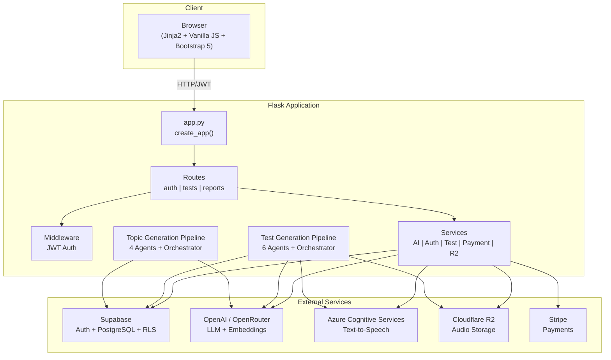

# Project Overview

## What is LinguaLoop?

LinguaLoop is an AI-powered language learning platform that generates adaptive listening and reading comprehension tests. Users take tests matched to their skill level via an ELO rating system, and the platform continuously generates fresh content using multi-agent AI pipelines.

## Target Users

Language learners studying Chinese, English, or Japanese who want adaptive comprehension practice.

## Core Value Proposition

- AI-generated tests that never run out of fresh content
- Adaptive difficulty via ELO rating system (like chess ratings for language skills)
- Multi-skill testing: listening, reading, and dictation modes
- Support for 3 languages with language-specific AI models

## Key Features

1. **OTP Authentication** - Passwordless email login via Supabase Auth
2. **Test Taking** - Interactive tests with audio playback, multiple choice, ELO scoring
3. **AI Test Generation** - 6-agent pipeline: topic translation → prose writing → question generation → validation → title generation → audio synthesis
4. **AI Topic Generation** - 4-agent pipeline: exploration → deduplication (embeddings) → cultural validation → production queue
5. **ELO Rating System** - Adaptive difficulty matching for both users and tests
6. **Token Economy** - 2 free daily tokens, purchasable via Stripe (1 token = take test, 5 tokens = generate test)
7. **Audio Pipeline** - Azure TTS → Cloudflare R2 storage → public CDN URLs
8. **User Reporting** - Bug reports and feedback submission

## High-Level Architecture

## Technology Stack Summary

| Layer | Technology |
|-------|-----------|
| Backend Framework | Flask 3.0.3 (Python) |
| Frontend | Jinja2 templates + Vanilla JS + Bootstrap 5 |
| Database | Supabase (PostgreSQL) with pgvector |
| Authentication | Supabase Auth (OTP) + JWT |
| AI/LLM | OpenAI API + OpenRouter (Gemini, DeepSeek, Qwen) |
| Speech | Azure Cognitive Services TTS |
| Storage | Cloudflare R2 (S3-compatible) |
| Payments | Stripe |
| Testing | pytest + pytest-flask |

## Project Structure Summary

- `app.py` - Main Flask application and entry point
- `config.py` - Centralized configuration
- `routes/` - API endpoint handlers (auth, tests, reports)
- `middleware/` - JWT authentication decorators
- `services/` - Business logic layer (8 core services)
- `services/test_generation/` - 6-agent test creation pipeline
- `services/topic_generation/` - 4-agent topic discovery pipeline
- `templates/` - 8 Jinja2 HTML templates
- `static/` - CSS and JavaScript assets
- `scripts/` - Batch processing utilities
- `prompts/` - AI prompt templates
- `migrations/` - SQL schema migrations

## Related Documents

- [Tech Stack](02-tech-stack.md) - Detailed dependency list
- [Glossary](03-glossary.md) - Domain terminology
- [System Architecture](../02-Architecture/01-system-architecture.md) - Detailed architecture diagrams
