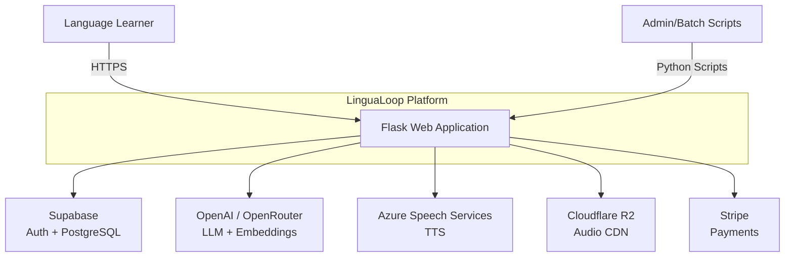
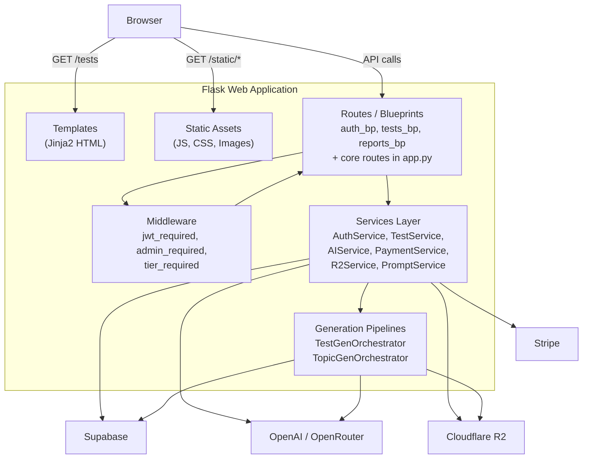
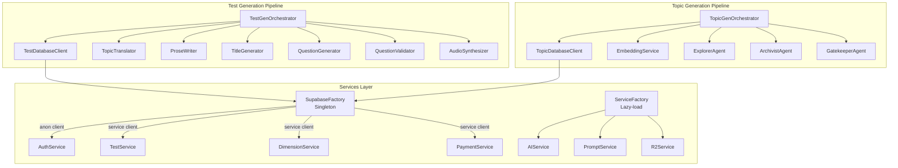

# System Architecture

LinguaLoop is a Flask-based language learning platform that generates AI-powered listening, reading, and dictation tests. This document describes the system at three levels of detail using the C4 model approach.

---

## L1 - System Context

The highest-level view showing LinguaLoop and its external dependencies.

**External Systems:**

| System | Purpose | Protocol |
|--------|---------|----------|
| Supabase | Authentication (OTP/JWT), PostgreSQL database, Row-Level Security | HTTPS (REST) |
| OpenAI | GPT models for question generation, text-embedding-3-small for semantic similarity, TTS for audio | HTTPS (REST) |
| OpenRouter | Alternative LLM gateway with language-specific model routing (Gemini, DeepSeek, Qwen) | HTTPS (REST) |
| Cloudflare R2 | S3-compatible object storage for generated audio files, served via public CDN URL | HTTPS (S3 API) |
| Stripe | Payment processing for token package purchases | HTTPS (REST) |

**Actors:**

- **Language Learner**: End user who takes tests, views scores, and purchases tokens via the web UI.
- **Admin/Batch Scripts**: Python scripts that trigger topic generation and test generation pipelines. Authenticate using the Supabase service role key.

---

## L2 - Container Diagram

Breaking the Flask application into its internal containers (layers).

**Container responsibilities:**

| Container | Location | Responsibility |
|-----------|----------|----------------|
| **Routes / Blueprints** | `routes/auth.py`, `routes/tests.py`, `routes/reports.py`, `app.py` | Thin HTTP handlers. Extract parameters, call services, return JSON or redirect. |
| **Middleware** | `middleware/auth.py` | Authentication and authorization decorators. Validates JWTs via Supabase Auth, sets `g.current_user_id`. |
| **Services** | `services/*.py` | Business logic layer. Each service encapsulates a single domain concern (auth, tests, AI, payments, storage, prompts). |
| **Pipelines** | `services/test_generation/`, `services/topic_generation/` | Multi-agent orchestration systems for batch content generation. Run as background scripts. |
| **Templates** | `templates/*.html` | Server-rendered HTML pages. Client-side JavaScript handles auth state and API calls. |
| **Static Assets** | `static/js/`, `static/css/` | Frontend JavaScript modules, stylesheets, and images. |

---

## L3 - Component Diagram

Detailed view inside the Services and Pipelines layers.

**Services Layer Components:**

| Component | File | Description |
|-----------|------|-------------|
| `SupabaseFactory` | `services/supabase_factory.py` | Singleton factory providing anon and service-role Supabase clients. Initialized once at app startup. |
| `AuthService` | `services/auth_service.py` | Handles OTP login, token refresh, user creation in the `users` table. |
| `TestService` | `services/test_service.py` | Test CRUD operations, attempt recording, ELO calculations, recommended test queries. |
| `DimensionService` | `services/test_service.py` | Static class that pre-loads `dim_languages` and `dim_test_types` into in-memory caches at startup. |
| `AIService` | `services/ai_service.py` | Wraps OpenAI/OpenRouter API calls for transcript generation, question generation, and moderation. |
| `R2Service` | `services/r2_service.py` | Uploads and manages audio files in Cloudflare R2 using S3-compatible API. |
| `PromptService` | `services/prompt_service.py` | Loads and renders prompt templates from the filesystem. |
| `ServiceFactory` | `services/service_factory.py` | Lazy-loading factory for AIService, PromptService, and R2Service. |

**Test Generation Agents (6):**

| Agent | File | Responsibility |
|-------|------|----------------|
| `TopicTranslator` | `agents/topic_translator.py` | Translates English topic concepts into the target language. |
| `ProseWriter` | `agents/prose_writer.py` | Generates reading/listening passages at a specified CEFR difficulty level. |
| `TitleGenerator` | `agents/title_generator.py` | Creates human-readable test titles from topics. |
| `QuestionGenerator` | `agents/question_generator.py` | Generates multiple-choice questions from prose passages. |
| `QuestionValidator` | `agents/question_validator.py` | Validates question quality, answer correctness, and distractor plausibility. |
| `AudioSynthesizer` | `agents/audio_synthesizer.py` | Converts prose to speech via TTS and uploads to R2. |

**Topic Generation Agents (4):**

| Agent | File | Responsibility |
|-------|------|----------------|
| `EmbeddingService` | `agents/embedder.py` | Generates vector embeddings for semantic similarity checks. |
| `ExplorerAgent` | `agents/explorer.py` | Proposes new topic candidates given a category and lens. |
| `ArchivistAgent` | `agents/archivist.py` | Checks candidate novelty against existing topics using cosine similarity. |
| `GatekeeperAgent` | `agents/gatekeeper.py` | Validates cultural appropriateness and educational value. |

---

## Related Documents

- [Request Lifecycle](./02-request-lifecycle.md) - How a single API request flows through the system.
- [Service Dependency Graph](./03-service-dependency-graph.md) - How services depend on each other.
- [Design Patterns](./04-design-patterns.md) - Patterns used throughout the codebase.
- [Security Model](./06-security-model.md) - Authentication, authorization, and data access controls.
