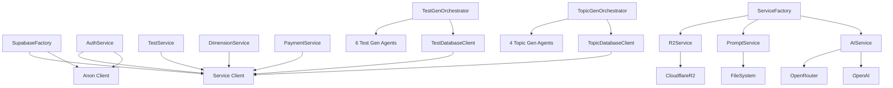

# Service Dependency Graph

This document maps how services depend on each other and on external systems. Understanding these dependencies is essential for reasoning about initialization order, testing in isolation, and the impact of changes.

---

## Dependency Graph



---

## Dependency Details

### Foundation Layer: SupabaseFactory

`SupabaseFactory` is the root dependency for all database-connected services. It produces two clients:

| Client | Variable | RLS Behavior | Used By |
|--------|----------|--------------|---------|
| **Anon Client** | `_anon_client` | Respects RLS policies | AuthService (user-context operations), middleware token validation |
| **Service Client** | `_service_client` | Bypasses RLS | TestService, DimensionService, PaymentService, TestDatabaseClient, TopicDatabaseClient, admin_required/tier_required checks |

**Initialization order matters**: `SupabaseFactory.initialize()` must be called before any service that depends on `get_supabase()` or `get_supabase_admin()`.

### Service Layer Dependencies

| Service | Depends On | Notes |
|---------|-----------|-------|
| `AuthService` | Anon Client, Service Client | Uses anon for user-context auth, service client for user table lookups |
| `TestService` | Service Client (via `get_supabase_admin()`) | Singleton, retrieved via `get_test_service()` |
| `DimensionService` | Service Client | Static class. Initialized once at startup, caches never refreshed during runtime. |
| `AIService` | OpenAI SDK client, Config, PromptService | Created by ServiceFactory. Uses either OpenAI or OpenRouter based on config. |
| `R2Service` | Config (R2 credentials) | Created by ServiceFactory. Uses boto3 S3-compatible client. |
| `PromptService` | Filesystem (prompt templates) | No external service dependencies. Reads `.txt` prompt files. |
| `ServiceFactory` | Config | Lazy-loads AIService, PromptService, R2Service on first access via `@property`. |

### Pipeline Dependencies

| Pipeline | Database Client | Agents | External APIs |
|----------|----------------|--------|---------------|
| `TestGenOrchestrator` | `TestDatabaseClient` (service client) | TopicTranslator, ProseWriter, TitleGenerator, QuestionGenerator, QuestionValidator, AudioSynthesizer | OpenRouter (LLM), OpenAI (TTS, embeddings), R2 (audio upload) |
| `TopicGenOrchestrator` | `TopicDatabaseClient` (service client) | EmbeddingService, ExplorerAgent, ArchivistAgent, GatekeeperAgent | OpenRouter (LLM), OpenAI (embeddings) |

Both pipelines use their own `*DatabaseClient` classes which internally call `get_supabase_admin()` to get the service client. This means `SupabaseFactory` must be initialized before any pipeline can run.

### Agent Dependencies

**Test Generation Agents:**

| Agent | External Dependency |
|-------|-------------------|
| TopicTranslator | OpenRouter (LLM) |
| ProseWriter | OpenRouter (LLM) |
| TitleGenerator | OpenRouter (LLM) |
| QuestionGenerator | OpenRouter (LLM) |
| QuestionValidator | OpenRouter (LLM) |
| AudioSynthesizer | OpenAI (TTS), R2 (upload) |

**Topic Generation Agents:**

| Agent | External Dependency |
|-------|-------------------|
| EmbeddingService | OpenAI (text-embedding-3-small) |
| ExplorerAgent | OpenRouter (LLM) |
| ArchivistAgent | TopicDatabaseClient (existing embeddings), EmbeddingService |
| GatekeeperAgent | OpenRouter (LLM) |

---

## Initialization Order in app.py

The `_initialize_services(app)` function in `app.py` initializes services in dependency order:

```
1. SupabaseFactory.initialize()        -- Foundation
2. get_supabase() -> app.supabase      -- Anon client
3. get_supabase_admin() -> app.supabase_service  -- Service client
4. AuthService(app.supabase)           -- Depends on anon client
5. DimensionService.initialize(app.supabase_service)  -- Depends on service client
6. get_test_service() -> app.test_service  -- Depends on DimensionService
7. ServiceFactory(Config)              -- Depends on Config
8. R2Service(Config)                   -- Independent
9. stripe.api_key = ...               -- Independent
10. PromptService()                    -- Independent
```

Each initialization step is wrapped in a try/except so that failure of one service does not prevent the rest from initializing. The service attribute is set to `None` on failure.

---

## Related Documents

- [System Architecture](./01-system-architecture.md) - High-level system context and container diagrams.
- [Design Patterns](./04-design-patterns.md) - Factory, singleton, and other patterns used in the dependency graph.
- [App Entrypoint](../04-Backend/01-app-entrypoint.md) - Detailed walkthrough of the initialization sequence.
