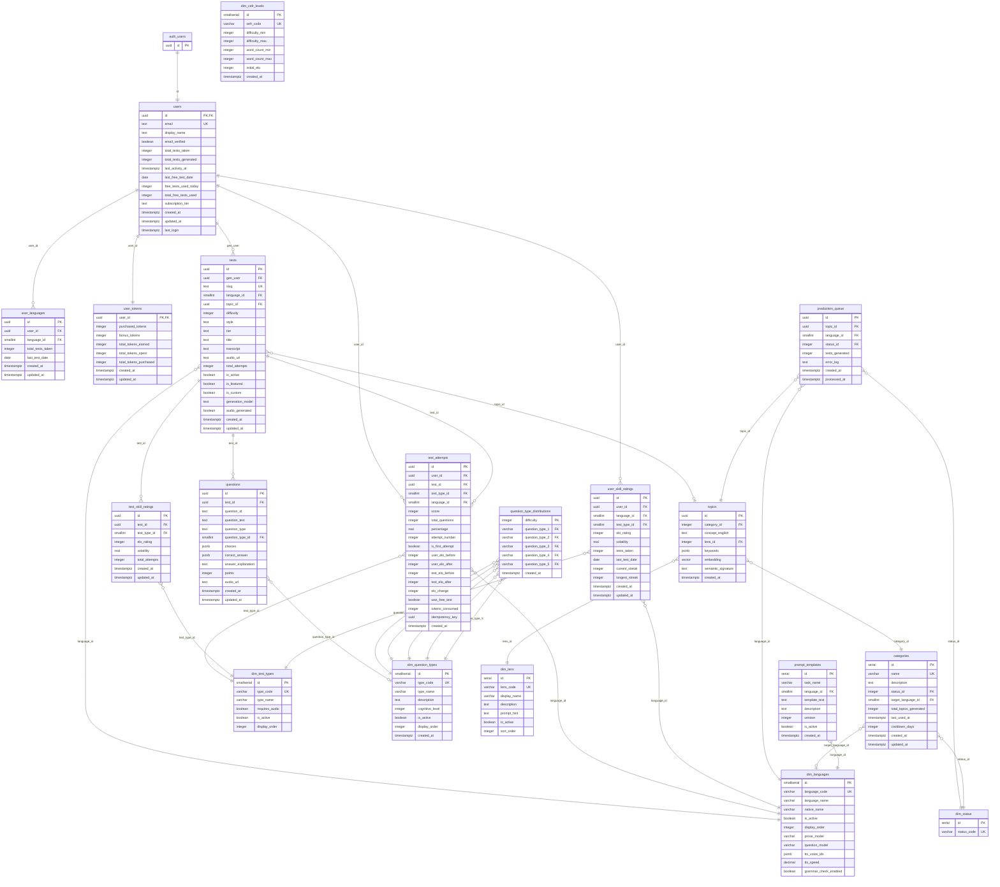

# Database Schema Overview

LinguaLoop uses **Supabase** (managed PostgreSQL) with the **pgvector** extension for embedding-based similarity search. Data models are defined as Python `dataclasses` (no ORM). Database access is through the Supabase PostgREST client and PostgreSQL RPC functions.

## Architecture

- **Supabase PostgREST**: RESTful access via the `supabase-py` client
- **RPC Functions**: Server-side PostgreSQL functions for atomic operations (ELO calculation, test submission)
- **pgvector**: 1536-dimensional embeddings on the `topics` table for semantic deduplication
- **Row-Level Security (RLS)**: Enforced on user-facing tables; bypassed by the service role client for admin/batch operations
- **No ORM**: Python `dataclasses` map to table rows; queries use the Supabase client builder pattern

## Table Groups

### User Domain
| Table | Purpose |
|-------|---------|
| `users` | Core user profiles, linked to `auth.users` |
| `user_skill_ratings` | Per-user ELO ratings by language and test type |
| `user_languages` | Tracks which languages a user has studied |
| `user_tokens` | Token balance and spending breakdown |
| `token_transactions` | Audit log for all token operations |
| `user_reports` | User-submitted reports |

### Test Domain
| Table | Purpose |
|-------|---------|
| `tests` | Generated tests with transcripts and metadata |
| `questions` | Individual questions belonging to a test |
| `test_attempts` | Records of user test submissions with ELO snapshots |
| `test_skill_ratings` | Per-test ELO ratings by test type |

### Generation Domain
| Table | Purpose |
|-------|---------|
| `topics` | Topic concepts with pgvector embeddings |
| `production_queue` | Topic-language pairs awaiting test generation |
| `categories` | Topic categories with cooldown scheduling |
| `topic_generation_runs` | Metrics for topic generation pipeline runs |
| `test_generation_runs` | Metrics for test generation pipeline runs |
| `test_generation_config` | Runtime configuration key-value store |

### Dimension Tables
| Table | Purpose |
|-------|---------|
| `dim_languages` | Supported languages with model configuration |
| `dim_test_types` | Test modes (listening, reading, dictation) |
| `dim_question_types` | Question taxonomy with cognitive levels |
| `dim_cefr_levels` | CEFR level definitions with word counts and ELO ranges |
| `dim_lens` | Topic exploration perspectives (historical, cultural, etc.) |
| `dim_status` | Status codes for queue and category workflows |

### System Tables
| Table | Purpose |
|-------|---------|
| `prompt_templates` | Versioned LLM prompt templates per task and language |
| `question_type_distributions` | Maps difficulty levels to question type mixes |
| `flagged_content` | Content flagged by moderation |

## Entity-Relationship Diagram

## Key Design Patterns

1. **Dimension Tables**: All enumerated values (languages, test types, statuses, CEFR levels) are stored in `dim_*` tables rather than as string enums. This enables runtime configuration changes without code deploys.

2. **ELO Rating System**: Both users and tests have ELO ratings. Ratings are tracked per (user, language, test_type) and per (test, test_type) combination, enabling fine-grained skill assessment.

3. **Dual-Client Architecture**: The anon client respects RLS for user-facing operations; the service role client bypasses RLS for admin, batch, and generation pipeline operations.

4. **Atomic Submissions**: Test submissions are processed via the `process_test_submission` RPC function, which validates answers, calculates ELO, and updates all related tables in a single transaction.

5. **pgvector Embeddings**: The `topics.embedding` column stores 1536-dimensional OpenAI embeddings. The `match_topics` RPC function uses cosine similarity for semantic deduplication within categories.

---

## Related Documents

- [02-table-reference.md](./02-table-reference.md) -- Full column-level documentation for every table
- [03-dimension-tables.md](./03-dimension-tables.md) -- Dimension table seed data and caching patterns
- [04-rpc-functions.md](./04-rpc-functions.md) -- PostgreSQL RPC function reference
- [05-rls-policies.md](./05-rls-policies.md) -- Row-Level Security policy documentation
- [06-migration-history.md](./06-migration-history.md) -- Migration file history and changelog
