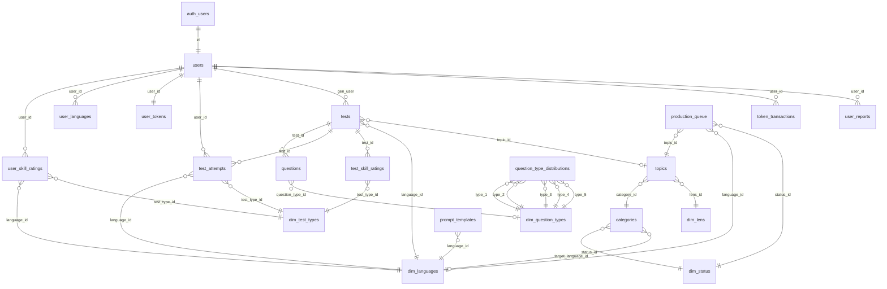

# Tables Reference

Complete column-level documentation for every table in the LinguaLoop database. Tables are grouped by domain. Column types reflect the Supabase (PostgreSQL) schema; constraints are listed where defined in migrations or inferred from application code.

---

## User Domain

### `users`

Managed by Supabase Auth trigger. A row is created when a user signs up via `auth.users`. The application also has a manual fallback insert in `services/auth_service.py` (line 170-178).

| Column | Type | Constraints | Description |
|--------|------|-------------|-------------|
| `id` | `uuid` | PK, FK -> `auth.users.id` | Matches the Supabase Auth user ID |
| `email` | `text` | UNIQUE | User email from auth provider |
| `display_name` | `text` | | Optional display name |
| `email_verified` | `boolean` | DEFAULT `true` | Whether email has been verified |
| `total_tests_taken` | `integer` | DEFAULT `0` | Lifetime count of test attempts |
| `total_tests_generated` | `integer` | DEFAULT `0` | Lifetime count of tests generated |
| `last_activity_at` | `timestamptz` | | Last recorded activity timestamp |
| `last_free_test_date` | `date` | | Date of last free test usage (for daily reset) |
| `free_tests_used_today` | `integer` | DEFAULT `0` | Free tests consumed today |
| `total_free_tests_used` | `integer` | DEFAULT `0` | Lifetime free tests consumed |
| `subscription_tier` | `text` | DEFAULT `'free'` | One of: `free`, `premium`, `admin`, `moderator` |
| `created_at` | `timestamptz` | DEFAULT `NOW()` | Account creation timestamp |
| `updated_at` | `timestamptz` | DEFAULT `NOW()` | Last profile update |
| `last_login` | `timestamptz` | | Most recent login timestamp |

**Source**: `services/auth_service.py` lines 170-178, `Project Knowledge/03-Database/01-schema-overview.md` lines 70-85

---

### `user_skill_ratings`

Tracks per-user ELO ratings segmented by language and test type. Created on first test submission by `process_test_submission` RPC. Starting ELO is 1200.

| Column | Type | Constraints | Description |
|--------|------|-------------|-------------|
| `id` | `uuid` | PK | Auto-generated |
| `user_id` | `uuid` | FK -> `users.id` | The rated user |
| `language_id` | `smallint` | FK -> `dim_languages.id` | Language being studied |
| `test_type_id` | `smallint` | FK -> `dim_test_types.id` | Test mode (listening/reading/dictation) |
| `elo_rating` | `integer` | DEFAULT `1200` | Current ELO rating (range 400-3000) |
| `volatility` | `real` | DEFAULT `1.0` | Rating volatility multiplier |
| `tests_taken` | `integer` | DEFAULT `0` | Number of first-attempts in this skill |
| `last_test_date` | `date` | | Date of last test in this skill |
| `current_streak` | `integer` | DEFAULT `0` | Consecutive-day streak |
| `longest_streak` | `integer` | DEFAULT `0` | All-time longest streak |
| `created_at` | `timestamptz` | DEFAULT `NOW()` | Row creation |
| `updated_at` | `timestamptz` | DEFAULT `NOW()` | Last update |

**Unique constraint**: `(user_id, language_id, test_type_id)`

**Source**: `migrations/process_test_submission_v2.sql` lines 166-184, `migrations/elo_functions.sql` lines 82-134

---

### `user_languages`

Tracks which languages a user has studied and when. Upserted by `process_test_submission` on every attempt.

| Column | Type | Constraints | Description |
|--------|------|-------------|-------------|
| `id` | `uuid` | PK | Auto-generated |
| `user_id` | `uuid` | FK -> `users.id` | |
| `language_id` | `smallint` | FK -> `dim_languages.id` | |
| `total_tests_taken` | `integer` | DEFAULT `0` | Tests taken in this language |
| `last_test_date` | `date` | | Last test date |
| `created_at` | `timestamptz` | DEFAULT `NOW()` | |
| `updated_at` | `timestamptz` | DEFAULT `NOW()` | |

**Unique constraint**: `(user_id, language_id)`

**Source**: `migrations/process_test_submission_v2.sql` lines 300-309, `migrations/elo_functions.sql` lines 197-206

---

### `user_tokens`

Token balance for the freemium economy. One row per user.

| Column | Type | Constraints | Description |
|--------|------|-------------|-------------|
| `user_id` | `uuid` | PK, FK -> `users.id` | |
| `purchased_tokens` | `integer` | DEFAULT `0` | Tokens bought via Stripe |
| `bonus_tokens` | `integer` | DEFAULT `0` | Promotional / welcome tokens |
| `total_tokens_earned` | `integer` | DEFAULT `0` | Lifetime tokens received |
| `total_tokens_spent` | `integer` | DEFAULT `0` | Lifetime tokens consumed |
| `total_tokens_purchased` | `integer` | DEFAULT `0` | Lifetime tokens bought |
| `created_at` | `timestamptz` | DEFAULT `NOW()` | |
| `updated_at` | `timestamptz` | DEFAULT `NOW()` | |

**Source**: `Project Knowledge/03-Database/01-schema-overview.md` lines 113-121

---

### `token_transactions`

Audit log for every token credit or debit.

| Column | Type | Constraints | Description |
|--------|------|-------------|-------------|
| `id` | `uuid` | PK | Auto-generated |
| `user_id` | `uuid` | FK -> `users.id` | |
| `amount` | `integer` | NOT NULL | Positive = credit, negative = debit |
| `type` | `text` | NOT NULL | Transaction type (e.g., `purchase`, `free_daily`, `test_consumption`) |
| `description` | `text` | | Human-readable description |
| `created_at` | `timestamptz` | DEFAULT `NOW()` | |

**Source**: Inferred from schema overview and `services/auth_service.py` RPC calls (`get_token_balance`, `grant_daily_free_tokens`)

---

### `user_reports`

User-submitted feedback and bug reports.

| Column | Type | Constraints | Description |
|--------|------|-------------|-------------|
| `id` | `uuid` | PK | Auto-generated |
| `user_id` | `uuid` | FK -> `users.id` | Reporting user |
| `report_category` | `text` | | Category of report |
| `description` | `text` | | User's description |
| `current_page` | `text` | | Page URL when report was filed |
| `test_id` | `uuid` | FK -> `tests.id`, nullable | Associated test if applicable |
| `user_agent` | `text` | | Browser user agent string |
| `screen_resolution` | `text` | | Screen dimensions |
| `created_at` | `timestamptz` | DEFAULT `NOW()` | |

**Source**: `Project Knowledge/03-Database/01-schema-overview.md` line 23

---

## Test Domain

### `tests`

Core test content table. Each row is a generated comprehension test with a transcript and metadata.

| Column | Type | Constraints | Description |
|--------|------|-------------|-------------|
| `id` | `uuid` | PK | Auto-generated or set by pipeline |
| `slug` | `text` | UNIQUE, NOT NULL | URL-safe identifier, format: `{lang}-d{difficulty}-{topic}-{timestamp}` |
| `language_id` | `smallint` | FK -> `dim_languages.id` | Target language |
| `topic_id` | `uuid` | FK -> `topics.id`, nullable | Source topic (null for legacy/custom tests) |
| `gen_user` | `uuid` | FK -> `users.id` | User or system account who generated the test |
| `difficulty` | `integer` | CHECK `1-9` | Difficulty level mapped to CEFR |
| `style` | `text` | | Generation style parameter |
| `tier` | `text` | DEFAULT `'free'` | Access tier |
| `title` | `text` | | Display title (generated by LLM or fallback) |
| `transcript` | `text` | | Full prose passage |
| `audio_url` | `text` | | Supabase Storage URL for TTS audio |
| `total_attempts` | `integer` | DEFAULT `0` | Attempt counter |
| `is_active` | `boolean` | DEFAULT `true` | Soft delete / visibility flag |
| `is_featured` | `boolean` | DEFAULT `false` | Featured on homepage |
| `is_custom` | `boolean` | DEFAULT `false` | User-generated vs pipeline-generated |
| `generation_model` | `text` | | LLM model used for generation |
| `audio_generated` | `boolean` | DEFAULT `false` | Whether TTS audio exists |
| `created_at` | `timestamptz` | DEFAULT `NOW()` | |
| `updated_at` | `timestamptz` | DEFAULT `NOW()` | |

**Source**: `services/test_service.py` lines 385-402, `services/test_generation/database_client.py` lines 583-613

---

### `questions`

Individual questions belonging to a test. Each test has 5 questions (configurable via `test_generation_config`).

| Column | Type | Constraints | Description |
|--------|------|-------------|-------------|
| `id` | `uuid` | PK | Auto-generated |
| `test_id` | `uuid` | FK -> `tests.id`, NOT NULL | Parent test |
| `question_id` | `text` | | Legacy string identifier (e.g., `q1`, `q2`) |
| `question_text` | `text` | NOT NULL | The question in the target language |
| `question_type` | `text` | | Legacy type string (e.g., `multiple_choice`) |
| `question_type_id` | `smallint` | FK -> `dim_question_types.id` | Semantic question type (added by migration) |
| `choices` | `jsonb` | | Array of 4 answer options: `["Option A", "Option B", "Option C", "Option D"]` |
| `answer` | `jsonb` | | Correct answer as JSONB string: `"The correct option"` |
| `correct_answer` | `text` | | Correct answer as plain text (legacy column) |
| `answer_explanation` | `text` | | Explanation of why the answer is correct |
| `points` | `integer` | DEFAULT `1` | Point value |
| `audio_url` | `text` | | Per-question audio URL (if applicable) |
| `created_at` | `timestamptz` | DEFAULT `NOW()` | |
| `updated_at` | `timestamptz` | DEFAULT `NOW()` | |

**Indexes**: `idx_questions_type` on `question_type_id`

**Note**: The `answer` column (JSONB) is used by `process_test_submission_v2` for server-side validation. The `correct_answer` column (text) is a legacy field used by older code paths.

**Source**: `services/test_service.py` lines 421-432, `services/test_generation/database_client.py` lines 615-648, `migrations/process_test_submission_v2.sql` lines 73-88

---

### `test_attempts`

Records of user test submissions with ELO snapshots before and after.

| Column | Type | Constraints | Description |
|--------|------|-------------|-------------|
| `id` | `uuid` | PK | Auto-generated |
| `user_id` | `uuid` | FK -> `users.id`, NOT NULL | Test taker |
| `test_id` | `uuid` | FK -> `tests.id`, NOT NULL | Test taken |
| `test_type_id` | `smallint` | FK -> `dim_test_types.id` | Test mode used |
| `language_id` | `smallint` | FK -> `dim_languages.id` | Language of the test |
| `score` | `integer` | | Number of correct answers |
| `total_questions` | `integer` | | Total questions in the test |
| `percentage` | `real` | | Score as percentage (0-100), may be generated column |
| `attempt_number` | `integer` | | Sequential attempt number per user+test+type |
| `is_first_attempt` | `boolean` | | Only first attempts affect ELO |
| `user_elo_before` | `integer` | | User ELO snapshot before this attempt |
| `user_elo_after` | `integer` | | User ELO after calculation |
| `test_elo_before` | `integer` | | Test ELO snapshot before |
| `test_elo_after` | `integer` | | Test ELO after calculation |
| `elo_change` | `integer` | | Delta (user_elo_after - user_elo_before) |
| `was_free_test` | `boolean` | DEFAULT `true` | Whether this consumed a free test slot |
| `tokens_consumed` | `integer` | DEFAULT `0` | Tokens deducted for this attempt |
| `idempotency_key` | `uuid` | UNIQUE, nullable | Prevents duplicate submissions |
| `created_at` | `timestamptz` | DEFAULT `NOW()` | |

**Source**: `migrations/process_test_submission_v2.sql` lines 261-294

---

### `test_skill_ratings`

Per-test ELO ratings by test type. Created when a test is generated; updated on first attempts.

| Column | Type | Constraints | Description |
|--------|------|-------------|-------------|
| `id` | `uuid` | PK | Auto-generated |
| `test_id` | `uuid` | FK -> `tests.id`, NOT NULL | |
| `test_type_id` | `smallint` | FK -> `dim_test_types.id`, NOT NULL | |
| `elo_rating` | `integer` | DEFAULT `1400` | Current test difficulty ELO |
| `volatility` | `real` | DEFAULT `1.0` | Rating volatility |
| `total_attempts` | `integer` | DEFAULT `0` | First-attempt count |
| `created_at` | `timestamptz` | DEFAULT `NOW()` | |
| `updated_at` | `timestamptz` | DEFAULT `NOW()` | |

**Unique constraint**: `(test_id, test_type_id)`

**Source**: `services/test_generation/database_client.py` lines 650-693, `migrations/process_test_submission_v2.sql` lines 190-205

---

## Generation Domain

### `topics`

Topic concepts with pgvector embeddings for semantic deduplication. Created by the topic generation pipeline.

| Column | Type | Constraints | Description |
|--------|------|-------------|-------------|
| `id` | `uuid` | PK | Auto-generated |
| `category_id` | `integer` | FK -> `categories.id` | Parent category |
| `concept_english` | `text` | NOT NULL | English description of the topic concept |
| `lens_id` | `integer` | FK -> `dim_lens.id` | Exploration perspective used |
| `keywords` | `jsonb` | | Array of keywords: `["keyword1", "keyword2"]` |
| `embedding` | `vector(1536)` | | OpenAI text-embedding-ada-002 vector |
| `semantic_signature` | `text` | | Human-readable dedup signature |
| `created_at` | `timestamptz` | DEFAULT `NOW()` | |

**Source**: `services/topic_generation/database_client.py` lines 430-468

---

### `production_queue`

Topic-language pairs awaiting test generation. Each topic fans out to all active languages.

| Column | Type | Constraints | Description |
|--------|------|-------------|-------------|
| `id` | `uuid` | PK | Auto-generated |
| `topic_id` | `uuid` | FK -> `topics.id`, NOT NULL | Topic to generate tests for |
| `language_id` | `smallint` | FK -> `dim_languages.id`, NOT NULL | Target language |
| `status_id` | `integer` | FK -> `dim_status.id` | Workflow status (pending -> processing -> active/rejected) |
| `tests_generated` | `integer` | DEFAULT `0` | Count of tests produced from this item |
| `error_log` | `text` | | Error message if generation failed |
| `created_at` | `timestamptz` | DEFAULT `NOW()` | |
| `processed_at` | `timestamptz` | | When processing completed |

**Source**: `services/test_generation/database_client.py` lines 145-233, `migrations/test_generation_tables.sql` lines 143-147

---

### `categories`

Topic categories with cooldown scheduling. Controls which category the topic generation pipeline selects next.

| Column | Type | Constraints | Description |
|--------|------|-------------|-------------|
| `id` | `serial` | PK | Auto-increment |
| `name` | `varchar` | UNIQUE, NOT NULL | Category name |
| `description` | `text` | | Human-readable description |
| `status_id` | `integer` | FK -> `dim_status.id` | Active/inactive status |
| `target_language_id` | `smallint` | FK -> `dim_languages.id`, nullable | Language-specific category (null = universal) |
| `total_topics_generated` | `integer` | DEFAULT `0` | Running count |
| `last_used_at` | `timestamptz` | | Last time this category was used for generation |
| `cooldown_days` | `integer` | DEFAULT `0` | Minimum days between uses |
| `created_at` | `timestamptz` | DEFAULT `NOW()` | |
| `updated_at` | `timestamptz` | DEFAULT `NOW()` | |

**Source**: `services/topic_generation/database_client.py` lines 270-396

---

### `topic_generation_runs`

Metrics logging for topic generation pipeline executions.

| Column | Type | Constraints | Description |
|--------|------|-------------|-------------|
| `id` | `serial` | PK | Auto-increment |
| `run_date` | `date` | NOT NULL | Date of the run |
| `category_id` | `integer` | | Category processed |
| `category_name` | `text` | | Denormalized category name |
| `topics_generated` | `integer` | DEFAULT `0` | Successfully created topics |
| `topics_rejected_similarity` | `integer` | DEFAULT `0` | Rejected by vector similarity check |
| `topics_rejected_gatekeeper` | `integer` | DEFAULT `0` | Rejected by gatekeeper LLM |
| `candidates_proposed` | `integer` | DEFAULT `0` | Total candidates from explorer LLM |
| `api_calls_llm` | `integer` | DEFAULT `0` | LLM API calls made |
| `api_calls_embedding` | `integer` | DEFAULT `0` | Embedding API calls made |
| `total_cost_usd` | `decimal` | DEFAULT `0.0` | Estimated cost |
| `execution_time_seconds` | `integer` | | Wall-clock time |
| `error_message` | `text` | | Error if run failed |
| `created_at` | `timestamptz` | DEFAULT `NOW()` | |

**Source**: `services/topic_generation/database_client.py` lines 560-586

---

### `test_generation_runs`

Metrics logging for test generation pipeline executions.

| Column | Type | Constraints | Description |
|--------|------|-------------|-------------|
| `id` | `serial` | PK | Auto-increment |
| `run_date` | `date` | NOT NULL, DEFAULT `CURRENT_DATE` | |
| `queue_items_processed` | `integer` | DEFAULT `0` | Queue items handled |
| `tests_generated` | `integer` | DEFAULT `0` | Tests successfully created |
| `tests_failed` | `integer` | DEFAULT `0` | Tests that failed generation |
| `execution_time_seconds` | `integer` | | Wall-clock time |
| `error_message` | `text` | | Error if run failed |
| `created_at` | `timestamptz` | DEFAULT `NOW()` | |

**Index**: `idx_test_generation_runs_date` on `run_date`

**Source**: `migrations/test_generation_tables.sql` lines 107-120

---

### `test_generation_config`

Runtime configuration key-value store for the test generation pipeline.

| Column | Type | Constraints | Description |
|--------|------|-------------|-------------|
| `config_key` | `varchar(50)` | PK | Configuration key |
| `config_value` | `text` | NOT NULL | Value (parsed by application) |
| `description` | `text` | | What this config controls |
| `created_at` | `timestamptz` | DEFAULT `NOW()` | |
| `updated_at` | `timestamptz` | DEFAULT `NOW()` | |

**Seed values**:

| Key | Value | Description |
|-----|-------|-------------|
| `target_difficulties` | `[4, 6, 9]` | Difficulties generated per queue item |
| `batch_size` | `50` | Max queue items per run |
| `system_user_id` | `de6fd05b-...` | System user UUID for `gen_user` |
| `questions_per_test` | `5` | Questions per test |
| `default_prose_model` | `google/gemini-2.0-flash-exp` | Default LLM for prose |
| `default_question_model` | `google/gemini-2.0-flash-exp` | Default LLM for questions |

**Source**: `migrations/test_generation_tables.sql` lines 88-104

---

## System Tables

### `prompt_templates`

Versioned LLM prompt templates per task and language. Supports language-specific overrides with English fallback.

| Column | Type | Constraints | Description |
|--------|------|-------------|-------------|
| `id` | `serial` | PK | Auto-increment |
| `task_name` | `varchar` | NOT NULL | Template identifier (e.g., `prose_generation`, `question_inference`) |
| `language_id` | `smallint` | FK -> `dim_languages.id` | Target language (2=English is universal fallback) |
| `template_text` | `text` | NOT NULL | Prompt template with `{placeholders}` |
| `description` | `text` | | Human-readable description |
| `version` | `integer` | DEFAULT `1` | Version number for A/B testing |
| `is_active` | `boolean` | DEFAULT `true` | Whether this version is active |
| `created_at` | `timestamptz` | DEFAULT `NOW()` | |

**Unique constraint**: `(task_name, language_id, version)`

**Source**: `migrations/test_generation_tables.sql` lines 153-472, `services/test_generation/database_client.py` lines 529-577

---

### `question_type_distributions`

Maps difficulty levels (1-9) to a distribution of 5 question types.

| Column | Type | Constraints | Description |
|--------|------|-------------|-------------|
| `difficulty` | `integer` | PK, CHECK `1-9` | Difficulty level |
| `question_type_1` | `varchar(30)` | FK -> `dim_question_types.type_code` | First question type |
| `question_type_2` | `varchar(30)` | FK -> `dim_question_types.type_code` | Second question type |
| `question_type_3` | `varchar(30)` | FK -> `dim_question_types.type_code` | Third question type |
| `question_type_4` | `varchar(30)` | FK -> `dim_question_types.type_code` | Fourth question type |
| `question_type_5` | `varchar(30)` | FK -> `dim_question_types.type_code` | Fifth question type |
| `created_at` | `timestamptz` | DEFAULT `NOW()` | |

**Source**: `migrations/test_generation_tables.sql` lines 57-85

---

### `flagged_content` / `flagged_inputs`

Content flagged by the moderation system.

| Column | Type | Constraints | Description |
|--------|------|-------------|-------------|
| `id` | `uuid` | PK | Auto-generated |
| `user_email` | `text` | | Email of the user whose content was flagged |
| `content_hash` | `text` | | SHA-256 hash (first 32 chars) of flagged content |
| `content_type` | `text` | | Type of content (e.g., `test_generation`) |
| `flagged_categories` | `jsonb` | | Categories that triggered the flag |
| `content_length` | `integer` | | Length of the original content |
| `flagged_at` | `timestamptz` | | When the flag was raised |

**Source**: `services/test_service.py` lines 552-570

---

### `stripe_payments`

Payment records from Stripe integration.

| Column | Type | Constraints | Description |
|--------|------|-------------|-------------|
| `id` | `uuid` | PK | Auto-generated |
| `user_id` | `uuid` | FK -> `users.id` | Paying user |
| `stripe_payment_id` | `text` | UNIQUE | Stripe payment intent ID |
| `amount` | `integer` | | Payment amount in cents |
| `currency` | `text` | DEFAULT `'usd'` | Currency code |
| `status` | `text` | | Payment status |
| `created_at` | `timestamptz` | DEFAULT `NOW()` | |

**Source**: Inferred from schema overview

---

## Entity-Relationship Diagram

---

## Related Documents

- [01-schema-overview.md](./01-schema-overview.md) -- High-level architecture and table groups
- [03-dimension-tables.md](./03-dimension-tables.md) -- Dimension table seed data and lookup patterns
- [04-rpc-functions.md](./04-rpc-functions.md) -- PostgreSQL RPC function reference
- [05-rls-policies.md](./05-rls-policies.md) -- Row-Level Security policy documentation
- [06-migrations.md](./06-migrations.md) -- Migration file history and changelog
