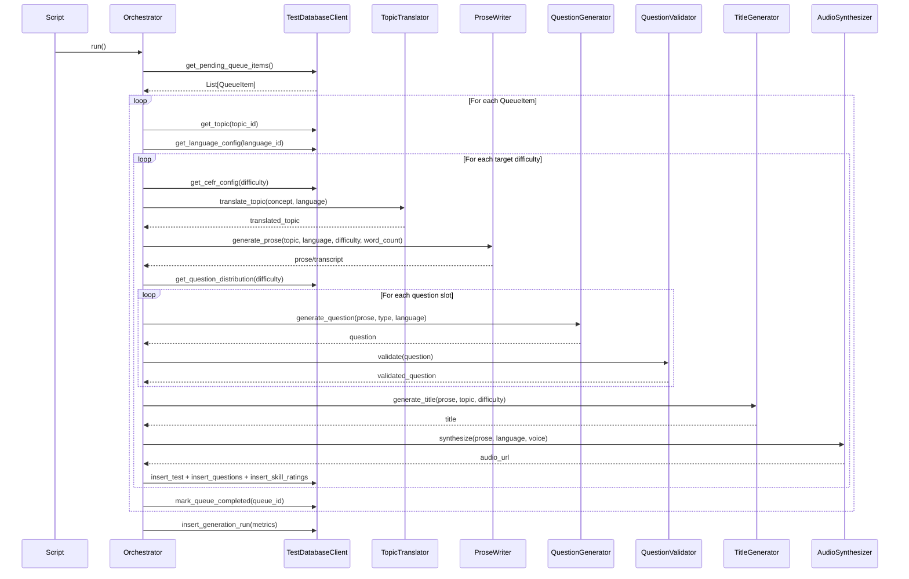

# Test Generation Pipeline Overview

The test generation pipeline transforms queued topic-language pairs from the `production_queue` table into complete reading/listening comprehension tests. Each test includes prose content, multiple-choice questions, a title, and synthesized audio -- all generated by specialized AI agents coordinated by the `TestGenerationOrchestrator`.

## Entry Point

The pipeline is triggered by the script `scripts/run_test_generation.py`, which instantiates the orchestrator and calls `run()`.

## End-to-End Sequence

## Data Flow Between Agents

### 1. Queue Item Retrieval
The orchestrator fetches pending items from `production_queue` (filtered to active languages only). Each `QueueItem` contains a `topic_id` and `language_id` that drive the rest of the pipeline.

### 2. Topic and Language Resolution
For each queue item, the orchestrator loads the `Topic` (concept, keywords, category) and `LanguageConfig` (language-specific model overrides, TTS voice IDs, speed settings).

### 3. Topic Translation (TopicTranslator)
For non-English languages, the `TopicTranslator` translates the English `concept_english` and `keywords` into the target language. The translated values are passed downstream to `ProseWriter` and `TitleGenerator` so the LLM prompts are in the correct language.

### 4. Prose Generation (ProseWriter)
The `ProseWriter` receives the translated topic, target language, CEFR level, and word count range (from `dim_cefr_levels`). It uses a language-specific `prose_generation` prompt template from the `prompt_templates` table, filling in placeholders like `{topic_concept}`, `{cefr_level}`, `{min_words}`, and `{max_words}`. The resulting prose text flows to all subsequent agents.

### 5. Question Generation (QuestionGenerator)
The `QuestionGenerator` receives the prose text plus a list of question type codes from `question_type_distributions` (e.g., `['literal_detail', 'main_idea', 'inference']`). For each type, it loads a type-specific prompt template (e.g., `question_literal_detail`) and generates one MCQ. Previously generated question texts are passed to each subsequent call to prevent semantic overlap.

### 6. Question Validation (QuestionValidator)
Each generated question passes through the `QuestionValidator`, which checks structural requirements (4 options, answer matches an option) and semantic overlap with previously validated questions using Jaccard similarity (threshold 0.65). Invalid questions are logged but do not halt the pipeline. A minimum of 3 valid questions is required per test.

### 7. Title Generation (TitleGenerator)
The `TitleGenerator` receives the prose, translated topic concept, difficulty, and CEFR level. It uses a language-specific `title_generation` prompt template. Title generation failures are non-fatal -- the test saves with a NULL title.

### 8. Audio Synthesis (AudioSynthesizer)
The `AudioSynthesizer` converts the prose text to speech using Azure Cognitive Services Speech SDK. It selects a voice from the language config's `tts_voice_ids` list (random selection for variety). The resulting MP3 is uploaded to Cloudflare R2, and the public URL is stored on the test record.

### 9. Database Persistence
For each generated test, the orchestrator inserts:
- A row in `tests` (slug, language, difficulty, transcript, audio_url, title)
- Rows in `questions` (one per validated question, with type_id linkage)
- Rows in `test_skill_ratings` (one per active test type, with initial ELO rating)

### 10. Queue Completion
After all difficulty levels are processed for a queue item, it is marked `active` (completed) or `rejected` (failed) in `production_queue`.

### 11. Metrics
At the end of the run, a `test_generation_runs` row is inserted with aggregate metrics: queue items processed, tests generated, tests failed, and execution time.

## Key Configuration

| Setting | Default | Description |
|---------|---------|-------------|
| `batch_size` | 50 | Max queue items per run |
| `target_difficulties` | [1, 3, 6, 9] | Difficulty levels to generate |
| `questions_per_test` | 5 | Questions per test |
| `dry_run` | false | Skip database writes and audio generation |

## Error Handling

- Each queue item is processed in a try/catch block. Failures mark the item as `rejected` with the error message in `error_log`.
- Individual question generation failures are tolerated (the pipeline continues with remaining question slots).
- Title generation failures are non-fatal (test saves with NULL title).
- Audio generation failures are fatal for that test (no partial saves).

---

### Related Documents

- [Orchestrator](./02-orchestrator.md)
- [TopicTranslator](./03-agents/01-topic-translator.md)
- [ProseWriter](./03-agents/02-prose-writer.md)
- [TitleGenerator](./03-agents/03-title-generator.md)
- [QuestionGenerator](./03-agents/04-question-generator.md)
- [QuestionValidator](./03-agents/05-question-validator.md)
- [AudioSynthesizer](./03-agents/06-audio-synthesizer.md)
- [Configuration](./04-config.md)
- [Database Client](./05-database-client.md)
