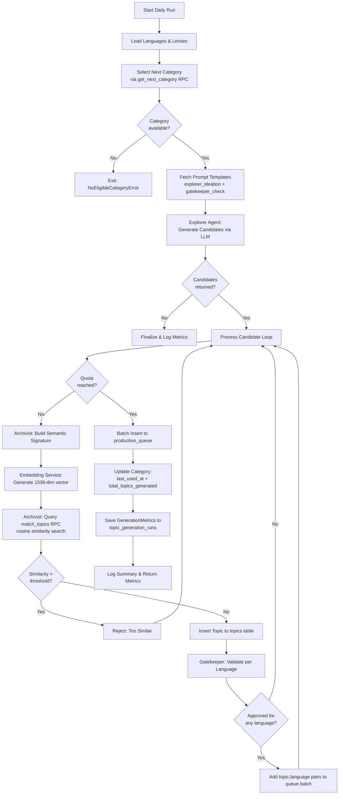

# Topic Generation Pipeline Overview

The topic generation pipeline is an automated, multi-agent system that produces diverse, semantically deduplicated topics for LinguaDojo's language-learning test content. It runs as a daily batch process, selecting one category at a time, generating candidate topics via an LLM, filtering duplicates through vector similarity, validating cultural fit per target language, and queuing approved topics for downstream content generation.

## Source References

| File | Path |
|------|------|
| Module init | `services/topic_generation/__init__.py` (lines 1-23) |
| Orchestrator | `services/topic_generation/orchestrator.py` (lines 1-327) |
| Config | `services/topic_generation/config.py` (lines 1-116) |
| Database Client | `services/topic_generation/database_client.py` (lines 1-598) |
| Agents init | `services/topic_generation/agents/__init__.py` (lines 1-23) |

## Pipeline Purpose

The pipeline generates topics that serve as the foundation for test content across multiple languages. Each topic represents a concept (e.g., "The economic impact of precision farming drones") tagged with a thematic lens (e.g., "economic") and a set of keywords. Topics are stored with vector embeddings to prevent semantic duplication, and each approved topic is queued for content generation in every target language that passes cultural validation.

## Architecture and Agents

The pipeline uses four specialized agents coordinated by the `TopicGenerationOrchestrator`:

| Agent | Class | Role |
|-------|-------|------|
| **Explorer** | `ExplorerAgent` | Generates candidate topic ideas using an LLM via OpenRouter |
| **Archivist** | `ArchivistAgent` | Checks semantic novelty by comparing embeddings against existing topics |
| **Gatekeeper** | `GatekeeperAgent` | Validates cultural and linguistic appropriateness per target language via LLM |
| **Embedding Service** | `EmbeddingService` | Generates 1536-dimensional text embeddings via OpenAI |

## Pipeline Flow

### Input

- An eligible category selected from the `categories` table via the `get_next_category` RPC function, which respects per-category cooldown periods (`cooldown_days` and `last_used_at` columns).

### Processing Steps

1. **Load Dimensions** -- Fetch active languages from `dim_languages` and active lenses from `dim_lens`.
2. **Select Category** -- Call `get_next_category()` RPC to pick the next category whose cooldown has elapsed.
3. **Fetch Prompts** -- Load `explorer_ideation` and `gatekeeper_check` prompt templates from `prompt_templates` table.
4. **Explorer generates candidates** -- The Explorer agent calls the LLM with the category name, available lenses, and the explorer prompt template. It returns up to `max_candidates_per_run` (default 10) `TopicCandidate` objects, each containing a concept, lens code, and keywords.
5. **Per-candidate processing loop** (capped at `daily_topic_quota`, default 5):
   - **Archivist constructs semantic signature** -- A formatted string like `"Agriculture: The economic impact of precision farming drones [Economic] (automation, technology, investment)"`.
   - **Archivist checks novelty** -- The signature is embedded via the Embedding Service, then compared against existing topics in the same category using the `match_topics` RPC (cosine similarity search). If similarity exceeds `similarity_threshold` (default 0.85), the candidate is rejected.
   - **Topic insertion** -- Novel topics are inserted into the `topics` table with their embedding and semantic signature.
   - **Gatekeeper validates per language** -- For each active language, the Gatekeeper calls the LLM to check cultural and linguistic appropriateness. A short-circuit mechanism stops validation after `gatekeeper_short_circuit_threshold` (default 3) consecutive rejections.
   - **Queue approved pairs** -- Each approved (topic, language) pair is added to a batch queue list.
6. **Batch queue insertion** -- All approved topic-language pairs are inserted into the `production_queue` table with `pending` status.
7. **Update category** -- The category's `last_used_at` timestamp and `total_topics_generated` counter are updated.
8. **Log metrics** -- A `GenerationMetrics` record is written to `topic_generation_runs` for monitoring.

### Output

- New rows in the `topics` table, each with an embedding vector and semantic signature.
- New rows in the `production_queue` table, one per approved (topic, language) pair, ready for content generation.
- A `topic_generation_runs` record with execution statistics.

## Quality Gates

### 1. Cosine Similarity Threshold (Archivist)

The Archivist generates a 1536-dimensional embedding for each candidate's semantic signature and queries the database for existing topics in the same category that exceed the `similarity_threshold` (default 0.85). Candidates that are too similar to existing topics are rejected. This prevents generating near-duplicate content.

- Configurable via `TOPIC_SIMILARITY_THRESHOLD` env var (valid range: 0.5 to 1.0)
- Uses `match_topics` Supabase RPC with pgvector cosine similarity
- Returns up to 5 matches above threshold

### 2. Gatekeeper LLM Review

The Gatekeeper sends each candidate through an LLM prompt for every target language, checking cultural and linguistic appropriateness. The LLM returns a YES/NO decision. Topics must be approved for at least one language to be queued.

- Uses a lower temperature (default 0.3) for more deterministic decisions
- Short-circuit after N consecutive rejections (default 3) to save API costs
- Ambiguous responses default to rejection (fail-safe)

## Daily Quota System

The pipeline enforces a per-run quota via `daily_topic_quota` (default 5). Once this many topics have been approved and inserted, processing stops even if candidates remain. This controls costs and ensures steady content growth rather than bursts.

- Configurable via `TOPIC_DAILY_QUOTA` env var
- The Explorer generates more candidates than the quota (`max_candidates_per_run` defaults to 10) to account for rejections
- Quota is checked before processing each candidate in the loop

## Pipeline Flow Diagram

## Dry Run Mode

Setting `TOPIC_DRY_RUN=true` (or `topic_gen_config.dry_run = True`) causes the pipeline to execute all logic -- including LLM calls and embedding generation -- but skip all database writes. Topics are assigned a nil UUID and metrics are not persisted. This is useful for cost estimation and prompt testing.

## Cost Estimation

The orchestrator estimates per-run costs at finalization (see `orchestrator.py`, lines 296-300):

- LLM calls (Explorer + Gatekeeper via Gemini Flash on OpenRouter): approximately $0.001 per call
- Embedding calls (OpenAI text-embedding-3-small): approximately $0.0001 per call

## Related Documents

- [02-orchestrator.md](./02-orchestrator.md) -- Detailed orchestrator class documentation
- [03-agents/](./03-agents/) -- Individual agent documentation
- [04-config.md](./04-config.md) -- Configuration reference
- [05-database-client.md](./05-database-client.md) -- Database client and data models
