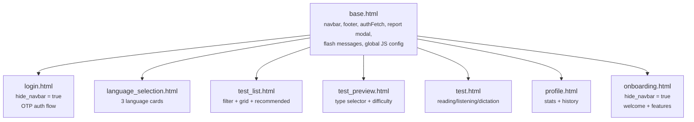

# Frontend Overview

> **Source files:** All files under `templates/` and `static/`

## Architecture

LinguaDojo uses **server-side rendering (SSR)** via Flask and Jinja2. There is no single-page application framework, no client-side router, and no build step. Every page is a full HTML document rendered on the server; JavaScript on each page handles interactivity, API calls, and DOM updates.

| Layer | Technology | Version / Notes |
|-------|-----------|----------------|
| Template engine | Jinja2 | Shipped with Flask |
| CSS framework | Bootstrap | 5.3.2 (CDN) |
| Icon library | Font Awesome | 6.5.1 (CDN) |
| Additional icons | Bootstrap Icons | 1.11.2 (CDN, language_selection only) |
| JavaScript | Vanilla JS | No frameworks, no bundlers |
| Auth | JWT + refresh tokens | Stored in `localStorage` |

## Templates

All templates live in `templates/` and extend `base.html`.

| Template | Route | Purpose |
|----------|-------|---------|
| `base.html` | -- | Base layout: navbar, footer, flash messages, report modal, `authFetch()`, global JS config |
| `login.html` | `/login` | Two-step OTP authentication (email then 6-digit code) |
| `language_selection.html` | `/language-selection` | Choose practice language (Chinese, English, Japanese) |
| `test_list.html` | `/tests` | Browse all tests with filters, recommended tests, random test |
| `test_preview.html` | `/test/<slug>/preview` | Preview test metadata and select test type before starting |
| `test.html` | `/test/<slug>` | Take a test: reading, listening, or dictation mode |
| `profile.html` | `/profile` | User stats, ELO ratings per language/skill, test history |
| `onboarding.html` | `/welcome` | Welcome page shown to first-time users after login |

## Static Assets

| File | Location | Purpose |
|------|----------|---------|
| `styles.css` | `static/css/styles.css` | Design system: CSS custom properties, component styles, utility classes |
| `utils.js` | `static/js/utils.js` | Shared utility library (~315 lines): ELO helpers, DOM helpers, API wrappers, storage helpers |

Both files are loaded by `base.html` and available on every page.

## Client-Side Authentication

Authentication is handled entirely on the client side via JWT tokens stored in `localStorage`:

- **`jwt_token`** -- Short-lived access token sent as `Authorization: Bearer <token>` header
- **`refresh_token`** -- Long-lived token used to obtain a new `jwt_token` when the current one expires
- **`user_data`** -- JSON object with user profile information
- **`selectedLanguageId`** -- The ID of the currently selected practice language

The global `window.authFetch()` function (defined in `base.html`, lines 180-246) wraps `fetch()` with automatic token refresh on 401 responses.

## Global JavaScript Configuration

Every page has access to the `window.LINGUADOJO` object, initialized in `base.html` (lines 166-170):

```javascript
window.LINGUADOJO = {
    API_BASE: "{{ url_for('index') }}",
    JWT_TOKEN: localStorage.getItem('jwt_token'),
    USER_DATA: JSON.parse(localStorage.getItem('user_data') || '{}')
};
```

## Template Inheritance Diagram



## Block Override Summary

`base.html` defines these Jinja2 blocks that child templates can override:

| Block | Default | Used by |
|-------|---------|---------|
| `title` | `LinguaDojo` | All child templates |
| `extra_css` | empty | All child templates (inline `<style>` blocks) |
| `body_class` | `bg-slate-50` | login, language_selection, test |
| `main_class` | `container py-4` | (not overridden by any current template) |
| `content` | empty | All child templates |
| `extra_js` | empty | All child templates (inline `<script>` blocks) |

Child templates can also set Jinja2 variables to control layout:

| Variable | Effect |
|----------|--------|
| `hide_navbar` | Hides the top navigation bar (used by `login.html`, `onboarding.html`) |
| `hide_footer` | Hides the page footer |

---

## Related Documents

- [02-templates/01-base-template.md](02-templates/01-base-template.md) -- Detailed base.html documentation
- [02-templates/02-page-reference.md](02-templates/02-page-reference.md) -- All child template documentation
- [03-static-assets.md](03-static-assets.md) -- styles.css and utils.js reference
- [04-client-auth-flow.md](04-client-auth-flow.md) -- Authentication flow details
