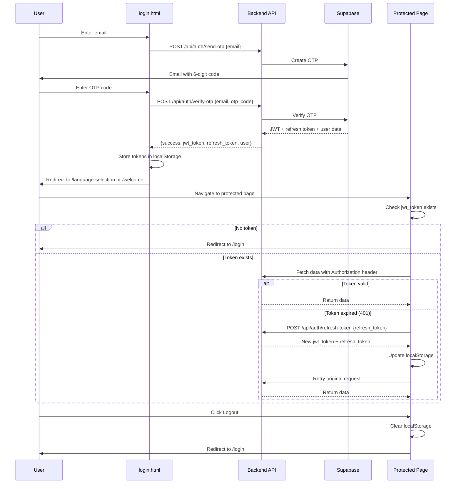

# Client-Side Authentication Flow

**Purpose**: Document the complete client-side authentication flow, token management, and protected route patterns in LinguaLoop/LinguaDojo.

---

## Authentication Overview

**Type**: JWT-based authentication with OTP (One-Time Password) login

**No Passwords**: The application uses passwordless authentication via email OTP codes.

**Token Storage**: `localStorage` (not cookies or sessionStorage)

**Token Refresh**: Automatic silent refresh on 401 responses

---

## Complete Authentication Flow



---

## LocalStorage Keys

### 1. jwt_token

**Purpose**: JWT access token for authenticated requests

**Format**: String (JWT token)

**Lifespan**: Short-lived (typically 1 hour, set by backend)

**Usage**:
```javascript
const token = localStorage.getItem('jwt_token');
headers['Authorization'] = `Bearer ${token}`;
```

**Source**: `templates/login.html:277`, `templates/base.html:168`

---

### 2. refresh_token

**Purpose**: Long-lived token for obtaining new access tokens

**Format**: String (refresh token from Supabase)

**Lifespan**: Long-lived (typically 30 days or longer)

**Usage**:
```javascript
const refreshToken = localStorage.getItem('refresh_token');
// Used in authFetch() when jwt_token expires
```

**Source**: `templates/login.html:282`, `templates/base.html:194`

---

### 3. user_data

**Purpose**: Cached user profile information

**Format**: JSON string (parsed object)

**Contains**:
```json
{
  "id": "user-uuid",
  "email": "user@example.com",
  "totalTestsTaken": 5,
  "created_at": "2024-01-01T00:00:00Z"
}
```

**Usage**:
```javascript
const userData = JSON.parse(localStorage.getItem('user_data') || '{}');
window.LINGUADOJO.USER_DATA = userData;
```

**Source**: `templates/login.html:278`, `templates/base.html:169`

---

### 4. selectedLanguage

**Purpose**: User's selected learning language

**Format**: JSON string

**Contains**:
```json
{
  "id": 1,
  "code": "cn",
  "name": "Chinese"
}
```

**Usage**: Filtering tests, displaying language indicator in navbar

**Source**: `templates/language_selection.html`, `templates/base.html:249`

---

## authFetch() - Automatic Token Refresh

The `authFetch()` function in `base.html` wraps the native `fetch()` API with automatic token refresh logic.

### Implementation

**Location**: `templates/base.html:180-246`

```javascript
window.authFetch = async function(url, options = {}) {
    const token = localStorage.getItem('jwt_token');

    // Set up headers with auth token
    options.headers = {
        'Content-Type': 'application/json',
        ...options.headers,
        'Authorization': `Bearer ${token}`
    };

    let response = await fetch(url, options);

    // If 401 Unauthorized, try to refresh the token
    if (response.status === 401) {
        const refreshToken = localStorage.getItem('refresh_token');

        if (refreshToken) {
            try {
                console.log('Token expired, attempting refresh...');
                const refreshResponse = await fetch('/api/auth/refresh-token', {
                    method: 'POST',
                    headers: { 'Content-Type': 'application/json' },
                    body: JSON.stringify({ refresh_token: refreshToken })
                });

                if (refreshResponse.ok) {
                    const data = await refreshResponse.json();

                    // Store new tokens
                    localStorage.setItem('jwt_token', data.jwt_token);
                    localStorage.setItem('refresh_token', data.refresh_token);
                    window.LINGUADOJO.JWT_TOKEN = data.jwt_token;

                    console.log('Token refreshed successfully, retrying request...');

                    // Retry the original request with new token
                    options.headers['Authorization'] = `Bearer ${data.jwt_token}`;
                    response = await fetch(url, options);
                } else {
                    // Refresh failed - clear tokens and redirect to login
                    console.error('Token refresh failed, redirecting to login');
                    localStorage.removeItem('jwt_token');
                    localStorage.removeItem('refresh_token');
                    localStorage.removeItem('user_data');
                    window.location.href = '/login';
                    return response;
                }
            } catch (e) {
                console.error('Token refresh error:', e);
                localStorage.removeItem('jwt_token');
                localStorage.removeItem('refresh_token');
                localStorage.removeItem('user_data');
                window.location.href = '/login';
                return response;
            }
        } else {
            // No refresh token available - redirect to login
            console.log('No refresh token, redirecting to login');
            localStorage.removeItem('jwt_token');
            localStorage.removeItem('user_data');
            window.location.href = '/login';
            return response;
        }
    }

    return response;
};
```

### Usage Example

```javascript
// In page scripts (test.html, profile.html, etc.)
const response = await authFetch('/api/tests/test/my-test-slug');
const data = await response.json();
```

---

## Silent Token Refresh

**Trigger**: 401 Unauthorized response from API

**Process**:
1. Detect 401 response
2. Attempt to refresh using `refresh_token`
3. If refresh succeeds:
   - Update `jwt_token` and `refresh_token` in localStorage
   - Retry original request with new token
4. If refresh fails:
   - Clear all auth data from localStorage
   - Redirect to `/login`

**Benefits**:
- Seamless user experience (no sudden logouts)
- Requests automatically recover from token expiration
- User doesn't see authentication errors

---

## Logout Flow

### Implementation

**Location**: `templates/base.html:281-292`

```javascript
const logoutBtn = document.getElementById('logout-btn');
if (logoutBtn) {
    logoutBtn.addEventListener('click', function(e) {
        e.preventDefault();

        // Clear all auth data
        localStorage.removeItem('jwt_token');
        localStorage.removeItem('refresh_token');
        localStorage.removeItem('user_data');

        // Redirect to login
        window.location.href = '/login';
    });
}
```

### Process

1. User clicks logout button (in navbar dropdown)
2. Clear all localStorage keys:
   - `jwt_token`
   - `refresh_token`
   - `user_data`
3. Redirect to `/login`

**Note**: No API call to backend for logout (client-side only). Server-side sessions are stateless (JWT).

---

## Protected Page Pattern

### Pattern 1: Check on Page Load

```javascript
// In page scripts
document.addEventListener('DOMContentLoaded', function() {
    // Check if already logged in
    if (!localStorage.getItem('jwt_token')) {
        window.location.href = '/login';
        return;
    }

    // Load protected content
    loadUserData();
});
```

**Example**: `templates/test.html`, `templates/profile.html`

---

### Pattern 2: Redirect if Already Logged In

```javascript
// In login.html
if (localStorage.getItem('jwt_token')) {
    window.location.href = '/language-selection';
}
```

**Prevents**: Logged-in users from accessing login page

**Source**: `templates/login.html:365-367`

---

## Global Configuration

### window.LINGUADOJO Object

**Location**: `templates/base.html:166-170`

```javascript
window.LINGUADOJO = {
    API_BASE: "{{ url_for('index') }}",
    JWT_TOKEN: localStorage.getItem('jwt_token'),
    USER_DATA: JSON.parse(localStorage.getItem('user_data') || '{}')
};
```

**Purpose**: Centralized configuration accessible from all page scripts

**Usage**:
```javascript
const token = window.LINGUADOJO.JWT_TOKEN;
const userId = window.LINGUADOJO.USER_DATA.id;
```

---

## Language Indicator

### updateLanguageIndicator()

**Purpose**: Display selected language in navbar

**Location**: `templates/base.html:248-276`

```javascript
function updateLanguageIndicator() {
    const savedLanguage = localStorage.getItem('selectedLanguage');
    if (savedLanguage) {
        const lang = JSON.parse(savedLanguage);

        const flagMap = {
            'en': '🇺🇸',
            'zh': '🇨🇳',
            'ja': '🇯🇵',
            'ko': '🇰🇷',
            'fr': '🇫🇷',
            'English': '🇺🇸',
            'Chinese': '🇨🇳',
            'Japanese': '🇯🇵'
        };

        const indicator = document.getElementById('navLanguageIndicator');
        const flag = document.getElementById('navLanguageFlag');
        const name = document.getElementById('navLanguageName');

        if (indicator && flag && name) {
            flag.textContent = flagMap[lang.code] || flagMap[lang.name] || '🌐';
            name.textContent = lang.name;
            indicator.style.display = 'flex';
        }
    }
}

document.addEventListener('DOMContentLoaded', function() {
    updateLanguageIndicator();
    // ...
});
```

**Display**: Shows flag emoji + language name in navbar (e.g., "🇨🇳 Chinese")

---

## Security Considerations

### 1. Token Storage

**Current**: `localStorage` (vulnerable to XSS)

**Alternatives**:
- `httpOnly` cookies (more secure, but requires server-side session management)
- Service Workers with encrypted storage

**Risk**: If XSS vulnerability exists, attacker can steal tokens from localStorage

**Mitigation**:
- Escape all user input (using `escapeHtml()` in utils.js)
- Content Security Policy headers
- Input validation on backend

---

### 2. Token Lifespan

**Short JWT lifespan** (e.g., 1 hour) minimizes window of exploitation

**Refresh token rotation**: New refresh token issued on each refresh

---

### 3. HTTPS Only

**Required**: All authentication must happen over HTTPS in production

**Prevents**: Man-in-the-middle attacks stealing tokens

---

## Error Handling

### Network Errors

```javascript
try {
    const response = await authFetch('/api/endpoint');
    if (!response.ok) throw new Error('Request failed');
    const data = await response.json();
} catch (error) {
    console.error('API error:', error);
    alert('Network error. Please try again.');
}
```

### Token Refresh Failures

Automatically handled by `authFetch()`:
- Logs error to console
- Clears localStorage
- Redirects to `/login`

---

## Related Documents

- [Base Template](./02-templates/01-base-template.md)
- [Page Reference (Login Page)](./02-templates/02-page-reference.md)
- [Auth Routes](../04-Backend/03-routes/01-auth-routes.md)
- [Auth Middleware](../04-Backend/04-middleware/01-auth-middleware.md)
- [Security Model](../02-Architecture/06-security-model.md)
- [Static Assets (utils.js)](./03-static-assets.md)
