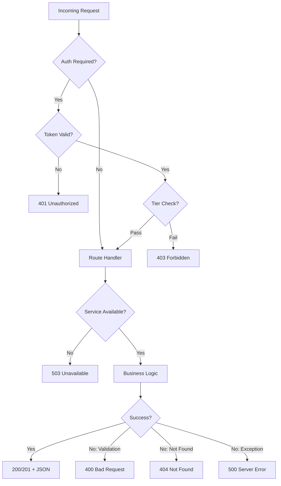

# Error Handling Patterns

> Source references: `routes/tests.py`, `routes/auth.py`, `routes/reports.py`, `app.py`, `middleware/auth.py`, `static/js/utils.js`, `services/test_generation/orchestrator.py`, `services/topic_generation/orchestrator.py`

---

## 1. Flask Route Error Handling

Every API route wraps its body in a try/except that returns a JSON error response:

```python
@tests_bp.route('/generate_test', methods=['POST'])
@supabase_jwt_required
def generate_test():
    try:
        # ... route logic ...
        return jsonify({"status": "success", ...}), 200
    except Exception as e:
        current_app.logger.error(f"UNEXPECTED ERROR in generate_test: {e}")
        current_app.logger.error(f"Traceback: {traceback.format_exc()}")
        return jsonify({
            "error": f"Test generation failed: {str(e)}",
            "status": "error",
            "step": "unexpected_error",
            "error_type": type(e).__name__
        }), 500
```

### Step-Level Error Reporting

Multi-step endpoints (like `generate_test`) use nested try/except blocks with a `step` field identifying where failure occurred:

```python
try:
    transcript = current_app.openai_service.generate_transcript(...)
except Exception as e:
    return jsonify({
        "error": f"Failed to generate transcript: {str(e)}",
        "status": "error",
        "step": "transcript_generation"      # <-- identifies the failing step
    }), 500

try:
    questions = current_app.openai_service.generate_questions(...)
except Exception as e:
    return jsonify({
        "error": f"Failed to generate questions: {str(e)}",
        "status": "error",
        "step": "question_generation"
    }), 500
```

Steps used in `generate_test`: `transcript_generation`, `question_generation`, `database_save`, `unexpected_error`.

### Non-Critical Failures

Some operations are allowed to fail without aborting the request. These log warnings instead of errors:

```python
try:
    audio_result = current_app.openai_service.generate_audio(transcript, slug)
except Exception as e:
    current_app.logger.warning(f"Audio generation failed (non-critical): {e}")
    # Continues -- test is still saved without audio
```

---

## 2. Global Error Handlers

Registered in `app.py` via `_register_error_handlers()`:

```python
@app.errorhandler(404)
def not_found(error):
    if request.path.startswith('/api/'):
        return jsonify({"error": "Endpoint not found", "status": "not_found"}), 404
    return redirect(url_for('login'))

@app.errorhandler(405)
def method_not_allowed(error):
    return jsonify({"error": "Method not allowed", "status": "method_not_allowed"}), 405

@app.errorhandler(500)
def internal_error(error):
    if request.path.startswith('/api/'):
        return jsonify({"error": "Internal server error", "status": "internal_error"}), 500
    return render_template('error.html', error="Internal server error"), 500
```

API routes (`/api/*`) always return JSON. Web routes redirect or render HTML error pages.

---

## 3. Authentication Error Handling

### Token Validation Errors

```python
# Missing token
if not token:
    return jsonify({'error': 'Token missing'}), 401

# Invalid/expired token
try:
    user_response = supabase.auth.get_user(token)
    if not user_response or not user_response.user:
        return jsonify({'error': 'Invalid or expired token'}), 401
except Exception as e:
    logger.error(f'JWT validation failed: {e}')
    return jsonify({'error': 'Invalid token'}), 401
```

### Admin/Tier Authorization Errors

```python
# Admin check failure
if result.data[0]['subscription_tier'] not in ['admin', 'moderator']:
    return jsonify({'error': 'Admin access required'}), 403

# Tier check failure
return jsonify({'error': f'Requires {" or ".join(required_tiers)} access'}), 403
```

### Auth Route Error Responses

Auth routes return a consistent shape even on failure, including `user: null` and `jwt_token: null`:

```python
return jsonify({
    'success': False,
    'error': 'Server error occurred',
    'message': 'Server error occurred',
    'user': None,
    'jwt_token': None
}), 500
```

---

## 4. HTTP Status Codes Used

| Code | Meaning | Usage |
|---|---|---|
| `200` | Success | Standard successful response |
| `201` | Created | Report submission (`POST /api/reports/submit`) |
| `400` | Bad Request | Missing/invalid parameters, invalid OTP, invalid package |
| `401` | Unauthorized | Missing token, invalid token, expired token |
| `403` | Forbidden | Insufficient tier, admin required |
| `404` | Not Found | Test not found, user not found, endpoint not found |
| `500` | Server Error | Unhandled exceptions, service failures |
| `503` | Service Unavailable | AI service or database not initialized |

---

## 5. Service Availability Checks

Routes check that services are available before proceeding:

```python
if not current_app.openai_service:
    return jsonify({"error": "AI service not available", "status": "error"}), 503

if not current_app.supabase_service:
    return jsonify({"error": "Database service not connected", "status": "error"}), 503
```

---

## 6. Database RPC Error Handling

The Supabase Python client sometimes throws exceptions for successful JSONB RPC responses. The codebase handles this explicitly:

```python
try:
    response = current_app.supabase_service.rpc('process_test_submission', {...}).execute()
    rpc_result = response.data
except Exception as e:
    error_data = e.json() if hasattr(e, 'json') else (e.args[0] if e.args else {})

    # Check if it's actually a successful JSONB response
    if isinstance(error_data, dict) and error_data.get('success'):
        rpc_result = error_data  # Treat as success
    else:
        return jsonify({"error": "Failed to process test submission"}), 500
```

After extracting the result, it validates the success flag:

```python
if not rpc_result or not rpc_result.get('success'):
    error_msg = rpc_result.get('error', 'Unknown error')
    return jsonify({"error": "Failed to process test submission", "details": error_msg}), 500
```

---

## 7. Pipeline Error Handling (Orchestrators)

### Per-Item Error Handling with Continuation

Both test and topic generation orchestrators catch errors per item and continue processing:

```python
for item in queue_items:
    try:
        tests_generated = self._process_queue_item(item)
        self.metrics.queue_items_processed += 1
    except Exception as e:
        logger.error(f"Failed to process queue item {item.id}: {e}")
        self.metrics.tests_failed += 1
        if not test_gen_config.dry_run:
            self.db.mark_queue_failed(item.id, str(e))
```

### Per-Difficulty Error Handling

Within a queue item, individual difficulty levels can fail independently:

```python
for difficulty in test_gen_config.target_difficulties:
    try:
        success = self._generate_test(topic, lang_config, category_name, difficulty)
    except Exception as e:
        logger.error(f"Failed to generate test at difficulty {difficulty}: {e}")
        # Continue with other difficulties
```

### Non-Critical Sub-Step Failures

Title generation failure does not abort test generation:

```python
try:
    title = self.title_generator.generate_title(...)
except Exception as e:
    logger.warning(f"Title generation failed, continuing with NULL title: {e}")
    title = None
```

### Metrics Persistence Failure

Even metrics saving is wrapped to prevent cascading failures:

```python
if not test_gen_config.dry_run:
    try:
        self.db.insert_generation_run(self.metrics)
    except Exception as e:
        logger.error(f"Failed to save metrics: {e}")
```

---

## 8. Client-Side Error Handling

### API Request Wrapper

`utils.js` provides `apiRequest()` which throws on non-OK responses:

```javascript
async function apiRequest(url, options = {}) {
    const response = await fetch(url, config);
    const data = await response.json();

    if (!response.ok) {
        throw new Error(data.error || data.message || 'Request failed');
    }

    return data;
}
```

Page-specific JavaScript should wrap API calls in try/catch:

```javascript
try {
    const result = await apiPost('/api/tests/generate_test', payload);
    // Handle success
} catch (error) {
    // Display error to user
    showError(error.message);
}
```

### Auth Error Recovery

The client stores refresh tokens and attempts silent refresh on 401 responses. If refresh fails, the user is redirected to the login page and tokens are cleared from `localStorage`.

---

## 9. Error Flow Diagram



---

## Related Documents

- [01-coding-conventions.md](./01-coding-conventions.md) -- General code patterns
- [03-api-response-format.md](./03-api-response-format.md) -- Response shapes
- [../12-PRD/02-feature-specifications/01-otp-authentication.md](../12-PRD/02-feature-specifications/01-otp-authentication.md) -- Auth error edge cases
