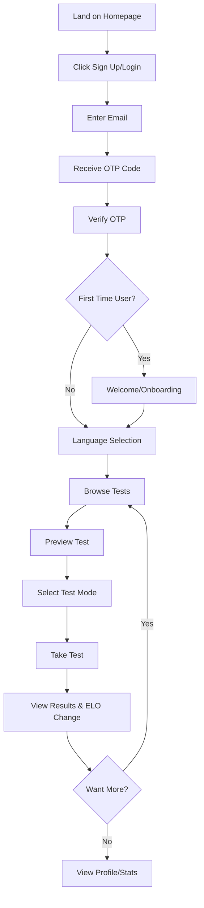
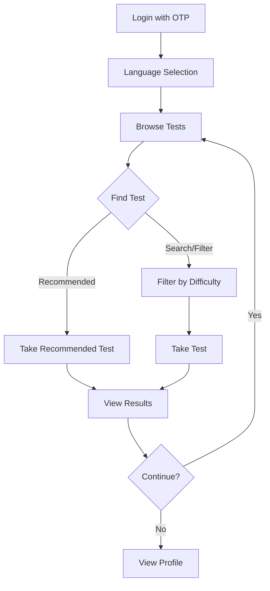

# Product Requirements Document

**Product Name**: LinguaDojo (formerly LinguaLoop)

**Version**: 1.0

**Last Updated**: 2024

---

## Executive Summary

LinguaDojo is an AI-powered language learning platform that helps users improve their listening comprehension, reading, and dictation skills through adaptive testing. The platform generates unlimited, personalized language tests using AI, tracks user progress with an ELO rating system, and provides multi-modal practice (reading, listening, dictation).

---

## Product Vision

**Mission**: Make language learning accessible, engaging, and adaptive through AI-generated content and personalized difficulty matching.

**Vision**: Become the leading platform for active language practice, where learners can practice any language at their exact skill level with unlimited, high-quality content.

**Value Proposition**:
- **Adaptive Difficulty**: ELO rating system ensures users always practice at their optimal level
- **Unlimited Content**: AI generates fresh, diverse tests on demand
- **Multi-Modal Practice**: Reading, listening, and dictation modes for comprehensive skill development
- **Progress Tracking**: Detailed statistics and ELO progression over time

---

## Target Users

### Primary Personas

#### 1. Self-Directed Language Learner
- **Age**: 18-45
- **Goal**: Improve listening comprehension in a new language
- **Pain Points**: Lack of level-appropriate practice materials, need for variety
- **Motivation**: Personal growth, travel preparation, career advancement

#### 2. Intermediate/Advanced Learner
- **Age**: 25-55
- **Goal**: Maintain and refine language skills
- **Pain Points**: Difficulty finding challenging content at their level
- **Motivation**: Professional development, staying sharp

#### 3. Test Preparation Student
- **Age**: 18-30
- **Goal**: Prepare for language proficiency exams (HSK, JLPT, TOEFL)
- **Pain Points**: Need for realistic test practice
- **Motivation**: Academic requirements, certification

---

## User Journey

### New User Flow

### Returning User Flow

---

## Core Features

### 1. Authentication
- **OTP-based login** (no passwords)
- Email-based verification with 6-digit codes
- JWT token management with refresh tokens
- Automatic token refresh on expiration

**Detailed Spec**: [OTP Authentication](./02-feature-specifications/01-otp-authentication.md)

---

### 2. Test Taking
- **3 Test Modes**: Reading, Listening, Dictation
- Multiple-choice questions (4 options)
- Audio playback with speed control
- Progress tracking during test
- Immediate results with correct/incorrect highlighting

**Detailed Spec**: [Test Taking](./02-feature-specifications/02-test-taking.md)

---

### 3. Test Generation (AI Pipeline)
- Automated test generation using 6-agent pipeline
- Topic-based content creation
- Quality validation and review
- Audio synthesis via Azure TTS
- Storage on Cloudflare R2

**Detailed Spec**: [Test Generation](./02-feature-specifications/03-test-generation.md)

---

### 4. Topic Generation (AI Pipeline)
- Daily automated topic discovery
- Similarity-based deduplication
- Category rotation and cooldown
- LLM-based quality gatekeeper
- Vector embedding for semantic search

**Detailed Spec**: [Topic Generation](./02-feature-specifications/04-topic-generation.md)

---

### 5. ELO Rating System
- Adaptive difficulty matching
- User and test ELO ratings
- Separate ratings per test mode (reading/listening/dictation)
- Standard ELO formula with K-factor 32
- Recommended test matching

**Detailed Spec**: [ELO Progression](./02-feature-specifications/06-elo-progression.md)

---

### 6. Token Economy & Payments
- Free daily allocation (2 tokens/day)
- Token costs: 1 for test, 5 for generation
- Stripe-powered purchases
- Multiple package sizes
- Auto-reset at midnight UTC

**Detailed Spec**: [Token Payments](./02-feature-specifications/05-token-payments.md)

---

### 7. Multi-Language Support
- Chinese, English, Japanese
- Language-specific LLM models
- Language-specific TTS voices
- Per-language user progress tracking

**Detailed Spec**: [Language Selection](./02-feature-specifications/08-language-selection.md)

---

### 8. User Reporting
- In-app issue reporting
- 6 report categories
- Auto-captured context (page, test, device info)
- Bilingual UI (EN/CN labels)

**Detailed Spec**: [User Reporting](./02-feature-specifications/07-user-reporting.md)

---

## Key Metrics

### Success Metrics

| Metric | Target | Measurement |
|--------|--------|-------------|
| **User Retention** | 40% Day-7, 20% Day-30 | Active users returning |
| **Tests Taken/User** | Avg 10/month | Test completion rate |
| **ELO Progression** | +100 per month (active users) | ELO change over time |
| **Test Quality Score** | >4.0/5.0 | User feedback ratings |
| **Token Purchase Conversion** | 5% of active users | Payment completion |

### Engagement Metrics

- Daily Active Users (DAU)
- Weekly Active Users (WAU)
- Average session duration
- Tests per session
- Test completion rate
- Mode distribution (reading vs listening vs dictation)

### Quality Metrics

- Test generation success rate (% without errors)
- Question validation pass rate
- Audio synthesis success rate
- Topic uniqueness (similarity < 0.85)

---

## Technical Requirements

### Performance

| Requirement | Target |
|-------------|--------|
| **Page Load Time** | <2 seconds (initial load) |
| **Test Load Time** | <1 second (cached) |
| **Audio Load Time** | <3 seconds (streaming) |
| **API Response Time** | <500ms (p95) |
| **Uptime** | 99.9% (excluding scheduled maintenance) |

### Scalability

- Support 10,000 concurrent users
- Handle 100,000 tests/day generation capacity
- Database query optimization for <100ms response
- CDN-cached static assets (R2 + Cloudflare)

### Security

- HTTPS only (production)
- JWT with short expiration (1 hour)
- Refresh token rotation
- Row Level Security (RLS) on all user data
- XSS prevention (input escaping)
- SQL injection prevention (parameterized queries)
- Rate limiting on auth endpoints

### Compatibility

- **Desktop Browsers**: Chrome, Firefox, Safari, Edge (latest 2 versions)
- **Mobile Browsers**: Safari (iOS), Chrome (Android)
- **Screen Sizes**: Responsive 320px - 2560px
- **Audio**: AAC/MP3 codec support required

---

## Non-Functional Requirements

### Accessibility

- Skip navigation links for keyboard users
- ARIA labels on interactive elements
- Keyboard navigation support
- Screen reader compatible (basic)
- Sufficient color contrast (WCAG AA)

### Internationalization

- Bilingual UI labels (English/Chinese)
- Language-specific content generation
- Right-to-left (RTL) not required (current languages)
- Unicode support for all languages

### Reliability

- Graceful degradation on network errors
- Retry logic for failed API calls
- Error logging and monitoring
- Data backup and recovery procedures
- Database migrations tracked and versioned

### Maintainability

- Modular codebase (services, routes, agents)
- Type hints throughout Python code
- Comprehensive documentation
- Clear separation of concerns (frontend/backend/pipelines)

---

## User Experience Requirements

### Onboarding

- **First-time users**: Welcome page explaining features
- **Returning users**: Direct to language selection
- **No tutorial required**: Intuitive UI

### Navigation

- Persistent navbar with language indicator
- Breadcrumb-style navigation
- Back to test list from results
- Quick access to profile and logout

### Feedback

- Loading states for all async operations
- Success/error messages for user actions
- Progress indicators during tests
- ELO change displayed prominently after test

### Visual Design

- Clean, modern aesthetic
- Bootstrap 5 component library
- Blue color scheme (primary: #3b82f6)
- Consistent typography and spacing
- Mobile-responsive layout

---

## Content Requirements

### Test Content

- **Difficulty Range**: 9 levels (1-9) mapped to CEFR (A1-C2)
- **Topics**: Diverse categories (daily life, culture, science, business, etc.)
- **Question Quality**: Validated for correctness and clarity
- **Audio Quality**: Clear, native-speaker quality TTS

### Topic Diversity

- 50+ categories across languages
- Lenses (perspectives) for varied angles
- Cooldown period to prevent category fatigue
- Similarity checking to avoid duplicates

---

## Future Enhancements (Out of Scope v1)

- [ ] Speaking practice mode (voice recording)
- [ ] Writing practice mode (essay grading)
- [ ] Social features (leaderboards, friends)
- [ ] Achievement badges and gamification
- [ ] Mobile native apps (iOS/Android)
- [ ] Additional languages (Spanish, French, Korean)
- [ ] Vocabulary builder with spaced repetition
- [ ] Custom test creation by users
- [ ] Teacher dashboard for classroom use
- [ ] API for third-party integrations

---

## Constraints and Assumptions

### Technical Constraints

- 3 languages only (Chinese, English, Japanese)
- OTP-only authentication (no passwords, OAuth, or social login)
- Single Supabase project (no multi-tenancy)
- No real-time features (no WebSockets)
- No automated testing suite (manual QA)
- No CI/CD pipeline (manual deployment)

### Business Constraints

- Free tier limited to 2 tests/day
- Token costs hardcoded (not configurable per user)
- Payment via Stripe only
- Audio via Azure TTS only (no alternatives)
- No refund mechanism for tokens

### Assumptions

- Users have stable internet connection
- Users' browsers support modern JavaScript (ES6+)
- Audio playback supported in user's browser
- Users willing to check email for OTP codes
- Stripe availability in user's region

---

## Success Criteria

### MVP Launch Criteria

- [x] OTP authentication working
- [x] 3 test modes functional (reading, listening, dictation)
- [x] Test generation pipeline stable
- [x] Topic generation pipeline stable
- [x] ELO system calculating correctly
- [x] Payment integration with Stripe
- [x] Mobile-responsive UI
- [x] Error reporting functional

### v1.0 Success Criteria

- [ ] 1,000+ registered users
- [ ] 10,000+ tests taken
- [ ] 40% Day-7 retention
- [ ] <2s page load time
- [ ] 99.9% uptime
- [ ] Positive user feedback (>4.0/5.0)

---

## Related Documents

- [OTP Authentication Spec](./02-feature-specifications/01-otp-authentication.md)
- [Test Taking Spec](./02-feature-specifications/02-test-taking.md)
- [Test Generation Spec](./02-feature-specifications/03-test-generation.md)
- [Topic Generation Spec](./02-feature-specifications/04-topic-generation.md)
- [Token Payments Spec](./02-feature-specifications/05-token-payments.md)
- [ELO Progression Spec](./02-feature-specifications/06-elo-progression.md)
- [User Reporting Spec](./02-feature-specifications/07-user-reporting.md)
- [Language Selection Spec](./02-feature-specifications/08-language-selection.md)
