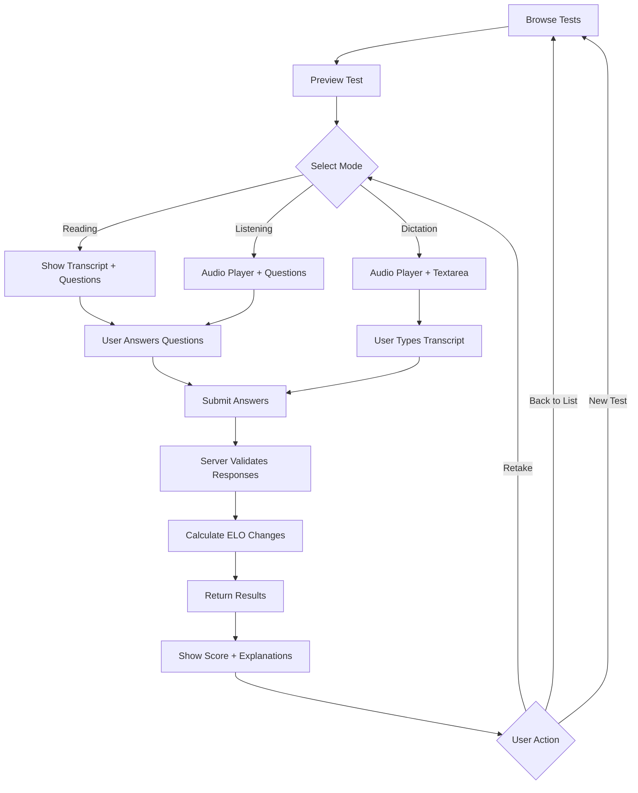

# Feature Specification: Test Taking

**Status**: Production
**Last Updated**: 2026-02-14
**Owner**: Backend Team
**Version**: 1.0

---

## Overview

The test-taking feature is the core learning experience in LinguaLoop/LinguaDojo. Users browse available language tests, select from three different test modes (Reading, Listening, Dictation), answer questions, and receive immediate feedback with ELO-based skill ratings that adapt to their performance.

---

## User Stories

### As a user browsing tests
- I want to browse available tests by difficulty and language
- I want to see test metadata (difficulty, language, topic, ELO rating)
- I want to preview a test before committing to take it
- I want to see recommended tests based on my current skill level

### As a user taking a test
- I want to choose between Reading, Listening, or Dictation modes
- I want to see my progress during the test (X of Y questions answered)
- I want to play/pause audio and adjust playback speed (Listening/Dictation modes)
- I want visual feedback when I answer each question
- I want to navigate between questions before submitting

### As a user reviewing results
- I want to submit my answers and see which I got right/wrong
- I want to see detailed explanations for each question
- I want to see how my ELO rating changed after the test
- I want to retake tests without affecting my ELO (for practice)

---

## Test Modes

### 1. Reading Mode
**Description**: Display full transcript, answer comprehension questions

**User Experience**:
- Transcript displayed in full at top of page
- 5 multiple-choice questions below transcript
- Users read at their own pace
- No audio playback required

**Scoring**: Based on comprehension of written text

---

### 2. Listening Mode
**Description**: Play audio, answer questions WITHOUT seeing transcript

**User Experience**:
- Audio player displayed at top
- No transcript visible (hidden)
- 5 multiple-choice questions visible
- Users listen to audio (can replay)

**Audio Controls**:
- Play/Pause button
- Progress bar with seek functionality
- Time display (current / total duration)
- Speed control: 0.75x, 1.0x, 1.25x, 1.5x
- Replay as many times as needed

**Scoring**: Based on listening comprehension

---

### 3. Dictation Mode
**Description**: Play audio, type what you hear (transcription)

**User Experience**:
- Audio player displayed at top
- Large textarea for user to type transcript
- No questions shown (single submission field)
- Users listen and type what they hear

**Scoring**: Levenshtein similarity algorithm
- **Pass threshold**: ≥80% similarity to correct transcript
- **Scoring formula**: Edit distance / max(user_length, correct_length)
- Case-insensitive comparison
- Punctuation normalized

---

## Test Taking Flow



---

## Question Structure

### Question Types
- **Multiple choice**: 4 options (A, B, C, D)
- **Single correct answer** per question
- **5 questions** per test (typical)
- Question types vary by difficulty:
  - **Type 1**: Direct comprehension (what/who/where)
  - **Type 2**: Inference (why/how/implication)
  - **Type 3**: Analysis (theme/tone/purpose)

### Question Distribution by Difficulty
| Difficulty | Type 1 | Type 2 | Type 3 |
|-----------|--------|--------|--------|
| 1-3 (A1-A2) | 4 | 1 | 0 |
| 4-6 (B1-B2) | 2 | 2 | 1 |
| 7-9 (C1-C2) | 1 | 2 | 2 |

---

## Audio Player Features

### Playback Controls
- **Play/Pause**: Toggle audio playback
- **Progress Bar**: Visual timeline with seek capability
- **Time Display**: Shows `current_time / total_duration` (e.g., "1:23 / 3:45")
- **Speed Control**: Dropdown or buttons for 0.75x, 1.0x, 1.25x, 1.5x
- **Replay**: Users can replay audio unlimited times

### Technical Requirements
- **Format**: MP3, 192kbps
- **Preload**: Metadata preloaded (`<audio preload="metadata">`)
- **Accessibility**: Keyboard controls (spacebar = play/pause)
- **Mobile-friendly**: Touch controls, responsive design

---

## Test Submission Logic

### Client-Side (Frontend)
1. Collect user responses for all questions
2. Build responses array:
   ```json
   {
     "responses": [
       {
         "question_id": "uuid-1",
         "selected_answer": "B"
       },
       {
         "question_id": "uuid-2",
         "selected_answer": "A"
       }
     ],
     "test_mode": "reading"
   }
   ```
3. POST to `/api/tests/{slug}/submit`
4. Display loading state during submission

### Server-Side (Backend)
1. Validate test exists and is active
2. Get correct answers from `questions` table
3. Compare user responses to correct answers
4. Calculate score and percentage
5. Calculate ELO changes (if first attempt)
6. Record attempt in `test_attempts` table
7. Update user and test ELO ratings
8. Return detailed results

### Database RPC Function
**Function**: `process_test_submission`

**Parameters**:
```sql
p_user_id: UUID
p_test_id: UUID
p_language_id: INTEGER
p_test_type_id: INTEGER (1=reading, 2=listening, 3=dictation)
p_responses: JSONB (array of {question_id, selected_answer})
p_was_free_test: BOOLEAN
p_idempotency_key: UUID
```

**Returns**:
```json
{
  "success": true,
  "attempt_id": "uuid",
  "score": 4,
  "total_questions": 5,
  "percentage": 80,
  "is_first_attempt": true,
  "user_elo_before": 1400,
  "user_elo_after": 1412.5,
  "user_elo_change": 12.5,
  "test_elo_before": 1450,
  "test_elo_after": 1442.3,
  "test_elo_change": -7.7,
  "question_results": [
    {
      "question_id": "uuid-1",
      "question_text": "What is...",
      "selected_answer": "B",
      "correct_answer": "B",
      "is_correct": true,
      "answer_explanation": "Explanation text..."
    }
  ]
}
```

---

## Results Display

### Score Summary
```
Score: 4/5 (80%)
ELO Change: +12.5 (1400 → 1412.5)
```

### Question-by-Question Feedback
For each question, display:
- Question text
- User's selected answer (highlighted)
- Correct answer (if different)
- Visual indicator:
  - ✅ **Correct**: Green left border
  - ❌ **Incorrect**: Red left border
- Answer explanation (always shown after submission)

### Success Message
```
Great job! You scored 4 out of 5.
Your skill rating increased by 12.5 points.
```

### Action Buttons
- **Back to Test List**: Return to browse tests
- **Retake Test**: Practice mode (no ELO change)
- **Find Similar Tests**: Recommended tests at similar difficulty

---

## Acceptance Criteria

### Test Preview
- Display test title, difficulty, language, topic
- Show test mode options (Reading, Listening, Dictation)
- Show estimated time to complete
- Display current user ELO vs test ELO (skill match)

### During Test
- All questions must be answered before submit button is enabled
- Timer displays elapsed time (MM:SS format)
- Progress indicator: "Question 3 of 5 answered"
- Audio can be played multiple times in Listening/Dictation modes
- Question navigation: click to jump between questions
- Visual feedback: answered questions highlighted in nav

### Submission Validation
- Client-side: Ensure all questions answered
- Server-side: Validate question IDs exist
- Server-side: Validate selected answers are valid choices
- Idempotency: Duplicate submissions return cached result

### Post-Submission
- Results cannot be changed after submission
- **First attempt**: ELO ratings update (user and test)
- **Retakes**: Allowed but don't affect ELO
- Results page shows all question explanations
- User can navigate away and return to results later

---

## ELO Rating System

### Initial Ratings
- **New users**: Start at 1400 ELO per language
- **New tests**: Initial ELO based on difficulty (1200-1600)

### Rating Calculation
- **Algorithm**: Standard ELO with K-factor = 32
- **Expected score**: `E = 1 / (1 + 10^((R_opponent - R_player) / 400))`
- **Rating change**: `ΔR = K × (S - E)`
  - S = actual score (0.0 to 1.0)
  - E = expected score (0.0 to 1.0)
  - K = volatility factor (32 for new users, decreases with attempts)

### Per-Mode ELO
- Users have **separate ELO ratings** for each test mode:
  - Reading ELO
  - Listening ELO
  - Dictation ELO
- Tests have **separate ELO ratings** for each mode
- Ratings stored in `user_skill_ratings` and `test_skill_ratings` tables

---

## API Endpoints

### GET /api/tests
Get list of available tests with ELO ratings.

**Query Parameters**:
- `language_id`: Filter by language (1=Chinese, 2=English, 3=Japanese)
- `difficulty`: Filter by difficulty (1-9)
- `limit`: Max results (default 50)

**Response**:
```json
{
  "success": true,
  "tests": [
    {
      "id": "uuid",
      "slug": "test-slug",
      "title": "Test Title",
      "language_id": 1,
      "difficulty": 5,
      "listening_rating": 1450,
      "reading_rating": 1420,
      "dictation_rating": 1480,
      "total_attempts": 150,
      "is_featured": false
    }
  ]
}
```

---

### GET /api/tests/{slug}
Get test details including questions.

**Response**:
```json
{
  "status": "success",
  "test": {
    "id": "uuid",
    "slug": "test-slug",
    "title": "Test Title",
    "language": "chinese",
    "language_name": "Chinese",
    "difficulty": 5,
    "transcript": "Full transcript text...",
    "audio_url": "https://cdn.example.com/audio.mp3",
    "questions": [
      {
        "id": "uuid",
        "question_id": "test-slug-q1",
        "question_text": "What is...?",
        "choices": ["A) Option A", "B) Option B", "C) Option C", "D) Option D"],
        "answer": "B",
        "answer_explanation": "Explanation..."
      }
    ]
  }
}
```

---

### POST /api/tests/{slug}/submit
Submit test answers and calculate results.

**Request Body**:
```json
{
  "responses": [
    {
      "question_id": "uuid-1",
      "selected_answer": "B"
    }
  ],
  "test_mode": "reading"
}
```

**Response**: See "Database RPC Function" section above.

---

### GET /api/tests/recommended
Get recommended tests based on user ELO.

**Query Parameters**:
- `language_id`: Required

**Response**:
```json
{
  "success": true,
  "recommended_tests": [
    {
      "slug": "test-slug",
      "title": "Test Title",
      "difficulty": 5,
      "elo_match_score": 0.95,
      "reason": "Well-matched to your reading level"
    }
  ]
}
```

---

## Data Model

### tests table
- `id` (UUID): Primary key
- `slug` (text): URL-friendly identifier
- `title` (text): Test title
- `language_id` (integer): FK to dim_languages
- `topic_id` (UUID): FK to topics
- `difficulty` (integer): 1-9 scale
- `transcript` (text): Full text content
- `audio_url` (text): CDN URL to audio file
- `total_attempts` (integer): Aggregate attempt count
- `is_active` (boolean): Availability flag

### questions table
- `id` (UUID): Primary key
- `test_id` (UUID): FK to tests
- `question_id` (text): Human-readable ID (e.g., "test-slug-q1")
- `question_text` (text): Question content
- `question_type_id` (integer): FK to dim_question_types
- `choices` (text[]): Array of answer options
- `answer` (text): Correct answer (A, B, C, or D)
- `answer_explanation` (text): Explanation text
- `points` (integer): Question weight (default 1)

### test_attempts table
- `id` (UUID): Primary key
- `user_id` (UUID): FK to users
- `test_id` (UUID): FK to tests
- `test_type_id` (integer): FK to dim_test_types
- `score` (integer): Number correct
- `total_questions` (integer): Total questions
- `percentage` (numeric): Score as percentage
- `user_elo_before` (integer): ELO before attempt
- `user_elo_after` (integer): ELO after attempt
- `test_elo_before` (integer): Test ELO before
- `test_elo_after` (integer): Test ELO after
- `is_first_attempt` (boolean): ELO update flag
- `created_at` (timestamp): Submission time

### test_skill_ratings table
- `test_id` (UUID): FK to tests
- `test_type_id` (integer): FK to dim_test_types (reading/listening/dictation)
- `elo_rating` (integer): Current ELO for this mode
- `volatility` (integer): K-factor
- `total_attempts` (integer): Attempt count for this mode

### user_skill_ratings table
- `user_id` (UUID): FK to users
- `language_id` (integer): FK to dim_languages
- `test_type_id` (integer): FK to dim_test_types
- `elo_rating` (integer): Current ELO
- `volatility` (integer): K-factor
- `total_attempts` (integer): Attempt count

---

## Edge Cases & Error Handling

### Test Not Found
- **Response**: 404 with message "Test not found"
- **Cause**: Invalid slug or inactive test

### Incomplete Responses
- **Client-side**: Disable submit until all answered
- **Server-side**: Return 400 "All questions must be answered"

### Invalid Question IDs
- **Validation**: Check all question_id values exist in database
- **Response**: 400 "Invalid question ID"

### Invalid Answer Choices
- **Validation**: Ensure selected_answer in ['A', 'B', 'C', 'D']
- **Response**: 400 "Invalid answer choice"

### Audio Playback Failures
- **Fallback**: Display transcript in Listening mode if audio fails
- **Error message**: "Audio unavailable, transcript displayed"
- **Retry**: Allow user to retry audio load

### Duplicate Submission
- **Idempotency**: Use idempotency_key to detect duplicates
- **Response**: Return cached result from first submission
- **No double ELO update**: Check is_first_attempt flag

### Network Error During Submission
- **Retry**: Automatic retry with exponential backoff
- **User feedback**: "Submitting... (retrying)"
- **Timeout**: 30 second max wait time

---

## Performance Considerations

- **Audio preload**: Metadata only (not full file) to reduce bandwidth
- **Question lazy load**: Load questions only when test starts
- **ELO calculation**: Performed in database (single RPC call)
- **Result caching**: Cache results for 24 hours (for retakes)
- **Pagination**: Limit test lists to 50 items per page

---

## Accessibility

- **Keyboard navigation**: Arrow keys for question navigation
- **Screen readers**: ARIA labels on all controls
- **Audio transcript**: Available as fallback for hearing-impaired
- **High contrast mode**: Support system preferences
- **Font scaling**: Responsive to user font size settings

---

## Related Documents

- [Product Requirements Document](../01-product-requirements.md)
- [ELO Rating System](../../10-Systems/elo-system.md)
- [Test Service](../../04-Backend/services/test_service.md)
- [API Reference: Test Endpoints](../../07-API-Reference/test-endpoints.md)
- [Database Schema: tests](../../03-Database/tables/tests.md)
- [Database Schema: questions](../../03-Database/tables/questions.md)
- [Database Schema: test_attempts](../../03-Database/tables/test_attempts.md)
- [Database Function: process_test_submission](../../03-Database/functions/process_test_submission.md)

---

## Source Files

- Backend: `c:\Users\James\Documents\Coding\LinguaLoop\WebApp\routes\tests.py`
- Frontend: `c:\Users\James\Documents\Coding\LinguaLoop\WebApp\templates\test.html`
- Service: `c:\Users\James\Documents\Coding\LinguaLoop\WebApp\services\test_service.py`
- Database: `c:\Users\James\Documents\Coding\LinguaLoop\WebApp\migrations\process_test_submission_v2.sql`

---

## Change Log

| Date | Version | Changes | Author |
|------|---------|---------|--------|
| 2026-02-14 | 1.0 | Initial specification | Backend Team |
