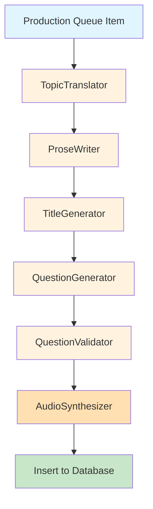

# Feature Specification: Test Generation Pipeline

**Status**: Production
**Last Updated**: 2026-02-14
**Owner**: AI Pipelines Team
**Version**: 1.0

---

## Overview

The test generation pipeline is an automated, multi-agent AI system that produces high-quality language learning tests from topic queue items. Using a 6-agent architecture, the pipeline translates topics, generates CEFR-aligned prose, creates comprehension questions, validates answers, and synthesizes native-speaker audio.

---

## Purpose

Transform approved topic queue items into complete, production-ready language tests at multiple difficulty levels without manual intervention.

**Input**: Queue items from `production_queue` table
**Output**: Complete tests in `tests` and `questions` tables with audio files on R2

---

## Pipeline Architecture



---

## 6-Agent Pipeline

### Agent 1: TopicTranslator

**Purpose**: Translate English topic to target language

**Input**:
- `topic_concept`: English topic name (e.g., "Solar System Exploration")
- `keywords`: English keywords (e.g., ["planets", "NASA", "orbit"])
- `target_language`: Language name (e.g., "Chinese")
- `model_override`: Optional LLM model

**Output**:
- `translated_topic`: Topic in target language (e.g., "太阳系探索")
- `translated_keywords`: Keywords in target language (e.g., ["行星", "美国航空航天局", "轨道"])

**LLM**: OpenRouter (Gemini Flash 2.0)
**Skip for**: English tests (returns original topic)

**Prompt Template**: Database-stored translation prompt

---

### Agent 2: ProseWriter

**Purpose**: Generate CEFR-aligned narrative/transcript

**Input**:
- `topic_concept`: Translated topic name
- `language_name`: Target language (e.g., "Chinese")
- `language_code`: ISO code (e.g., "zh")
- `difficulty`: 1-9 scale
- `word_count_min`: Min words based on CEFR level
- `word_count_max`: Max words based on CEFR level
- `keywords`: Translated keywords
- `cefr_level`: A1, A2, B1, B2, C1, C2
- `prompt_template`: Language-specific prose template
- `model_override`: Optional LLM model

**Output**:
- `prose`: Complete transcript text (200-600 words depending on difficulty)

**LLM**: OpenRouter (Gemini Flash 2.0)
**Temperature**: 0.9 (high creativity)

**Prompt Template**: `prose_generation` (from database, per language)

**Word Count Targets by Difficulty**:
| Difficulty | CEFR | Word Range |
|-----------|------|------------|
| 1 | A1 | 100-150 |
| 2-3 | A2 | 150-250 |
| 4-5 | B1 | 250-350 |
| 6 | B2 | 350-450 |
| 7-8 | C1 | 450-550 |
| 9 | C2 | 550-700 |

**Quality Checks**:
- Word count within target range ±10%
- CEFR-appropriate vocabulary
- Natural narrative flow
- Cultural appropriateness

---

### Agent 3: TitleGenerator

**Purpose**: Create engaging, descriptive test title

**Input**:
- `prose`: Generated transcript
- `topic_concept`: Translated topic
- `difficulty`: 1-9 scale
- `cefr_level`: CEFR code
- `language_name`: Target language
- `language_code`: ISO code
- `prompt_template`: Title generation template
- `model_override`: Optional LLM model

**Output**:
- `title`: Short, engaging title (5-10 words)

**LLM**: OpenRouter (Gemini Flash 2.0)
**Temperature**: 0.7

**Prompt Template**: `title_generation` (from database, per language)

**Title Guidelines**:
- Concise (5-10 words max)
- Descriptive of content
- Engaging and clear
- In target language
- No clickbait or sensationalism

**Error Handling**: If title generation fails, set title to NULL (non-blocking)

---

### Agent 4: QuestionGenerator

**Purpose**: Generate 5 comprehension questions with multiple choice answers

**Input**:
- `prose`: Generated transcript
- `language_name`: Target language
- `question_type_codes`: Distribution of question types (e.g., ["type_1", "type_1", "type_2", "type_2", "type_3"])
- `difficulty`: 1-9 scale
- `prompt_templates`: Dict of {type_code: prompt_template}
- `model_override`: Optional LLM model

**Output**:
- `questions`: Array of 5 question objects:
  ```json
  [
    {
      "type_code": "type_1",
      "question": "What is the main topic?",
      "choices": ["A) Option A", "B) Option B", "C) Option C", "D) Option D"],
      "answer": "B",
      "explanation": "Explanation text..."
    }
  ]
  ```

**LLM**: OpenRouter (Gemini Flash 2.0)
**Temperature**: 0.7

**Prompt Templates**:
- `question_type_1`: Direct comprehension (what/who/where/when)
- `question_type_2`: Inference (why/how/implication)
- `question_type_3`: Analysis (theme/tone/purpose/author's intent)

**Question Type Distribution by Difficulty**:
| Difficulty | Type 1 | Type 2 | Type 3 |
|-----------|--------|--------|--------|
| 1-3 (A1-A2) | 4 | 1 | 0 |
| 4-6 (B1-B2) | 2 | 2 | 1 |
| 7-9 (C1-C2) | 1 | 2 | 2 |

**Question Requirements**:
- Exactly 4 choices (A, B, C, D)
- Single correct answer per question
- Answer must be one of the choices
- No "all of the above" or "none of the above"
- Distractors should be plausible
- Explanation references the prose

---

### Agent 5: QuestionValidator

**Purpose**: Validate answer correctness and question quality

**Input**:
- `questions`: Array of generated questions
- `prose`: Original transcript

**Output**:
- `valid_questions`: Array of validated questions
- `errors`: Array of validation error messages

**LLM**: OpenRouter (Gemini Flash 2.0)
**Temperature**: 0.3 (low, for consistency)

**Validation Checks**:
1. **Answer in choices**: Correct answer (e.g., "B") exists in choices array
2. **Answer correctness**: Verify answer is actually correct based on prose
3. **No ambiguity**: Only one answer should be clearly correct
4. **Distractor quality**: Wrong answers shouldn't be obviously incorrect
5. **Question clarity**: Question text is clear and well-formed

**Error Handling**:
- Log all validation errors
- If < 3 valid questions remain, FAIL the test generation
- If 3-4 valid questions, WARN but continue
- If 5 valid questions, SUCCESS

**Prompt Template**: `question_validation` (from database)

---

### Agent 6: AudioSynthesizer

**Purpose**: Generate high-quality TTS audio and upload to R2

**Input**:
- `text`: Prose transcript
- `file_id`: Test UUID (used for filename)
- `voice`: Voice ID for target language
- `speed`: Playback speed (default 1.0)

**Output**:
- `audio_url`: Full CDN URL to audio file on R2 (e.g., "https://r2.example.com/audio/test-uuid.mp3")

**Service**: Azure Cognitive Services TTS
**Fallback**: OpenAI TTS (if Azure fails)

**Voice Selection by Language**:
| Language | Voice ID | Gender | Region |
|----------|----------|--------|--------|
| Chinese | zh-CN-XiaoxiaoNeural | Female | Mainland China |
| English | en-US-JennyNeural | Female | United States |
| Japanese | ja-JP-NanamiNeural | Female | Japan |

**Audio Specifications**:
- **Format**: MP3
- **Bitrate**: 192kbps
- **Sample rate**: 44.1kHz
- **Mono**: Single channel
- **Duration**: 1-5 minutes (depending on prose length)

**Storage**:
- **Service**: Cloudflare R2
- **Bucket**: `lingualoop-audio`
- **Path**: `audio/{test_uuid}.mp3`
- **CDN**: Served via Cloudflare CDN (low latency worldwide)

**Error Handling**:
- Retry up to 3 times with exponential backoff
- If all retries fail, test saved without audio (audio_generated=false)
- Audio can be regenerated later via separate job

---

## Pipeline Orchestration

### Workflow Steps

1. **Fetch Queue Items**
   - Query `production_queue` table for `status_id = 'pending'`
   - Limit to `batch_size` items (default 50)
   - Mark as `status_id = 'processing'`

2. **For Each Queue Item**
   - Get topic details from `topics` table
   - Get language config from `dim_languages` table
   - Get category name from `dim_categories` table

3. **For Each Target Difficulty** (default: [1, 3, 6, 9])
   - Get CEFR config (word counts, initial ELO)
   - Get question type distribution
   - Generate test slug: `{language_code}-d{difficulty}-{topic_slug}`

4. **Run 6-Agent Pipeline**
   - Execute agents sequentially (each depends on previous output)
   - Log progress at each stage
   - Collect metrics (API calls, tokens, time)

5. **Save to Database**
   - Insert test record into `tests` table
   - Insert 5 question records into `questions` table
   - Insert skill ratings into `test_skill_ratings` table (for all 3 modes)

6. **Update Queue**
   - Mark queue item as `status_id = 'completed'`
   - Increment `tests_generated` counter
   - If errors, mark as `status_id = 'failed'` with error log

---

## Configuration

Configuration defined in `services/test_generation/config.py`:

```python
@dataclass
class TestGenConfig:
    # Generation parameters
    batch_size: int = 50  # Max queue items per run
    target_difficulties: List[int] = [1, 3, 6, 9]  # A2, B2, C2
    questions_per_test: int = 5

    # LLM Configuration
    default_prose_model: str = 'google/gemini-2.0-flash-exp'
    default_question_model: str = 'google/gemini-2.0-flash-exp'
    prose_temperature: float = 0.9
    question_temperature: float = 0.7

    # TTS Configuration
    default_tts_model: str = 'tts-1'
    default_tts_voice: str = 'alloy'
    default_tts_speed: float = 1.0

    # Retry Configuration
    max_retries: int = 3
    retry_delay: float = 2.0  # seconds

    # Operational Settings
    dry_run: bool = False  # If true, don't insert to DB
    log_level: str = 'INFO'

    # System user ID (for gen_user field)
    system_user_id: str = 'de6fd05b-0871-45d4-a2d8-0195fdf5355e'
```

**Environment Variables**:
- `TEST_GEN_BATCH_SIZE`: Override batch size
- `TEST_GEN_TARGET_DIFFICULTIES`: JSON array of difficulties
- `TEST_GEN_PROSE_MODEL`: Override LLM model for prose
- `TEST_GEN_QUESTION_MODEL`: Override LLM model for questions
- `TEST_GEN_DRY_RUN`: Set to 'true' for testing
- `OPENROUTER_API_KEY`: Required for LLM calls
- `OPENAI_API_KEY`: Required for TTS and embeddings

---

## Quality Gates

### 1. Transcript Length Validation
- Word count must be within target range ±10%
- **Pass**: 180-220 words for difficulty 2 (target 200)
- **Fail**: < 160 or > 240 words

### 2. Question Validation
- All questions validated by QuestionValidator
- Minimum 3 valid questions required (out of 5)
- **Pass**: 5/5 questions valid
- **Warn**: 3-4/5 questions valid (continue)
- **Fail**: < 3 questions valid (abort test)

### 3. Answer in Options
- Correct answer (e.g., "B") must exist in choices array
- **Pass**: All answers present
- **Fail**: Any missing answer

### 4. No Duplicate Questions
- Question text uniqueness check
- **Pass**: All questions unique
- **Warn**: Duplicates detected (log and continue)

### 5. Audio Synthesis Success
- Audio generation completes without errors
- **Pass**: Audio uploaded to R2, URL returned
- **Fail**: Audio generation fails (test saved without audio)

---

## Error Handling

### Per-Item Error Handling
- Each queue item processed in try/except block
- Errors logged to `production_queue.error_log`
- Failed items marked as `status_id = 'failed'`
- Pipeline continues with next queue item

### Agent-Level Error Handling
- LLM API errors: Retry up to 3 times with exponential backoff
- Parse errors: Log and fail gracefully
- TTS errors: Save test without audio (non-blocking)

### Critical Failures
- No queue items: Exit gracefully (exit code 0)
- Database connection lost: Exit with error (exit code 2)
- Configuration invalid: Exit with error (exit code 2)

---

## Metrics

### Per-Run Metrics
Stored in `test_generation_runs` table:

```json
{
  "run_date": "2026-02-14T10:30:00Z",
  "queue_items_processed": 10,
  "tests_generated": 37,
  "tests_failed": 3,
  "execution_time_seconds": 450,
  "error_message": null
}
```

### Per-Agent Metrics
- API calls made (LLM, TTS, embedding)
- Tokens consumed
- Average response time
- Error rate

### Quality Metrics
- Average word count per difficulty
- Question validation pass rate
- Audio synthesis success rate
- Average ELO rating by difficulty

---

## Data Model

### production_queue table
- `id` (UUID): Primary key
- `topic_id` (UUID): FK to topics
- `language_id` (integer): FK to dim_languages
- `status_id` (integer): FK to dim_queue_statuses
- `created_at` (timestamp)
- `updated_at` (timestamp)
- `tests_generated` (integer): Count of tests created
- `error_log` (text): Error details if failed

### tests table
- `id` (UUID): Primary key
- `slug` (text): URL-friendly identifier (e.g., "zh-d5-solar-exploration")
- `language_id` (integer): FK to dim_languages
- `topic_id` (UUID): FK to topics
- `difficulty` (integer): 1-9
- `title` (text): Test title (nullable)
- `transcript` (text): Full prose content
- `audio_url` (text): CDN URL to audio file
- `audio_generated` (boolean): Audio availability flag
- `gen_user` (UUID): FK to users (system user)
- `is_active` (boolean): Published flag
- `created_at` (timestamp)
- `updated_at` (timestamp)

### questions table
- `id` (UUID): Primary key
- `test_id` (UUID): FK to tests
- `question_id` (text): Human-readable ID (e.g., "zh-d5-solar-q1")
- `question_text` (text): Question content
- `question_type_id` (integer): FK to dim_question_types
- `choices` (text[]): Array of answer options
- `answer` (text): Correct answer (A, B, C, or D)
- `answer_explanation` (text): Explanation text
- `points` (integer): Question weight (default 1)

### test_skill_ratings table
- `test_id` (UUID): FK to tests
- `test_type_id` (integer): FK to dim_test_types (1=reading, 2=listening, 3=dictation)
- `elo_rating` (integer): Initial ELO (based on difficulty)
- `volatility` (integer): K-factor (32 for new tests)
- `total_attempts` (integer): 0 initially

---

## Scheduling

### Cron Job
```bash
# Run test generation every hour
0 * * * * /path/to/scripts/run_test_generation.py
```

### Manual Execution
```bash
# Run locally (dry run mode)
TEST_GEN_DRY_RUN=true python scripts/run_test_generation.py

# Run in production
python scripts/run_test_generation.py
```

### CI/CD Integration
- Runs as background job after topic generation
- Triggered by queue item insertion
- Monitored via metrics dashboard

---

## Performance Considerations

### Throughput
- **Single test**: ~30-60 seconds (all agents)
- **Batch of 50 items**: ~45 minutes (with 4 difficulties each = 200 tests)
- **Bottleneck**: Audio synthesis (10-15 seconds per test)

### Optimization Strategies
- Parallel audio generation (async upload)
- LLM request batching (where possible)
- Database bulk insert (questions, ratings)
- R2 multipart upload for large audio files

### Resource Usage
- **Memory**: ~500MB per orchestrator instance
- **CPU**: Low (I/O bound, waiting on API calls)
- **Network**: High (audio upload, API calls)
- **Cost**: ~$0.10 per test (LLM + TTS + storage)

---

## Exit Codes

| Code | Meaning | Description |
|------|---------|-------------|
| 0 | Success | All tests generated successfully |
| 1 | Partial Success | Some tests generated, some failed |
| 2 | Failure | No tests generated (critical error) |

---

## Related Documents

- [Product Requirements Document](../01-product-requirements.md)
- [Topic Generation Pipeline](04-topic-generation.md)
- [Test Generation Orchestrator](../../05-Pipelines/test-generation-pipeline.md)
- [Prompt Templates](../../09-Prompts/test-generation-prompts.md)
- [Database Schema: tests](../../03-Database/tables/tests.md)
- [Database Schema: questions](../../03-Database/tables/questions.md)
- [Database Schema: production_queue](../../03-Database/tables/production_queue.md)
- [Audio Synthesis](../../10-Systems/audio-synthesis.md)

---

## Source Files

- Orchestrator: `c:\Users\James\Documents\Coding\LinguaLoop\WebApp\services\test_generation\orchestrator.py`
- Configuration: `c:\Users\James\Documents\Coding\LinguaLoop\WebApp\services\test_generation\config.py`
- Agents: `c:\Users\James\Documents\Coding\LinguaLoop\WebApp\services\test_generation\agents\`
- Database Client: `c:\Users\James\Documents\Coding\LinguaLoop\WebApp\services\test_generation\database_client.py`
- Run Script: `c:\Users\James\Documents\Coding\LinguaLoop\WebApp\scripts\run_test_generation.py`

---

## Change Log

| Date | Version | Changes | Author |
|------|---------|---------|--------|
| 2026-02-14 | 1.0 | Initial specification | AI Pipelines Team |
