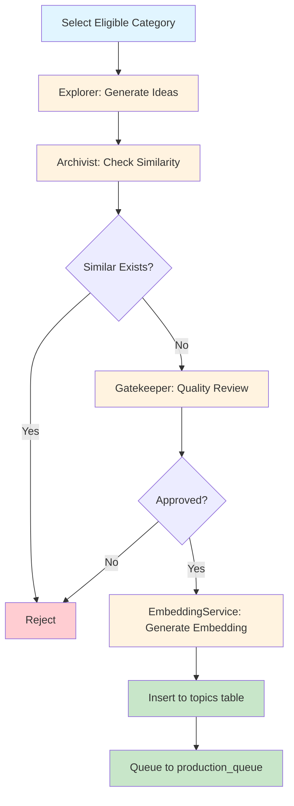

# Feature Specification: Topic Generation Pipeline

**Status**: Production
**Last Updated**: 2026-02-14
**Owner**: AI Pipelines Team
**Version**: 1.0

---

## Overview

The topic generation pipeline is an automated, multi-agent AI system that creates diverse, culturally-appropriate topics for language test content. Using a 4-agent architecture with semantic similarity checking, the pipeline ensures topic novelty while maintaining quality and cultural sensitivity across all supported languages.

---

## Purpose

Generate a steady stream of unique, high-quality topic candidates for the test generation pipeline, maintaining diversity across categories and avoiding semantic duplication.

**Input**: None (scheduled job)
**Output**: New topics in `topics` table, queued items in `production_queue`

---

## Pipeline Architecture



---

## 4-Agent Pipeline

### Agent 1: Explorer

**Purpose**: Generate creative topic ideas from diverse perspectives

**Input**:
- `category_name`: Category to explore (e.g., "Science & Technology")
- `active_lenses`: List of perspective lenses (e.g., "Historical", "Cultural", "Controversial")
- `prompt_template`: Explorer ideation prompt (from database)
- `num_candidates`: Number of ideas to generate (default 10)

**Output**:
- `candidates`: Array of topic ideas:
  ```json
  [
    {
      "concept": "The Evolution of Smartphone Technology",
      "lens_code": "historical",
      "keywords": ["iPhone", "Android", "touchscreen", "mobile computing"]
    }
  ]
  ```

**LLM**: OpenRouter (Gemini Flash 2.0)
**Temperature**: 0.8 (high creativity)

**Prompt Template**: `explorer_ideation` (from database)

**Lens Types**:
| Lens Code | Description | Example Topics |
|-----------|-------------|----------------|
| historical | Past events, evolution | "History of Space Exploration" |
| cultural | Cultural perspectives | "Tea Ceremonies Across Asia" |
| controversial | Debatable topics | "AI Ethics in Healthcare" |
| scientific | Scientific concepts | "Quantum Computing Basics" |
| practical | Real-world applications | "Urban Farming Techniques" |

**Diversity Strategy**:
- Each run uses 3-5 random lenses
- Lenses rotated across categories
- Explorer encouraged to think laterally

---

### Agent 2: Archivist

**Purpose**: Check semantic similarity to prevent duplicate topics

**Input**:
- `category_id`: Category UUID
- `semantic_signature`: Constructed signature (category + concept + lens + keywords)
- `similarity_threshold`: Cosine similarity cutoff (default 0.85)

**Output**:
- `is_novel`: Boolean (true if topic is unique enough)
- `rejection_reason`: Explanation if rejected
- `embedding`: 1536-dim vector embedding

**Method**:
1. Construct semantic signature: `{category_name} | {concept} | {lens} | {keywords}`
2. Generate embedding via EmbeddingService
3. Query pgvector for similar embeddings in same category
4. Calculate cosine similarity
5. Reject if similarity ≥ threshold

**Similarity Threshold**: 0.85 (configurable via `TOPIC_SIMILARITY_THRESHOLD`)

**Database Query**:
```sql
SELECT
    id,
    concept_english,
    1 - (embedding <=> $1) AS similarity
FROM topics
WHERE category_id = $2
    AND 1 - (embedding <=> $1) >= $3
ORDER BY similarity DESC
LIMIT 1;
```

**Edge Cases**:
- First topic in category: Always novel
- Exact duplicates: Similarity = 1.0 (rejected)
- Paraphrases: Similarity ~0.90-0.95 (rejected)
- Different angles: Similarity ~0.70-0.80 (accepted)

---

### Agent 3: Gatekeeper

**Purpose**: LLM-based quality and cultural sensitivity review

**Input**:
- `candidate`: Topic object with concept, lens, keywords
- `language`: Target language for cultural review
- `prompt_template`: Gatekeeper check prompt (from database)

**Output**:
- `approved`: Boolean
- `reasoning`: Explanation for decision

**LLM**: OpenRouter (GPT-4)
**Temperature**: 0.3 (low, for consistency)

**Prompt Template**: `gatekeeper_check` (from database)

**Review Criteria**:
1. **Appropriateness**: Suitable for language learners of all ages
2. **Cultural Sensitivity**: No offensive content for target culture
3. **Educational Value**: Provides learning opportunity
4. **Clarity**: Topic is well-defined and understandable
5. **Interest**: Engaging and relevant to modern learners

**Rejection Reasons**:
- Politically sensitive topics
- Religious or cultural taboos
- Overly niche or obscure
- Duplicate of existing concept
- Potentially offensive content

**Short-Circuit Optimization**:
- If 3+ languages reject in a row, abort (don't check remaining languages)
- Threshold configurable via `TOPIC_GATEKEEPER_SHORT_CIRCUIT`

---

### Agent 4: EmbeddingService

**Purpose**: Generate vector embeddings for semantic search

**Input**:
- `text`: Semantic signature string

**Output**:
- `embedding`: 1536-dimensional vector (float array)

**Model**: OpenAI `text-embedding-3-small`
**Dimensions**: 1536 (fixed)

**Usage**:
- Generate embedding for semantic signature
- Store in `topics.embedding` (pgvector column)
- Used by Archivist for similarity search

**Cost**: ~$0.02 per 1M tokens (~$0.0001 per embedding)

---

## Pipeline Orchestration

### Workflow Steps

1. **Load Dimension Data**
   - Fetch active languages from `dim_languages`
   - Fetch active lenses from `dim_lenses`
   - Build lens map for validation

2. **Select Next Category**
   - Query `dim_categories` for eligible categories:
     - `is_active = true`
     - Not used recently (cooldown period)
   - Order by `last_used_at ASC` (least recently used first)
   - Select first category

3. **Fetch Prompt Templates**
   - Load `explorer_ideation` template
   - Load `gatekeeper_check` template
   - Templates stored in `prompt_templates` table

4. **Explorer: Generate Candidates**
   - Pass category name, lenses, prompt to Explorer
   - Receive 10 topic candidates
   - Log API calls and metrics

5. **For Each Candidate** (max daily quota)
   - Validate lens exists in lens map
   - Construct semantic signature
   - Check novelty via Archivist
   - If novel:
     - Save topic to `topics` table
     - Run Gatekeeper for each language
     - Queue approved (language, topic) pairs

6. **Batch Queue Insertion**
   - Insert all approved pairs to `production_queue`
   - Set `status_id = 'pending'`

7. **Update Category**
   - Update `last_used_at` timestamp
   - Increment `topics_generated` count

8. **Log Metrics**
   - Save run metrics to `topic_generation_runs` table

---

## Configuration

Configuration defined in `services/topic_generation/config.py`:

```python
@dataclass
class TopicGenConfig:
    # Generation parameters
    daily_topic_quota: int = 5  # Max topics to generate per run
    similarity_threshold: float = 0.85  # Cosine similarity cutoff
    max_candidates_per_run: int = 10  # Explorer output size

    # LLM Configuration
    llm_model: str = 'google/gemini-2.0-flash-exp'
    llm_temperature: float = 0.8
    gatekeeper_temperature: float = 0.3

    # Embedding Configuration
    embedding_model: str = 'text-embedding-3-small'
    embedding_dimensions: int = 1536  # Fixed

    # Gatekeeper Configuration
    gatekeeper_short_circuit_threshold: int = 3  # Abort after 3 rejections

    # Operational Settings
    dry_run: bool = False  # If true, don't insert to DB
    log_level: str = 'INFO'
```

**Environment Variables**:
- `TOPIC_DAILY_QUOTA`: Override daily quota
- `TOPIC_SIMILARITY_THRESHOLD`: Override similarity threshold
- `TOPIC_MAX_CANDIDATES`: Override Explorer output size
- `TOPIC_LLM_MODEL`: Override LLM model
- `TOPIC_DRY_RUN`: Set to 'true' for testing
- `OPENROUTER_API_KEY`: Required for LLM calls
- `OPENAI_API_KEY`: Required for embeddings

---

## Quality Gates

### 1. Similarity Check
- **Threshold**: < 0.85 cosine similarity
- **Scope**: Within same category only
- **Pass**: Similarity < 0.85
- **Reject**: Similarity ≥ 0.85

### 2. Gatekeeper LLM Approval
- **Criteria**: Appropriate, interesting, culturally sensitive
- **Languages**: Must pass for at least 1 language
- **Pass**: Gatekeeper approves for 1+ languages
- **Reject**: All gatekeepers reject

### 3. Embedding Generation Success
- **Model**: OpenAI text-embedding-3-small
- **Pass**: Embedding generated (1536 dims)
- **Fail**: API error (retry up to 3 times)

### 4. Category Cooldown Respected
- **Cooldown**: 24 hours since last use
- **Pass**: Category not used in past 24 hours
- **Skip**: Category used recently (select next)

---

## Metrics

### Per-Run Metrics
Stored in `topic_generation_runs` table:

```json
{
  "run_date": "2026-02-14T10:30:00Z",
  "category_id": 1,
  "category_name": "Science & Technology",
  "candidates_proposed": 10,
  "topics_generated": 5,
  "topics_rejected_similarity": 3,
  "topics_rejected_gatekeeper": 2,
  "api_calls_llm": 15,
  "api_calls_embedding": 10,
  "total_cost_usd": 0.0023,
  "execution_time_seconds": 45,
  "error_message": null
}
```

### Success Metrics
- **Topics generated**: Count of approved topics
- **Rejection rate (similarity)**: % rejected due to duplicates
- **Rejection rate (gatekeeper)**: % rejected due to quality/culture
- **Success rate**: topics_generated / candidates_proposed

### Cost Metrics
- **LLM calls**: Explorer + Gatekeeper API calls
- **Embedding calls**: EmbeddingService API calls
- **Estimated cost**: ~$0.001 per topic (~$0.005 per run)

---

## Data Model

### topics table
- `id` (UUID): Primary key
- `category_id` (UUID): FK to dim_categories
- `concept_english` (text): English topic name
- `lens_id` (integer): FK to dim_lenses
- `keywords` (text[]): Array of keywords
- `embedding` (vector(1536)): Semantic embedding (pgvector)
- `semantic_signature` (text): Full signature for similarity
- `is_active` (boolean): Availability flag
- `created_at` (timestamp)
- `updated_at` (timestamp)

### production_queue table
- `id` (UUID): Primary key
- `topic_id` (UUID): FK to topics
- `language_id` (integer): FK to dim_languages
- `status_id` (integer): FK to dim_queue_statuses (1=pending, 2=processing, 3=completed, 4=failed)
- `created_at` (timestamp)
- `updated_at` (timestamp)
- `tests_generated` (integer): Count of tests created
- `error_log` (text): Error details if failed

### dim_categories table
- `id` (UUID): Primary key
- `name` (text): Category name (e.g., "Science & Technology")
- `description` (text): Category description
- `is_active` (boolean): Availability flag
- `last_used_at` (timestamp): Last topic generation time
- `topics_generated` (integer): Total topics created

### dim_lenses table
- `id` (integer): Primary key
- `lens_code` (text): Code (e.g., "historical")
- `lens_name` (text): Display name (e.g., "Historical")
- `description` (text): Lens description
- `is_active` (boolean): Availability flag

### dim_languages table
- `id` (integer): Primary key
- `language_code` (text): ISO code (e.g., "zh")
- `language_name` (text): Display name (e.g., "Chinese")
- `is_active` (boolean): Availability flag

---

## Category Selection Strategy

### Eligibility Criteria
1. `is_active = true`
2. `last_used_at IS NULL` OR `last_used_at < NOW() - INTERVAL '24 hours'`

### Selection Algorithm
```sql
SELECT id, name
FROM dim_categories
WHERE is_active = true
    AND (last_used_at IS NULL OR last_used_at < NOW() - INTERVAL '24 hours')
ORDER BY last_used_at ASC NULLS FIRST
LIMIT 1;
```

### Rotation Strategy
- Categories used in round-robin fashion
- Cooldown prevents over-representation
- New categories prioritized (`NULLS FIRST`)

### Edge Cases
- **No eligible categories**: Raise `NoEligibleCategoryError`, exit code 2
- **All categories recently used**: Wait for cooldown to expire
- **New category added**: Immediately eligible for use

---

## Error Handling

### Per-Candidate Error Handling
- Validation errors: Skip candidate, continue with next
- Unknown lens: Log warning, skip candidate
- Similarity check error: Retry up to 3 times, then skip

### Agent-Level Error Handling
- **Explorer fails**: Abort run (no candidates to process)
- **Archivist fails**: Skip candidate (assume non-novel)
- **Gatekeeper fails**: Skip language (try next language)
- **EmbeddingService fails**: Retry 3x, then skip candidate

### Critical Failures
- No eligible categories: Exit code 2
- Database connection lost: Exit code 2
- Configuration invalid: Exit code 2

### Non-Critical Failures
- Some candidates rejected: Continue (log metrics)
- Gatekeeper rejects all languages: Skip topic
- Quota reached: Exit normally (exit code 0)

---

## Exit Codes

| Code | Meaning | Description |
|------|---------|-------------|
| 0 | Success | All topics generated successfully (or quota reached) |
| 1 | Partial Success | Some topics generated, some failed |
| 2 | Failure | No topics generated (critical error) |

---

## Scheduling

### Cron Job
```bash
# Run topic generation daily at 2 AM
0 2 * * * /path/to/scripts/run_topic_generation.py
```

### Manual Execution
```bash
# Run locally (dry run mode)
TOPIC_DRY_RUN=true python scripts/run_topic_generation.py

# Run in production
python scripts/run_topic_generation.py
```

### CI/CD Integration
- Runs as scheduled daily job
- Monitored via metrics dashboard
- Alerts on consecutive failures

---

## Performance Considerations

### Throughput
- **Single topic**: ~5-10 seconds (all agents)
- **Full run (5 topics)**: ~30-60 seconds
- **Bottleneck**: LLM API calls (Gatekeeper reviews)

### Optimization Strategies
- Short-circuit Gatekeeper after 3 rejections
- Cache lens map (avoid repeated DB queries)
- Batch embedding generation (future)
- Parallel Gatekeeper reviews (future)

### Resource Usage
- **Memory**: ~300MB per orchestrator instance
- **CPU**: Low (I/O bound, waiting on API calls)
- **Network**: Moderate (API calls)
- **Cost**: ~$0.005 per run (~$1.50/month at daily frequency)

---

## Topic Diversity Strategies

### Lens Rotation
- Use 3-5 random lenses per run
- Rotate lenses across categories
- Track lens usage to ensure balance

### Category Rotation
- Round-robin category selection
- 24-hour cooldown between uses
- Prevents clustering in popular categories

### Semantic Distance
- Reject similar topics (≥85% similarity)
- Encourage lateral thinking in prompts
- Review keywords for diversity

### Quality over Quantity
- Daily quota: 5 topics (not aggressive)
- Prefer high-quality, unique topics
- Reject edge cases proactively

---

## Semantic Signature Construction

**Format**: `{category_name} | {concept} | {lens} | {keywords}`

**Example**:
```
Science & Technology | The Evolution of Smartphone Technology | historical | iPhone, Android, touchscreen, mobile computing
```

**Purpose**: Comprehensive representation for similarity matching

**Components**:
1. **Category**: Contextualizes the topic domain
2. **Concept**: Core topic idea
3. **Lens**: Perspective angle
4. **Keywords**: Key terms for fine-grained matching

---

## Related Documents

- [Product Requirements Document](../01-product-requirements.md)
- [Test Generation Pipeline](03-test-generation.md)
- [Topic Generation Orchestrator](../../05-Pipelines/topic-generation-pipeline.md)
- [Prompt Templates](../../09-Prompts/topic-generation-prompts.md)
- [Database Schema: topics](../../03-Database/tables/topics.md)
- [Database Schema: production_queue](../../03-Database/tables/production_queue.md)
- [Database Schema: dim_categories](../../03-Database/tables/dim_categories.md)
- [Semantic Search](../../10-Systems/semantic-search.md)

---

## Source Files

- Orchestrator: `c:\Users\James\Documents\Coding\LinguaLoop\WebApp\services\topic_generation\orchestrator.py`
- Configuration: `c:\Users\James\Documents\Coding\LinguaLoop\WebApp\services\topic_generation\config.py`
- Agents: `c:\Users\James\Documents\Coding\LinguaLoop\WebApp\services\topic_generation\agents\`
- Database Client: `c:\Users\James\Documents\Coding\LinguaLoop\WebApp\services\topic_generation\database_client.py`
- Run Script: `c:\Users\James\Documents\Coding\LinguaLoop\WebApp\scripts\run_topic_generation.py`

---

## Change Log

| Date | Version | Changes | Author |
|------|---------|---------|--------|
| 2026-02-14 | 1.0 | Initial specification | AI Pipelines Team |
