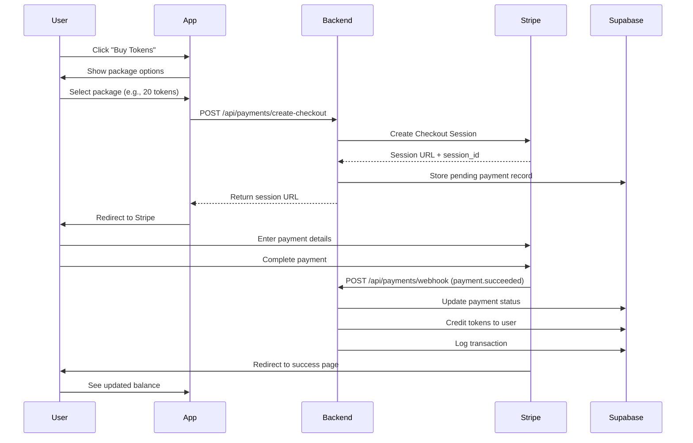
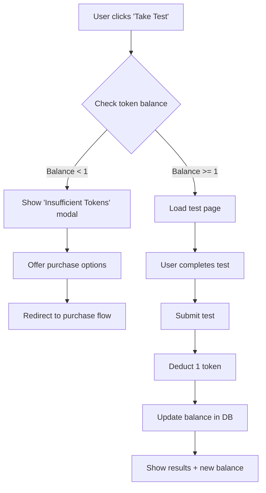
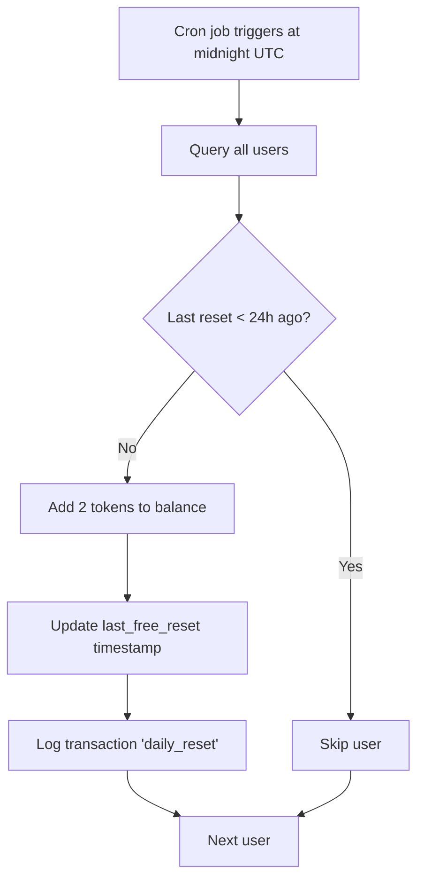

# Feature Specification: Token Payments

**Feature ID**: F-005
**Feature Name**: Token Economy & Payment System
**Status**: Active
**Last Updated**: 2026-02-14

---

## 1. Overview

### Purpose
The token payment system provides a freemium model where users receive free daily tokens for practice and can purchase additional tokens through Stripe-powered checkout sessions.

### Scope
- Free daily token allocation
- Token balance tracking and display
- Token-gated test taking and generation
- Stripe integration for token purchases
- Transaction history and audit trail

---

## 2. User Stories

### Core User Stories
- **US-005-01**: As a user, I want to receive free tokens daily to practice without paying
- **US-005-02**: As a user, I want to see my current token balance so I know how many tests I can take
- **US-005-03**: As a user, I want to purchase more tokens when I run out
- **US-005-04**: As a user, I want tokens deducted only when I successfully take/generate a test
- **US-005-05**: As a user, I want to see my token transaction history

### Extended User Stories
- **US-005-06**: As a user, I want to be notified when my balance is low
- **US-005-07**: As a user, I want my purchase to be reflected immediately after payment
- **US-005-08**: As a user, I want my free tokens to reset automatically at midnight UTC

---

## 3. Token Economy Design

### Free Daily Allocation
- **Amount**: 2 tokens per day
- **Reset Time**: Midnight UTC
- **Persistence**: Balance carries over (no expiration)
- **Cap**: No maximum balance limit

### Token Costs
| Action | Cost | Notes |
|--------|------|-------|
| Take Test | 1 token | Deducted after submission |
| Generate Test | 5 tokens | Deducted after successful generation |
| Daily Reset | +2 tokens | Free allocation |

### Stripe Packages
```python
STRIPE_PACKAGES = {
    'package_5': {'tokens': 5, 'price': 4.99},      # $1.00 per token
    'package_20': {'tokens': 20, 'price': 14.99},   # $0.75 per token
    'package_50': {'tokens': 50, 'price': 29.99},   # $0.60 per token
    'package_100': {'tokens': 100, 'price': 49.99}  # $0.50 per token
}
```

**Value Proposition**: Larger packages offer better per-token pricing (up to 50% savings).

---

## 4. User Flows

### 4.1 Purchase Flow



### 4.2 Token Deduction Flow



### 4.3 Daily Reset Flow



---

## 5. API Endpoints

### 5.1 GET /api/user/token-balance
**Description**: Get current token balance and last free reset time.

**Authentication**: Required

**Response**:
```json
{
  "success": true,
  "balance": 12,
  "last_free_reset": "2026-02-14T00:00:00Z",
  "next_reset": "2026-02-15T00:00:00Z"
}
```

### 5.2 POST /api/payments/create-checkout
**Description**: Create Stripe checkout session for token purchase.

**Authentication**: Required

**Request Body**:
```json
{
  "package": "package_20"
}
```

**Response**:
```json
{
  "success": true,
  "session_url": "https://checkout.stripe.com/...",
  "session_id": "cs_test_..."
}
```

**Error Response** (invalid package):
```json
{
  "success": false,
  "error": "Invalid package selected"
}
```

### 5.3 POST /api/payments/webhook
**Description**: Handle Stripe webhook events (payment.succeeded, payment.failed).

**Authentication**: Stripe signature verification

**Request Body** (Stripe event):
```json
{
  "type": "checkout.session.completed",
  "data": {
    "object": {
      "id": "cs_test_...",
      "metadata": {
        "user_id": "uuid",
        "package": "package_20"
      },
      "payment_status": "paid"
    }
  }
}
```

**Processing**:
1. Verify Stripe signature
2. Check event type
3. Extract user_id and package from metadata
4. Credit tokens to user
5. Log transaction
6. Return 200 OK

**Idempotency**: Use Stripe event_id to prevent duplicate processing.

---

## 6. Data Model

### 6.1 user_tokens
Primary table for tracking user token balances.

```sql
CREATE TABLE user_tokens (
    user_id UUID PRIMARY KEY REFERENCES auth.users(id),
    balance INTEGER NOT NULL DEFAULT 2,
    last_free_reset TIMESTAMP WITH TIME ZONE DEFAULT NOW(),
    created_at TIMESTAMP WITH TIME ZONE DEFAULT NOW(),
    updated_at TIMESTAMP WITH TIME ZONE DEFAULT NOW()
);
```

**Indexes**:
- PRIMARY KEY on user_id
- INDEX on last_free_reset (for daily reset queries)

### 6.2 token_transactions
Audit log for all token movements.

```sql
CREATE TABLE token_transactions (
    id UUID PRIMARY KEY DEFAULT uuid_generate_v4(),
    user_id UUID NOT NULL REFERENCES auth.users(id),
    amount INTEGER NOT NULL,
    type VARCHAR(50) NOT NULL,
    description TEXT,
    metadata JSONB,
    created_at TIMESTAMP WITH TIME ZONE DEFAULT NOW()
);
```

**Transaction Types**:
- `purchase`: Bought tokens via Stripe
- `daily_reset`: Free daily allocation
- `test_taken`: Spent 1 token taking a test
- `test_generated`: Spent 5 tokens generating a test
- `admin_adjustment`: Manual adjustment by admin

**Example Records**:
```sql
-- Purchase
INSERT INTO token_transactions VALUES (
    uuid_generate_v4(),
    'user-uuid',
    20,
    'purchase',
    'Purchased 20 tokens',
    '{"package": "package_20", "stripe_session_id": "cs_test_..."}',
    NOW()
);

-- Daily reset
INSERT INTO token_transactions VALUES (
    uuid_generate_v4(),
    'user-uuid',
    2,
    'daily_reset',
    'Daily free token allocation',
    NULL,
    NOW()
);

-- Test taken
INSERT INTO token_transactions VALUES (
    uuid_generate_v4(),
    'user-uuid',
    -1,
    'test_taken',
    'Took test: Chinese Daily Routines',
    '{"test_id": "test-uuid"}',
    NOW()
);
```

### 6.3 stripe_payments
Track Stripe payment sessions.

```sql
CREATE TABLE stripe_payments (
    id UUID PRIMARY KEY DEFAULT uuid_generate_v4(),
    user_id UUID NOT NULL REFERENCES auth.users(id),
    stripe_session_id VARCHAR(255) UNIQUE NOT NULL,
    package VARCHAR(50) NOT NULL,
    amount_usd DECIMAL(10,2) NOT NULL,
    tokens_credited INTEGER NOT NULL,
    status VARCHAR(50) NOT NULL,
    created_at TIMESTAMP WITH TIME ZONE DEFAULT NOW(),
    completed_at TIMESTAMP WITH TIME ZONE
);
```

**Status Values**:
- `pending`: Checkout session created
- `completed`: Payment succeeded, tokens credited
- `failed`: Payment failed
- `cancelled`: User cancelled checkout

---

## 7. Business Logic

### 7.1 Balance Check (Pre-Action)
**Location**: `routes/tests.py`, `routes/generate.py`

```python
def check_token_balance(user_id, required_tokens):
    """Check if user has sufficient tokens."""
    balance = get_user_balance(user_id)
    if balance < required_tokens:
        return {
            'success': False,
            'error': 'Insufficient tokens',
            'balance': balance,
            'required': required_tokens
        }
    return {'success': True, 'balance': balance}
```

### 7.2 Token Deduction (Post-Action)
**Timing**: Only after successful test submission or generation.

```python
def deduct_tokens(user_id, amount, transaction_type, description, metadata=None):
    """Deduct tokens and log transaction."""
    # Update balance
    supabase.table('user_tokens').update({
        'balance': supabase.rpc('decrement_balance', {'amount': amount}),
        'updated_at': 'NOW()'
    }).eq('user_id', user_id).execute()

    # Log transaction
    supabase.table('token_transactions').insert({
        'user_id': user_id,
        'amount': -amount,
        'type': transaction_type,
        'description': description,
        'metadata': metadata
    }).execute()
```

### 7.3 Daily Reset (Cron Job)
**Schedule**: Daily at 00:00 UTC

```python
def daily_token_reset():
    """Add 2 free tokens to all users who haven't received today's allocation."""
    cutoff = datetime.utcnow() - timedelta(hours=24)

    users = supabase.table('user_tokens').select('user_id').lt(
        'last_free_reset', cutoff
    ).execute()

    for user in users.data:
        # Add tokens
        supabase.table('user_tokens').update({
            'balance': supabase.rpc('increment_balance', {'amount': 2}),
            'last_free_reset': 'NOW()',
            'updated_at': 'NOW()'
        }).eq('user_id', user['user_id']).execute()

        # Log transaction
        supabase.table('token_transactions').insert({
            'user_id': user['user_id'],
            'amount': 2,
            'type': 'daily_reset',
            'description': 'Daily free token allocation'
        }).execute()
```

### 7.4 Webhook Processing
**Idempotency**: Track processed event IDs to prevent duplicate credits.

```python
def process_stripe_webhook(event):
    """Process Stripe webhook event."""
    event_id = event['id']

    # Check if already processed
    existing = supabase.table('stripe_events').select('id').eq(
        'event_id', event_id
    ).execute()

    if existing.data:
        return  # Already processed

    # Mark as processed
    supabase.table('stripe_events').insert({
        'event_id': event_id,
        'processed_at': 'NOW()'
    }).execute()

    # Extract data
    session = event['data']['object']
    user_id = session['metadata']['user_id']
    package = session['metadata']['package']
    tokens = STRIPE_PACKAGES[package]['tokens']

    # Credit tokens
    supabase.table('user_tokens').update({
        'balance': supabase.rpc('increment_balance', {'amount': tokens}),
        'updated_at': 'NOW()'
    }).eq('user_id', user_id).execute()

    # Log transaction
    supabase.table('token_transactions').insert({
        'user_id': user_id,
        'amount': tokens,
        'type': 'purchase',
        'description': f'Purchased {tokens} tokens',
        'metadata': {'stripe_session_id': session['id']}
    }).execute()

    # Update payment record
    supabase.table('stripe_payments').update({
        'status': 'completed',
        'completed_at': 'NOW()'
    }).eq('stripe_session_id', session['id']).execute()
```

---

## 8. Edge Cases & Error Handling

### 8.1 Webhook Arrives Before Redirect
**Problem**: User redirected to success page before webhook processes.

**Solution**: Poll balance on success page until updated.

```javascript
// On success page
async function pollBalance() {
    const maxAttempts = 10;
    for (let i = 0; i < maxAttempts; i++) {
        const response = await fetch('/api/user/token-balance');
        const data = await response.json();
        if (data.balance >= expectedBalance) {
            return; // Tokens credited
        }
        await sleep(2000); // Wait 2s
    }
    // Show "processing" message
}
```

### 8.2 Payment Succeeded but Webhook Fails
**Problem**: Stripe payment succeeded but webhook delivery failed.

**Solution**: Stripe retries webhook for 3 days. Also implement manual reconciliation.

```python
def reconcile_pending_payments():
    """Find payments pending for >1 hour and verify with Stripe."""
    cutoff = datetime.utcnow() - timedelta(hours=1)

    pending = supabase.table('stripe_payments').select('*').eq(
        'status', 'pending'
    ).lt('created_at', cutoff).execute()

    for payment in pending.data:
        session = stripe.checkout.Session.retrieve(payment['stripe_session_id'])
        if session.payment_status == 'paid':
            # Credit tokens manually
            credit_tokens(payment['user_id'], payment['tokens_credited'])
```

### 8.3 User Closes Stripe Page
**Problem**: User navigates away from Stripe checkout without completing payment.

**Solution**: Payment record remains in 'pending' status. No action needed.

### 8.4 Concurrent Test Taking with Low Balance
**Problem**: User has 1 token, opens 2 test tabs simultaneously.

**Solution**: Use database transaction with row locking.

```python
@transaction
def deduct_token_atomic(user_id):
    """Atomically check and deduct token."""
    balance = supabase.rpc('get_balance_for_update', {'uid': user_id}).execute()
    if balance.data < 1:
        raise InsufficientTokensError()

    supabase.rpc('decrement_balance', {'uid': user_id, 'amount': 1}).execute()
```

### 8.5 Daily Reset at Midnight UTC
**Problem**: Timezone confusion, users expect local midnight.

**Solution**: Clearly communicate reset time in UTC. Show countdown timer.

```javascript
function showNextResetTime() {
    const now = new Date();
    const tomorrow = new Date();
    tomorrow.setUTCHours(24, 0, 0, 0);
    const diff = tomorrow - now;
    const hours = Math.floor(diff / 3600000);
    const minutes = Math.floor((diff % 3600000) / 60000);
    return `${hours}h ${minutes}m until next free tokens`;
}
```

### 8.6 Duplicate Webhook Events
**Problem**: Stripe may send same event multiple times.

**Solution**: Track event IDs in `stripe_events` table.

---

## 9. UI Components

### 9.1 Token Balance Display
**Location**: Navbar (all pages)

```html
<div class="token-balance">
    <i class="fas fa-coins"></i>
    <span id="token-count">12</span> tokens
</div>
```

**Update Trigger**: After every token transaction.

### 9.2 Purchase Modal
**Trigger**: "Buy Tokens" button or low balance warning.

```html
<div class="modal" id="purchaseModal">
    <h3>Buy Tokens</h3>
    <div class="packages">
        <div class="package" data-package="package_5">
            <h4>5 Tokens</h4>
            <p class="price">$4.99</p>
            <p class="per-token">$1.00/token</p>
        </div>
        <div class="package best-value" data-package="package_20">
            <span class="badge">Best Value</span>
            <h4>20 Tokens</h4>
            <p class="price">$14.99</p>
            <p class="per-token">$0.75/token</p>
        </div>
        <!-- ... -->
    </div>
</div>
```

### 9.3 Insufficient Tokens Modal
**Trigger**: User attempts action without enough tokens.

```html
<div class="modal" id="insufficientTokensModal">
    <h3>Not Enough Tokens</h3>
    <p>You need <strong>5 tokens</strong> to generate a test.</p>
    <p>Current balance: <strong>2 tokens</strong></p>
    <button onclick="openPurchaseModal()">Buy Tokens</button>
    <button onclick="closeModal()">Cancel</button>
</div>
```

---

## 10. Acceptance Criteria

### AC-005-01: Free Daily Allocation
- [ ] New users start with 2 tokens
- [ ] Users receive 2 tokens every 24 hours
- [ ] Reset occurs at midnight UTC
- [ ] Balance displayed in navbar

### AC-005-02: Token Deduction
- [ ] Taking a test costs 1 token
- [ ] Generating a test costs 5 tokens
- [ ] Tokens deducted only after successful action
- [ ] Transaction logged in database

### AC-005-03: Balance Check
- [ ] Insufficient balance prevents action
- [ ] Clear error message shown
- [ ] Purchase modal offered
- [ ] No partial deductions

### AC-005-04: Stripe Purchase
- [ ] 4 package options displayed
- [ ] Redirect to Stripe checkout
- [ ] Payment processed successfully
- [ ] Tokens credited to account
- [ ] Transaction logged

### AC-005-05: Webhook Processing
- [ ] Webhook signature verified
- [ ] Idempotent processing (no duplicates)
- [ ] Tokens credited on payment.succeeded
- [ ] Payment record updated
- [ ] User sees updated balance

### AC-005-06: Error Handling
- [ ] Webhook failures handled gracefully
- [ ] Concurrent deductions prevented
- [ ] Invalid packages rejected
- [ ] Network errors shown to user

---

## 11. Security Considerations

### 11.1 Webhook Security
- Verify Stripe signature on all webhook requests
- Reject webhooks with invalid signatures
- Use HTTPS for webhook endpoint

### 11.2 Balance Manipulation Prevention
- No client-side balance updates
- All deductions/credits server-side only
- Use database transactions for atomicity
- Log all balance changes

### 11.3 Payment Fraud Prevention
- Stripe handles payment validation
- Track IP addresses in payment records
- Monitor for unusual purchase patterns
- Implement rate limiting on checkout creation

---

## 12. Performance Considerations

### 12.1 Database Queries
- Index on user_id in all token tables
- Use connection pooling
- Cache balance in session (invalidate on change)

### 12.2 Webhook Processing
- Process webhooks asynchronously
- Return 200 OK immediately
- Queue token credits for background processing

### 12.3 Daily Reset
- Batch process users in chunks of 1000
- Run during low-traffic hours (midnight UTC)
- Monitor execution time

---

## 13. Testing Strategy

### 13.1 Unit Tests
- Balance check logic
- Token deduction logic
- Daily reset calculation
- Webhook signature verification

### 13.2 Integration Tests
- End-to-end purchase flow (Stripe test mode)
- Webhook processing
- Concurrent deduction scenarios
- Daily reset cron job

### 13.3 Manual Testing
- Purchase each package
- Attempt action with insufficient balance
- Verify transaction history
- Test timezone edge cases

---

## 14. Monitoring & Analytics

### 14.1 Key Metrics
- Total tokens sold per day
- Average tokens per user
- Conversion rate (free → paid)
- Most popular package
- Failed payment rate

### 14.2 Alerts
- Webhook processing failures
- Daily reset job failures
- Unusual purchase volume
- Balance discrepancies

---

## 15. Related Documents

- **Technical Design**: `/Project Knowledge/13-TDD/01-architecture/03-backend-architecture.md`
- **Database Schema**: `/Project Knowledge/13-TDD/02-data-models/01-database-schema.md`
- **User Flow**: `/Project Knowledge/12-PRD/03-user-flows/02-test-taking-flow.md`
- **Configuration**: `/config.py` (STRIPE_PACKAGES, API keys)
- **Implementation**: `/routes/payments.py`, `/routes/tests.py`

---

## 16. Future Enhancements

### 16.1 Subscription Model (v2)
- Monthly unlimited tests for $9.99/month
- Annual plan with discount
- Subscription users bypass token system

### 16.2 Referral Program (v3)
- Invite friends, get 10 tokens
- Friend gets 5 bonus tokens
- Track referral source

### 16.3 Token Gifting (v4)
- Send tokens to other users
- Gift cards for token bundles
- Corporate bulk purchases

---

**Document Version**: 1.0
**Source Files**: `config.py`, `routes/payments.py`, `routes/tests.py`
**Last Review**: 2026-02-14
