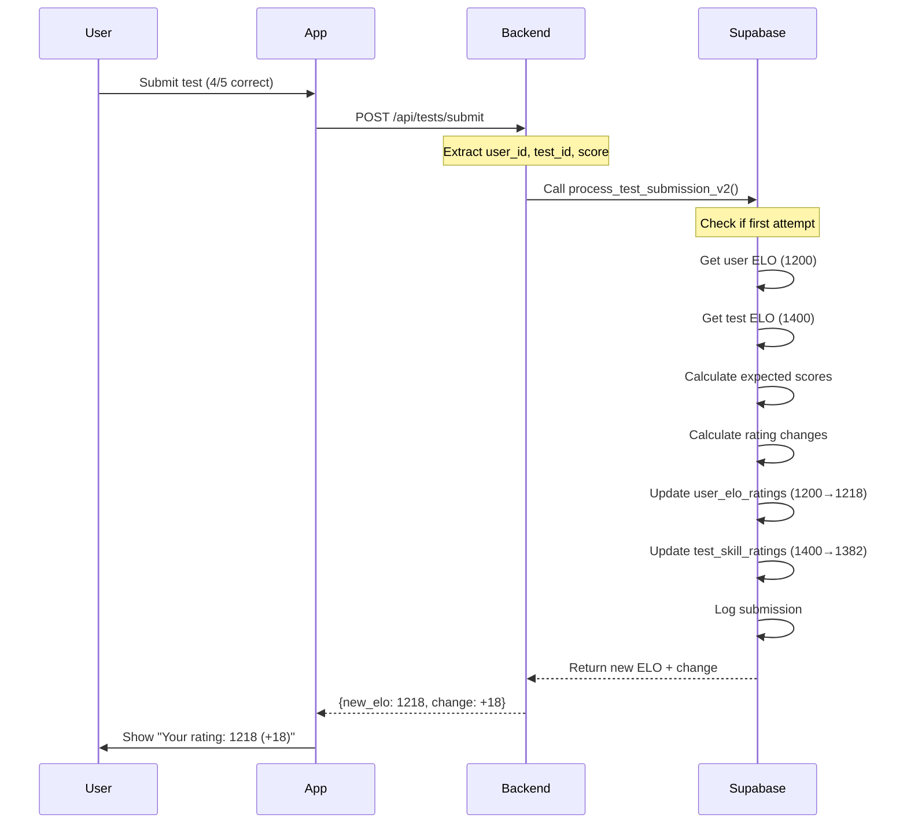

# Feature Specification: ELO Rating System

**Feature ID**: F-006
**Feature Name**: ELO-Based Skill Progression & Test Matching
**Status**: Active (v2 implemented)
**Last Updated**: 2026-02-14

---

## 1. Overview

### Purpose
The ELO rating system provides adaptive difficulty matching by tracking user skill levels and test difficulty separately per language and test mode (reading, listening, dictation). Users are matched with appropriately challenging tests, and both user and test ratings evolve based on performance.

### Scope
- User ELO ratings per language and mode
- Test ELO ratings per mode
- Dynamic rating updates after each test
- Recommended test matching algorithm
- Skill level categorization and display

---

## 2. User Stories

### Core User Stories
- **US-006-01**: As a user, I want to be matched with tests at my skill level so I'm neither bored nor overwhelmed
- **US-006-02**: As a user, I want to see my rating improve as I practice
- **US-006-03**: As a user, I want separate ratings for reading, listening, and dictation modes
- **US-006-04**: As a user, I want to see how much my rating changed after each test
- **US-006-05**: As a user, I want to know my skill level (Beginner, Intermediate, Advanced, etc.)

### Extended User Stories
- **US-006-06**: As a user, I want to see my rating history over time
- **US-006-07**: As a user, I want to see test difficulty ratings before starting
- **US-006-08**: As a user, I want recommended tests to match my current ELO
- **US-006-09**: As a returning user, I want my ratings to adjust faster initially (volatility)

---

## 3. ELO System Design

### 3.1 Starting Ratings

| Entity | Starting ELO | Notes |
|--------|-------------|-------|
| New User | 1200 | For all modes (reading, listening, dictation) |
| Generated Test | Varies by difficulty | See CEFR mapping below |

### 3.2 CEFR Difficulty Mapping

Generated tests are assigned initial ELO based on requested difficulty level:

| Difficulty Level | CEFR Level | Starting ELO |
|-----------------|------------|--------------|
| 1 | A1 | 875 |
| 2 | A1+ | 1050 |
| 3 | A2 | 1225 |
| 4 | B1 | 1400 |
| 5 | B1+ | 1575 |
| 6 | B2 | 1750 |
| 7 | C1 | 1925 |
| 8 | C1+ | 2100 |
| 9 | C2 | 2275 |

**Formula**: `starting_elo = 875 + ((difficulty - 1) * 175)`

### 3.3 ELO Formula

The system uses the standard ELO rating formula:

```
Expected Score = 1 / (1 + 10^((OpponentELO - SelfELO) / 400))

Rating Change = K-factor × (Actual Score - Expected Score)

New Rating = Current Rating + Rating Change
```

**Variables**:
- **K-factor**: 32 (for both users and tests in v2)
- **Actual Score**: For user = percentage correct (e.g., 4/5 = 0.8), for test = 1 - user score
- **Rating Range**: Clamped to [400, 3000]

### 3.4 Example Calculation

**Scenario**: User (ELO 1200) takes a test (ELO 1400) and scores 4/5 (80%).

**Step 1: Calculate Expected Scores**
```
User Expected = 1 / (1 + 10^((1400 - 1200) / 400))
              = 1 / (1 + 10^(200 / 400))
              = 1 / (1 + 10^0.5)
              = 1 / (1 + 3.162)
              = 0.24 (24% expected)

Test Expected = 1 / (1 + 10^((1200 - 1400) / 400))
              = 1 / (1 + 10^(-0.5))
              = 0.76 (76% expected)
```

**Step 2: Calculate Rating Changes**
```
User Actual Score = 4/5 = 0.80
User Change = 32 × (0.80 - 0.24) = 32 × 0.56 = 17.92

Test Actual Score = 1 - 0.80 = 0.20
Test Change = 32 × (0.20 - 0.76) = 32 × (-0.56) = -17.92
```

**Step 3: Apply Changes**
```
User New ELO = 1200 + 17.92 = 1217.92 ≈ 1218
Test New ELO = 1400 - 17.92 = 1382.08 ≈ 1382
```

---

## 4. Rating Update Flow



---

## 5. Data Model

### 5.1 user_elo_ratings
Tracks user skill ratings per language and mode.

```sql
CREATE TABLE user_elo_ratings (
    user_id UUID REFERENCES auth.users(id),
    language_id INTEGER REFERENCES dim_languages(id),
    listening_rating INTEGER DEFAULT 1200,
    reading_rating INTEGER DEFAULT 1200,
    dictation_rating INTEGER DEFAULT 1200,
    created_at TIMESTAMP WITH TIME ZONE DEFAULT NOW(),
    updated_at TIMESTAMP WITH TIME ZONE DEFAULT NOW(),
    PRIMARY KEY (user_id, language_id)
);
```

**Example Record**:
```sql
INSERT INTO user_elo_ratings VALUES (
    'user-uuid-123',
    1, -- Chinese
    1218, -- Listening
    1150, -- Reading
    1300, -- Dictation
    NOW(),
    NOW()
);
```

### 5.2 test_skill_ratings
Tracks test difficulty ratings per mode.

```sql
CREATE TABLE test_skill_ratings (
    test_id UUID REFERENCES tests(id),
    test_type_id INTEGER REFERENCES dim_test_types(id),
    rating INTEGER NOT NULL,
    volatility DECIMAL(5,2) DEFAULT 1.0, -- Removed in v2
    attempts INTEGER DEFAULT 0,
    last_attempt TIMESTAMP WITH TIME ZONE,
    created_at TIMESTAMP WITH TIME ZONE DEFAULT NOW(),
    updated_at TIMESTAMP WITH TIME ZONE DEFAULT NOW(),
    PRIMARY KEY (test_id, test_type_id)
);
```

**Test Type IDs**:
- 1 = Reading
- 2 = Listening
- 3 = Dictation

**Example Record**:
```sql
INSERT INTO test_skill_ratings VALUES (
    'test-uuid-456',
    2, -- Listening
    1382,
    1.0,
    15, -- 15 attempts by users
    '2026-02-14 10:30:00',
    NOW(),
    NOW()
);
```

### 5.3 test_submissions
Stores all test attempts (used to prevent duplicate ELO updates).

```sql
CREATE TABLE test_submissions (
    id UUID PRIMARY KEY DEFAULT uuid_generate_v4(),
    user_id UUID REFERENCES auth.users(id),
    test_id UUID REFERENCES tests(id),
    score DECIMAL(5,2) NOT NULL,
    time_taken INTEGER, -- seconds
    elo_before INTEGER,
    elo_after INTEGER,
    elo_change INTEGER,
    is_first_attempt BOOLEAN DEFAULT TRUE,
    created_at TIMESTAMP WITH TIME ZONE DEFAULT NOW()
);
```

---

## 6. Business Logic

### 6.1 First Attempt Detection
**Rule**: Only the first attempt at a test updates ELO. Retakes don't affect ratings.

```sql
-- Check if first attempt
SELECT NOT EXISTS (
    SELECT 1 FROM test_submissions
    WHERE user_id = $1 AND test_id = $2
) AS is_first_attempt;
```

**Rationale**: Prevents gaming the system by retaking easy tests.

### 6.2 process_test_submission_v2 Function
**Location**: `migrations/process_test_submission_v2.sql`

```sql
CREATE OR REPLACE FUNCTION process_test_submission_v2(
    p_user_id UUID,
    p_test_id UUID,
    p_score DECIMAL,
    p_time_taken INTEGER,
    p_test_type_id INTEGER,
    p_language_id INTEGER
) RETURNS JSONB AS $$
DECLARE
    v_is_first_attempt BOOLEAN;
    v_user_elo INTEGER;
    v_test_elo INTEGER;
    v_user_expected DECIMAL;
    v_test_expected DECIMAL;
    v_user_change INTEGER;
    v_test_change INTEGER;
    v_new_user_elo INTEGER;
    v_new_test_elo INTEGER;
    k_factor CONSTANT INTEGER := 32;
BEGIN
    -- Check if first attempt
    v_is_first_attempt := NOT EXISTS (
        SELECT 1 FROM test_submissions
        WHERE user_id = p_user_id AND test_id = p_test_id
    );

    -- Get current ELOs
    SELECT CASE p_test_type_id
        WHEN 1 THEN reading_rating
        WHEN 2 THEN listening_rating
        WHEN 3 THEN dictation_rating
    END INTO v_user_elo
    FROM user_elo_ratings
    WHERE user_id = p_user_id AND language_id = p_language_id;

    SELECT rating INTO v_test_elo
    FROM test_skill_ratings
    WHERE test_id = p_test_id AND test_type_id = p_test_type_id;

    -- Calculate expected scores
    v_user_expected := 1.0 / (1.0 + POWER(10, (v_test_elo - v_user_elo) / 400.0));
    v_test_expected := 1.0 - v_user_expected;

    -- Calculate rating changes (only if first attempt)
    IF v_is_first_attempt THEN
        v_user_change := ROUND(k_factor * (p_score - v_user_expected));
        v_test_change := ROUND(k_factor * ((1 - p_score) - v_test_expected));

        v_new_user_elo := GREATEST(400, LEAST(3000, v_user_elo + v_user_change));
        v_new_test_elo := GREATEST(400, LEAST(3000, v_test_elo + v_test_change));

        -- Update user ELO
        UPDATE user_elo_ratings
        SET reading_rating = CASE WHEN p_test_type_id = 1 THEN v_new_user_elo ELSE reading_rating END,
            listening_rating = CASE WHEN p_test_type_id = 2 THEN v_new_user_elo ELSE listening_rating END,
            dictation_rating = CASE WHEN p_test_type_id = 3 THEN v_new_user_elo ELSE dictation_rating END,
            updated_at = NOW()
        WHERE user_id = p_user_id AND language_id = p_language_id;

        -- Update test ELO
        UPDATE test_skill_ratings
        SET rating = v_new_test_elo,
            attempts = attempts + 1,
            last_attempt = NOW(),
            updated_at = NOW()
        WHERE test_id = p_test_id AND test_type_id = p_test_type_id;
    ELSE
        v_user_change := 0;
        v_new_user_elo := v_user_elo;
    END IF;

    -- Log submission
    INSERT INTO test_submissions (
        user_id, test_id, score, time_taken,
        elo_before, elo_after, elo_change, is_first_attempt
    ) VALUES (
        p_user_id, p_test_id, p_score, p_time_taken,
        v_user_elo, v_new_user_elo, v_user_change, v_is_first_attempt
    );

    -- Return result
    RETURN jsonb_build_object(
        'success', TRUE,
        'is_first_attempt', v_is_first_attempt,
        'elo_before', v_user_elo,
        'elo_after', v_new_user_elo,
        'elo_change', v_user_change,
        'test_elo_after', v_new_test_elo
    );
END;
$$ LANGUAGE plpgsql;
```

### 6.3 Recommended Test Matching
**Algorithm**: Find tests with ELO within ±200 of user's current ELO for that mode.

```sql
-- Get recommended listening tests for user
SELECT t.*
FROM tests t
JOIN test_skill_ratings tsr ON t.id = tsr.test_id
JOIN user_elo_ratings uer ON uer.user_id = $1 AND uer.language_id = t.language_id
WHERE tsr.test_type_id = 2 -- Listening
  AND tsr.rating BETWEEN (uer.listening_rating - 200) AND (uer.listening_rating + 200)
  AND t.language_id = $2
ORDER BY ABS(tsr.rating - uer.listening_rating) ASC
LIMIT 10;
```

**Rationale**: ±200 range provides ~30% win rate for lower-rated tests, ~70% for higher-rated.

---

## 7. Skill Level Categories

### 7.1 ELO Ranges
User-friendly labels for ELO ranges:

| Label | ELO Range | CEFR Equivalent | Color |
|-------|-----------|-----------------|-------|
| Beginner | 400-799 | Pre-A1 | Gray |
| Elementary | 800-999 | A1 | Blue |
| Pre-Intermediate | 1000-1199 | A2 | Green |
| Intermediate | 1200-1399 | B1 | Yellow |
| Upper-Intermediate | 1400-1599 | B1+ | Orange |
| Advanced | 1600-1799 | B2 | Red |
| Proficient | 1800-1999 | C1 | Purple |
| Expert | 2000-2199 | C1+ | Dark Purple |
| Master | 2200+ | C2 | Gold |

### 7.2 Skill Level Display
```python
def get_skill_level(elo):
    """Convert ELO to user-friendly skill level."""
    if elo < 800:
        return 'Beginner'
    elif elo < 1000:
        return 'Elementary'
    elif elo < 1200:
        return 'Pre-Intermediate'
    elif elo < 1400:
        return 'Intermediate'
    elif elo < 1600:
        return 'Upper-Intermediate'
    elif elo < 1800:
        return 'Advanced'
    elif elo < 2000:
        return 'Proficient'
    elif elo < 2200:
        return 'Expert'
    else:
        return 'Master'
```

---

## 8. UI Components

### 8.1 ELO Display (Dashboard)
```html
<div class="elo-card">
    <h3>🎧 Listening</h3>
    <div class="elo-value">1218</div>
    <div class="elo-change positive">+18</div>
    <div class="skill-level">Intermediate</div>
    <div class="progress-bar">
        <div class="progress" style="width: 60%"></div>
    </div>
    <p class="next-level">382 ELO to Upper-Intermediate</p>
</div>
```

### 8.2 Post-Test ELO Change
```html
<div class="test-result">
    <h2>Test Complete!</h2>
    <p>Score: 4/5 (80%)</p>
    <div class="elo-result">
        <span class="label">Your Rating:</span>
        <span class="old-elo">1200</span>
        <span class="arrow">→</span>
        <span class="new-elo">1218</span>
        <span class="change positive">+18</span>
    </div>
</div>
```

### 8.3 Test Difficulty Badge
```html
<div class="test-card">
    <h3>Chinese Daily Routines</h3>
    <div class="difficulty-badge" data-elo="1382">
        <i class="fas fa-chart-line"></i>
        <span>1382 ELO</span>
        <span class="label">Intermediate</span>
    </div>
</div>
```

---

## 9. Volatility System (v1 Only, Deprecated in v2)

### 9.1 Purpose
In v1, volatility increased rating changes for tests with few attempts or long gaps between attempts, making ratings adjust faster.

### 9.2 Formula (v1)
```
Volatility Multiplier = 1 + (base_volatility / attempts) + time_gap_factor

Rating Change = K-factor × Volatility × (Actual - Expected)
```

**Removed in v2**: Simplified to fixed K-factor of 32 for all ratings.

---

## 10. Edge Cases & Error Handling

### 10.1 New User with No Ratings
**Scenario**: User takes first test before rating record exists.

**Solution**: Create rating record with default 1200 ELO on first test.

```sql
INSERT INTO user_elo_ratings (user_id, language_id)
VALUES ($1, $2)
ON CONFLICT (user_id, language_id) DO NOTHING;
```

### 10.2 Test with No Rating
**Scenario**: Manually imported test has no skill rating.

**Solution**: Assign default ELO based on test metadata or use 1200.

```sql
INSERT INTO test_skill_ratings (test_id, test_type_id, rating)
VALUES ($1, $2, 1200)
ON CONFLICT DO NOTHING;
```

### 10.3 Perfect Score vs. Flawless Victory
**Scenario**: User scores 100% on a much harder test.

**Example**: User (1200) scores 5/5 on test (1800).

```
Expected = 1 / (1 + 10^((1800-1200)/400)) = 0.06 (6%)
Change = 32 × (1.0 - 0.06) = 32 × 0.94 = 30.08
New ELO = 1200 + 30 = 1230
```

**Large gain** (+30) reflects exceptional performance.

### 10.4 Retake Without ELO Update
**Scenario**: User retakes test to improve score.

**Behavior**: Score logged, but ELO unchanged.

```sql
INSERT INTO test_submissions (..., is_first_attempt)
VALUES (..., FALSE);
-- No ELO update
```

### 10.5 Concurrent Test Submissions
**Scenario**: User submits two tests simultaneously.

**Solution**: Database transactions ensure atomic ELO updates.

---

## 11. Acceptance Criteria

### AC-006-01: Initial Ratings
- [ ] New users start at 1200 ELO for all modes
- [ ] Generated tests assigned ELO based on difficulty (1-9)
- [ ] Ratings visible on dashboard

### AC-006-02: ELO Updates
- [ ] First test attempt updates both user and test ELO
- [ ] Calculation follows ELO formula exactly
- [ ] Changes clamped to [400, 3000] range
- [ ] Retakes don't update ELO

### AC-006-03: Per-Mode Ratings
- [ ] Listening test updates listening_rating only
- [ ] Reading test updates reading_rating only
- [ ] Dictation test updates dictation_rating only
- [ ] Modes tracked independently

### AC-006-04: Test Matching
- [ ] Recommended tests within ±200 ELO of user
- [ ] Sorted by proximity to user ELO
- [ ] Language-specific matching

### AC-006-05: UI Display
- [ ] Dashboard shows all 3 mode ratings
- [ ] Skill level label displayed
- [ ] Post-test shows ELO change
- [ ] Test cards show test ELO

### AC-006-06: Edge Cases
- [ ] New users get default ratings on first test
- [ ] Tests without ratings assigned default
- [ ] Concurrent submissions handled atomically
- [ ] Perfect scores on hard tests yield large gains

---

## 12. Performance Considerations

### 12.1 Database Optimization
- Index on (user_id, language_id) in user_elo_ratings
- Index on (test_id, test_type_id) in test_skill_ratings
- Composite index on test_submissions (user_id, test_id)

### 12.2 Query Optimization
- Use database function for ELO calculation (avoid app-level loops)
- Batch rating updates if processing multiple tests

### 12.3 Caching
- Cache user ELO in session (invalidate on test submission)
- Cache recommended tests for 1 hour

---

## 13. Testing Strategy

### 13.1 Unit Tests
- ELO calculation formula accuracy
- Rating change clamping (400-3000)
- Skill level categorization
- First attempt detection

### 13.2 Integration Tests
- End-to-end test submission → ELO update
- Concurrent submission handling
- Retake behavior (no ELO update)

### 13.3 Test Cases
```
User ELO | Test ELO | Score | Expected User Change
---------|----------|-------|---------------------
1200     | 1200     | 0.5   | 0 (as expected)
1200     | 1400     | 0.8   | +18 (beat expectation)
1200     | 1000     | 0.3   | -22 (lost to easier test)
1500     | 1500     | 1.0   | +16 (perfect score)
```

---

## 14. Monitoring & Analytics

### 14.1 Key Metrics
- Average user ELO per language/mode
- ELO distribution (histogram)
- Average rating change per test
- Tests with most volatile ratings

### 14.2 Dashboards
- User progression over time (line chart)
- ELO distribution by mode (bar chart)
- Test difficulty distribution (scatter plot)

---

## 15. Related Documents

- **Database Schema**: `/Project Knowledge/13-TDD/02-data-models/01-database-schema.md`
- **Migration Files**: `/migrations/elo_functions.sql`, `/migrations/process_test_submission_v2.sql`
- **Test Taking Flow**: `/Project Knowledge/12-PRD/03-user-flows/02-test-taking-flow.md`
- **User Dashboard**: `/Project Knowledge/12-PRD/02-feature-specifications/04-user-dashboard.md`

---

## 16. Future Enhancements

### 16.1 Decay System (v3)
- Ratings decrease after 30 days of inactivity
- Prevents stale high ratings

### 16.2 Seasonal Ratings (v4)
- Reset ratings every 3 months
- Maintain historical peak rating

### 16.3 Leaderboards (v5)
- Global rankings per language/mode
- Weekly/monthly top performers

### 16.4 Rating Uncertainty (Glicko-2)
- Track rating confidence interval
- Faster changes for uncertain ratings

---

**Document Version**: 2.0
**Source Files**: `migrations/process_test_submission_v2.sql`, `migrations/elo_functions.sql`
**Last Review**: 2026-02-14
