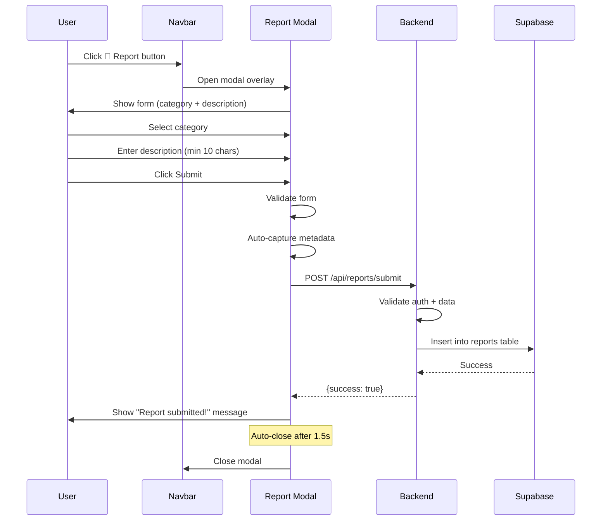
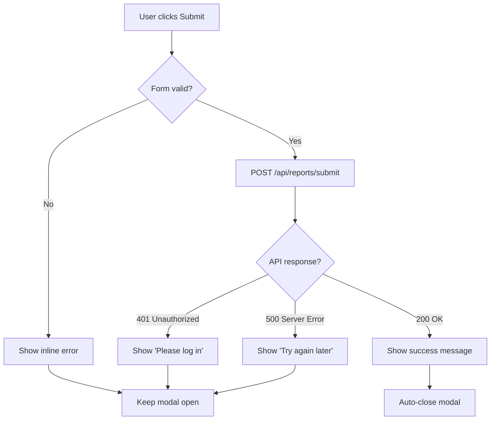

# Feature Specification: User Reporting System

**Feature ID**: F-007
**Feature Name**: User Feedback & Issue Reporting
**Status**: Active
**Last Updated**: 2026-02-14

---

## 1. Overview

### Purpose
The user reporting system provides a quick and accessible way for users to report bugs, incorrect test content, technical issues, and suggest improvements. All reports are captured with contextual metadata to aid in debugging and issue resolution.

### Scope
- Report modal accessible from all authenticated pages
- 6 predefined report categories
- Auto-capture of page context and technical metadata
- Bilingual UI (English/Chinese)
- Backend storage and admin review workflow

---

## 2. User Stories

### Core User Stories
- **US-007-01**: As a user, I want to report incorrect test answers so they can be fixed
- **US-007-02**: As a user, I want to report technical issues I encounter
- **US-007-03**: As a user, I want to suggest improvements to the platform
- **US-007-04**: As a user, I want the reporting process to be quick and easy (< 1 minute)

### Extended User Stories
- **US-007-05**: As a user, I want confirmation that my report was submitted
- **US-007-06**: As a user, I want to report without disrupting my current activity
- **US-007-07**: As an admin, I want detailed context with each report to aid in debugging

---

## 3. Report Categories

### 3.1 Category List

| Category ID | English Label | Chinese Label | Use Case |
|-------------|---------------|---------------|----------|
| `test_answer_incorrect` | Test answer incorrect | 测试答案不正确 | Wrong answer keys, typos in questions |
| `test_load_error` | Test won't load | 测试无法加载 | 404 errors, loading failures |
| `website_crash` | Website crashed | 网站崩溃 | JavaScript errors, white screens |
| `improvement_idea` | Improvement idea | 改进建议 | Feature requests, UX suggestions |
| `audio_quality` | Audio quality poor | 音频质量差 | Distorted audio, wrong pronunciation |
| `other` | Other | 其他 | Miscellaneous issues |

### 3.2 Category Selection Rationale

**Why these 6?**
- **test_answer_incorrect**: Most critical for learning quality
- **test_load_error**: Common technical issue users can clearly identify
- **website_crash**: Severe technical issues requiring immediate attention
- **improvement_idea**: Captures user feedback for product development
- **audio_quality**: Specific to listening/dictation tests
- **other**: Catch-all for edge cases

---

## 4. User Flow

### 4.1 Report Submission Flow



### 4.2 Error Handling Flow



---

## 5. UI Components

### 5.1 Report Button (Navbar)
**Location**: Navbar on all authenticated pages

```html
<button id="reportButton" class="btn btn-outline-secondary">
    <i class="fas fa-flag"></i> Report
</button>
```

**Styling**:
- Icon: Flag emoji or FontAwesome flag icon
- Position: Right side of navbar, before user profile
- Mobile: Icon only (text hidden)

### 5.2 Report Modal

```html
<div class="modal fade" id="reportModal" tabindex="-1">
    <div class="modal-dialog modal-dialog-centered">
        <div class="modal-content">
            <div class="modal-header">
                <h5 class="modal-title">Report an Issue / 报告问题</h5>
                <button type="button" class="btn-close" data-bs-dismiss="modal"></button>
            </div>
            <div class="modal-body">
                <form id="reportForm">
                    <!-- Category Dropdown -->
                    <div class="mb-3">
                        <label for="reportCategory" class="form-label">
                            Category / 类别 <span class="text-danger">*</span>
                        </label>
                        <select class="form-select" id="reportCategory" required>
                            <option value="">Select a category / 选择类别</option>
                            <option value="test_answer_incorrect">
                                Test answer incorrect / 测试答案不正确
                            </option>
                            <option value="test_load_error">
                                Test won't load / 测试无法加载
                            </option>
                            <option value="website_crash">
                                Website crashed / 网站崩溃
                            </option>
                            <option value="improvement_idea">
                                Improvement idea / 改进建议
                            </option>
                            <option value="audio_quality">
                                Audio quality poor / 音频质量差
                            </option>
                            <option value="other">
                                Other / 其他
                            </option>
                        </select>
                    </div>

                    <!-- Description Textarea -->
                    <div class="mb-3">
                        <label for="reportDescription" class="form-label">
                            Description / 描述 <span class="text-danger">*</span>
                        </label>
                        <textarea
                            class="form-control"
                            id="reportDescription"
                            rows="4"
                            minlength="10"
                            maxlength="1000"
                            placeholder="Please describe the issue in detail / 请详细描述问题"
                            required
                        ></textarea>
                        <small class="text-muted">
                            <span id="charCount">0</span> / 1000 characters
                        </small>
                    </div>

                    <!-- Error Message -->
                    <div id="reportError" class="alert alert-danger d-none"></div>

                    <!-- Success Message -->
                    <div id="reportSuccess" class="alert alert-success d-none">
                        Report submitted successfully! / 报告提交成功！
                    </div>
                </form>
            </div>
            <div class="modal-footer">
                <button type="button" class="btn btn-secondary" data-bs-dismiss="modal">
                    Cancel / 取消
                </button>
                <button type="submit" form="reportForm" class="btn btn-primary">
                    Submit / 提交
                </button>
            </div>
        </div>
    </div>
</div>
```

### 5.3 Client-Side JavaScript

```javascript
document.getElementById('reportForm').addEventListener('submit', async (e) => {
    e.preventDefault();

    const category = document.getElementById('reportCategory').value;
    const description = document.getElementById('reportDescription').value;

    // Validation
    if (!category) {
        showError('Please select a category');
        return;
    }
    if (description.length < 10) {
        showError('Description must be at least 10 characters');
        return;
    }

    // Auto-capture metadata
    const payload = {
        report_category: category,
        description: description,
        current_page: window.location.pathname,
        test_id: extractTestId(), // Extract from URL if on test page
        user_agent: navigator.userAgent,
        screen_resolution: `${screen.width}x${screen.height}`
    };

    try {
        const response = await fetch('/api/reports/submit', {
            method: 'POST',
            headers: {
                'Content-Type': 'application/json'
            },
            body: JSON.stringify(payload)
        });

        const data = await response.json();

        if (data.success) {
            showSuccess('Report submitted successfully!');
            setTimeout(() => {
                $('#reportModal').modal('hide');
                resetForm();
            }, 1500);
        } else {
            showError(data.error || 'Failed to submit report');
        }
    } catch (error) {
        showError('Network error. Please try again.');
    }
});

function extractTestId() {
    // Extract test_id from URL if on test page
    const match = window.location.pathname.match(/\/test\/([^\/]+)/);
    return match ? match[1] : null;
}

function showSuccess(message) {
    document.getElementById('reportSuccess').textContent = message;
    document.getElementById('reportSuccess').classList.remove('d-none');
    document.getElementById('reportError').classList.add('d-none');
}

function showError(message) {
    document.getElementById('reportError').textContent = message;
    document.getElementById('reportError').classList.remove('d-none');
    document.getElementById('reportSuccess').classList.add('d-none');
}

function resetForm() {
    document.getElementById('reportForm').reset();
    document.getElementById('reportSuccess').classList.add('d-none');
    document.getElementById('reportError').classList.add('d-none');
}

// Character counter
document.getElementById('reportDescription').addEventListener('input', (e) => {
    document.getElementById('charCount').textContent = e.target.value.length;
});
```

---

## 6. API Endpoint

### 6.1 POST /api/reports/submit

**Authentication**: Required (must be logged in)

**Request Headers**:
```
Content-Type: application/json
Authorization: Bearer <session_token>
```

**Request Body**:
```json
{
  "report_category": "test_answer_incorrect",
  "description": "Question 3 answer should be '去' not '走'",
  "current_page": "/test/chinese-daily-routines",
  "test_id": "uuid-or-null",
  "user_agent": "Mozilla/5.0 (Windows NT 10.0; Win64; x64)...",
  "screen_resolution": "1920x1080"
}
```

**Validation Rules**:
- `report_category`: Must be one of 6 valid categories (required)
- `description`: Min 10 chars, max 1000 chars (required)
- `current_page`: Auto-captured (optional)
- `test_id`: UUID or null (optional)
- `user_agent`: Auto-captured (optional)
- `screen_resolution`: Format "WIDTHxHEIGHT" (optional)

**Success Response** (200 OK):
```json
{
  "success": true,
  "message": "Report submitted successfully"
}
```

**Error Responses**:

**401 Unauthorized** (not logged in):
```json
{
  "success": false,
  "error": "Authentication required"
}
```

**400 Bad Request** (invalid data):
```json
{
  "success": false,
  "error": "Description must be at least 10 characters"
}
```

**500 Internal Server Error**:
```json
{
  "success": false,
  "error": "Database error. Please try again."
}
```

### 6.2 Backend Implementation

**Location**: `/routes/reports.py`

```python
from flask import Blueprint, request, jsonify
from auth import require_auth
from database import supabase

reports_bp = Blueprint('reports', __name__)

VALID_CATEGORIES = [
    'test_answer_incorrect',
    'test_load_error',
    'website_crash',
    'improvement_idea',
    'audio_quality',
    'other'
]

@reports_bp.route('/api/reports/submit', methods=['POST'])
@require_auth
def submit_report(user_id):
    """Handle user report submission."""
    data = request.json

    # Validate category
    category = data.get('report_category')
    if category not in VALID_CATEGORIES:
        return jsonify({
            'success': False,
            'error': 'Invalid report category'
        }), 400

    # Validate description
    description = data.get('description', '').strip()
    if len(description) < 10:
        return jsonify({
            'success': False,
            'error': 'Description must be at least 10 characters'
        }), 400
    if len(description) > 1000:
        return jsonify({
            'success': False,
            'error': 'Description must not exceed 1000 characters'
        }), 400

    # Extract metadata
    current_page = data.get('current_page', '')
    test_id = data.get('test_id')
    user_agent = data.get('user_agent', '')
    screen_resolution = data.get('screen_resolution', '')

    try:
        # Insert into database
        supabase.table('reports').insert({
            'user_id': user_id,
            'report_category': category,
            'description': description,
            'current_page': current_page,
            'test_id': test_id,
            'user_agent': user_agent,
            'screen_resolution': screen_resolution,
            'status': 'pending'
        }).execute()

        return jsonify({
            'success': True,
            'message': 'Report submitted successfully'
        })

    except Exception as e:
        print(f"Error submitting report: {e}")
        return jsonify({
            'success': False,
            'error': 'Database error. Please try again.'
        }), 500
```

---

## 7. Data Model

### 7.1 reports Table

```sql
CREATE TABLE reports (
    id UUID PRIMARY KEY DEFAULT uuid_generate_v4(),
    user_id UUID REFERENCES auth.users(id) ON DELETE CASCADE,
    report_category VARCHAR(50) NOT NULL,
    description TEXT NOT NULL,
    current_page VARCHAR(500),
    test_id UUID REFERENCES tests(id) ON DELETE SET NULL,
    user_agent TEXT,
    screen_resolution VARCHAR(20),
    status VARCHAR(20) DEFAULT 'pending',
    admin_notes TEXT,
    resolved_at TIMESTAMP WITH TIME ZONE,
    created_at TIMESTAMP WITH TIME ZONE DEFAULT NOW(),

    CONSTRAINT valid_category CHECK (
        report_category IN (
            'test_answer_incorrect',
            'test_load_error',
            'website_crash',
            'improvement_idea',
            'audio_quality',
            'other'
        )
    ),
    CONSTRAINT valid_status CHECK (
        status IN ('pending', 'in_progress', 'resolved', 'dismissed')
    )
);

-- Indexes
CREATE INDEX idx_reports_user_id ON reports(user_id);
CREATE INDEX idx_reports_status ON reports(status);
CREATE INDEX idx_reports_category ON reports(report_category);
CREATE INDEX idx_reports_created_at ON reports(created_at DESC);
```

### 7.2 Status Workflow

| Status | Description | Next State |
|--------|-------------|------------|
| `pending` | Newly submitted, awaiting review | `in_progress` or `dismissed` |
| `in_progress` | Admin investigating | `resolved` or `dismissed` |
| `resolved` | Issue fixed or addressed | Final state |
| `dismissed` | Not actionable or duplicate | Final state |

### 7.3 Example Records

```sql
-- Test answer incorrect report
INSERT INTO reports VALUES (
    uuid_generate_v4(),
    'user-uuid-123',
    'test_answer_incorrect',
    'Question 3 answer should be 去 not 走. The context is asking about going to the store.',
    '/test/chinese-daily-routines',
    'test-uuid-456',
    'Mozilla/5.0 (Windows NT 10.0; Win64; x64) AppleWebKit/537.36...',
    '1920x1080',
    'pending',
    NULL,
    NULL,
    NOW()
);

-- Website crash report
INSERT INTO reports VALUES (
    uuid_generate_v4(),
    'user-uuid-789',
    'website_crash',
    'When I clicked Submit Test, the page turned white and nothing happened. I had to refresh and lost my progress.',
    '/test/japanese-grammar-basics',
    'test-uuid-101',
    'Mozilla/5.0 (Macintosh; Intel Mac OS X 10_15_7)...',
    '2560x1440',
    'pending',
    NULL,
    NULL,
    NOW()
);

-- Improvement idea report
INSERT INTO reports VALUES (
    uuid_generate_v4(),
    'user-uuid-321',
    'improvement_idea',
    'It would be great to have a review mode where I can see all my incorrect answers from past tests in one place.',
    '/dashboard',
    NULL,
    'Mozilla/5.0 (iPhone; CPU iPhone OS 15_0 like Mac OS X)...',
    '390x844',
    'pending',
    NULL,
    NULL,
    NOW()
);
```

---

## 8. Auto-Captured Metadata

### 8.1 Metadata Fields

| Field | Source | Purpose | Example |
|-------|--------|---------|---------|
| `current_page` | `window.location.pathname` | Identify where issue occurred | `/test/chinese-daily-routines` |
| `test_id` | URL parameter or context | Link to specific test | `uuid-123` or `null` |
| `user_agent` | `navigator.userAgent` | Browser/device info for debugging | `Mozilla/5.0...` |
| `screen_resolution` | `screen.width x screen.height` | Display issues debugging | `1920x1080` |

### 8.2 Privacy Considerations

**What we DON'T capture**:
- IP address (logged by server, not stored)
- Precise location
- Personal information beyond user_id
- Browser history
- Cookies or local storage

**Why it's safe**:
- User-agent and screen resolution are non-identifying
- Data used only for debugging
- Compliant with GDPR (user consent implied by submission)

---

## 9. Admin Review Workflow

### 9.1 Admin Dashboard (Future)

**Planned features**:
- View all reports sorted by status/category/date
- Filter by category or user
- Assign reports to team members
- Add internal notes
- Update status (pending → in_progress → resolved)
- View user context (past reports, account status)

### 9.2 Triage Priority

| Category | Priority | SLA |
|----------|----------|-----|
| `website_crash` | Critical | 24 hours |
| `test_load_error` | High | 48 hours |
| `test_answer_incorrect` | Medium | 7 days |
| `audio_quality` | Medium | 7 days |
| `improvement_idea` | Low | 30 days |
| `other` | Variable | Case-by-case |

---

## 10. Edge Cases & Error Handling

### 10.1 User Not Logged In
**Scenario**: Unauthenticated user clicks Report button.

**Solution**: Modal should only appear on authenticated pages. If somehow accessed, API returns 401.

### 10.2 Network Error During Submission
**Scenario**: User's internet drops while submitting.

**Solution**: Show error message "Network error. Please try again." Modal stays open.

### 10.3 Duplicate Submissions
**Scenario**: User accidentally clicks Submit twice.

**Solution**: No prevention. Allow duplicates (admin can dismiss later).

**Alternative**: Implement client-side rate limiting (1 submit per 10 seconds).

### 10.4 Test Page Without test_id
**Scenario**: User reports from test list page, not test page.

**Solution**: `test_id` is nullable. Set to `null` if not on test page.

### 10.5 Description in Non-Latin Characters
**Scenario**: User writes report in Chinese/Japanese.

**Solution**: TEXT column supports all Unicode. No special handling needed.

### 10.6 Modal Doesn't Close on Success
**Scenario**: Auto-close fails due to JS error.

**Solution**: Also provide manual close button. User can close manually if auto-close fails.

---

## 11. Acceptance Criteria

### AC-007-01: Modal Access
- [ ] Report button visible in navbar on all authenticated pages
- [ ] Clicking button opens modal overlay
- [ ] Modal centered on screen
- [ ] Modal dismissible via X button or Cancel

### AC-007-02: Form Validation
- [ ] Category selection required
- [ ] Description min 10 chars enforced (client + server)
- [ ] Description max 1000 chars enforced
- [ ] Character counter updates in real-time
- [ ] Submit disabled until form valid

### AC-007-03: Metadata Capture
- [ ] current_page auto-captured from URL
- [ ] test_id extracted if on test page
- [ ] user_agent auto-captured
- [ ] screen_resolution auto-captured
- [ ] All metadata sent to API

### AC-007-04: Submission Flow
- [ ] Valid submission returns success
- [ ] Success message displayed
- [ ] Modal auto-closes after 1.5s
- [ ] Form resets on close
- [ ] Database record created

### AC-007-05: Error Handling
- [ ] Invalid category shows error
- [ ] Short description shows error
- [ ] Network error shows user-friendly message
- [ ] 401 error prompts login
- [ ] Errors don't close modal

### AC-007-06: Bilingual UI
- [ ] All labels shown in English/Chinese
- [ ] Category options bilingual
- [ ] Error messages bilingual
- [ ] Success messages bilingual

---

## 12. Performance Considerations

### 12.1 Modal Load Time
- Modal HTML included in base template (no lazy loading)
- < 50ms to open modal
- No external API calls until submit

### 12.2 Database Inserts
- reports table indexed on common query fields
- Inserts < 100ms
- No cascading triggers or complex validation

### 12.3 Rate Limiting
**Current**: None implemented
**Future**: Limit to 10 reports per user per day

---

## 13. Testing Strategy

### 13.1 Manual Testing
- [ ] Submit report from test page
- [ ] Submit report from dashboard
- [ ] Submit with each category
- [ ] Submit with min length description (10 chars)
- [ ] Submit with max length description (1000 chars)
- [ ] Try to submit without category
- [ ] Try to submit with 5 char description
- [ ] Test on mobile viewport
- [ ] Test bilingual display

### 13.2 Automated Tests
```python
def test_submit_report_success():
    """Test successful report submission."""
    response = client.post('/api/reports/submit', json={
        'report_category': 'test_answer_incorrect',
        'description': 'This is a test report with enough characters.',
        'current_page': '/test/example',
        'test_id': None,
        'user_agent': 'Test',
        'screen_resolution': '1920x1080'
    }, headers={'Authorization': 'Bearer valid_token'})

    assert response.status_code == 200
    assert response.json['success'] == True

def test_submit_report_invalid_category():
    """Test invalid category rejection."""
    response = client.post('/api/reports/submit', json={
        'report_category': 'invalid_category',
        'description': 'This should fail.',
    }, headers={'Authorization': 'Bearer valid_token'})

    assert response.status_code == 400
    assert 'Invalid report category' in response.json['error']

def test_submit_report_short_description():
    """Test short description rejection."""
    response = client.post('/api/reports/submit', json={
        'report_category': 'other',
        'description': 'Short',
    }, headers={'Authorization': 'Bearer valid_token'})

    assert response.status_code == 400
    assert 'at least 10 characters' in response.json['error']
```

---

## 14. Monitoring & Analytics

### 14.1 Key Metrics
- Total reports per day
- Reports by category (pie chart)
- Average time to resolution
- Most reported tests (by test_id)
- Users with most reports (potential spam)

### 14.2 Alerts
- Spike in crash reports (> 10/hour)
- Same test reported > 5 times (answer likely wrong)
- User submits > 20 reports (potential abuse)

---

## 15. Related Documents

- **Backend Routes**: `/routes/reports.py`
- **Frontend Template**: `/templates/base.html` (lines 363-405)
- **Database Schema**: `/Project Knowledge/13-TDD/02-data-models/01-database-schema.md`
- **User Dashboard**: `/Project Knowledge/12-PRD/02-feature-specifications/04-user-dashboard.md`

---

## 16. Future Enhancements

### 16.1 Email Notifications (v2)
- Email admin when critical reports submitted
- Email user when report resolved

### 16.2 Report Voting (v3)
- Users can upvote existing reports
- Prioritize highly-voted issues

### 16.3 Public Issue Tracker (v4)
- Users can see all submitted reports (anonymized)
- Comment on reports
- Track resolution status

### 16.4 Screenshot Attachment (v5)
- Allow users to upload screenshot
- Store in cloud storage (S3/Cloudinary)
- Display in admin dashboard

---

**Document Version**: 1.0
**Source Files**: `templates/base.html`, `routes/reports.py`
**Last Review**: 2026-02-14
