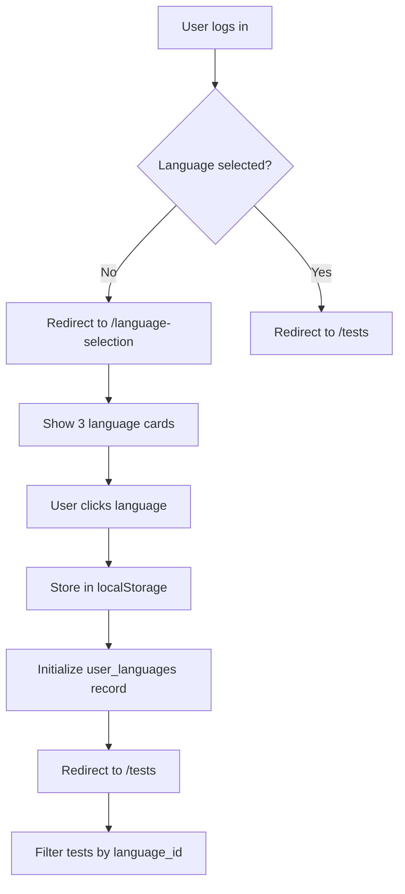
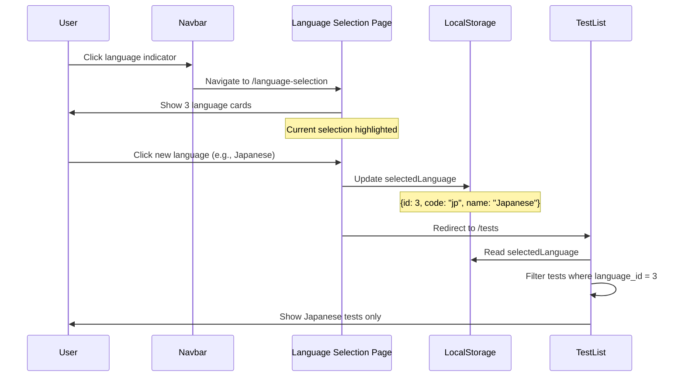

# Feature Specification: Language Selection

**Feature ID**: F-008
**Feature Name**: Target Language Selection & Filtering
**Status**: Active
**Last Updated**: 2026-02-14

---

## 1. Overview

### Purpose
The language selection feature allows users to choose their target learning language (Chinese, English, or Japanese) and filters all tests, content, and recommendations to match that selection. The selection is stored client-side and persists across sessions.

### Scope
- Dedicated language selection page
- 3 supported languages with visual cards
- LocalStorage-based persistence
- Language indicator in navbar
- Test filtering by selected language
- Per-language configuration (TTS voices, LLM models)

---

## 2. User Stories

### Core User Stories
- **US-008-01**: As a new user, I want to choose my target language before browsing tests
- **US-008-02**: As a user, I want to switch languages at any time
- **US-008-03**: As a user, I want to see my selected language in the navbar
- **US-008-04**: As a user, I want tests filtered to only show my selected language
- **US-008-05**: As a user, I want my language selection to persist across browser sessions

### Extended User Stories
- **US-008-06**: As a user, I want visual language cards (flags + names) for easy selection
- **US-008-07**: As a multilingual learner, I want to track progress separately per language
- **US-008-08**: As a user, I want language-specific content (TTS voices, questions)

---

## 3. Supported Languages

### 3.1 Language List

| Language | Code | Flag | ID | Status |
|----------|------|------|----|----|
| Chinese (Mandarin) | `cn` | 🇨🇳 | 1 | Active |
| English (US) | `en` | 🇺🇸 | 2 | Active |
| Japanese | `jp` | 🇯🇵 | 3 | Active |

**Future Languages** (planned):
- Spanish (`es`, 🇪🇸, ID 4)
- French (`fr`, 🇫🇷, ID 5)
- Korean (`kr`, 🇰🇷, ID 6)

### 3.2 Language Configuration

**TTS Voices** (from `config.py`):
```python
TTS_VOICES = {
    'cn': 'zh-CN-XiaoxiaoNeural',  # Female Mandarin voice
    'en': 'en-US-JennyNeural',      # Female US English voice
    'jp': 'ja-JP-NanamiNeural'      # Female Japanese voice
}
```

**LLM Models** (from `config.py`):
```python
LANGUAGE_MODELS = {
    'cn': 'gpt-4-turbo-preview',
    'en': 'gpt-4-turbo-preview',
    'jp': 'gpt-4-turbo-preview'
}
```

**Localization** (future):
```python
UI_LANGUAGES = {
    'cn': 'zh-CN',  # UI in Simplified Chinese
    'en': 'en-US',  # UI in English
    'jp': 'ja-JP'   # UI in Japanese
}
```

---

## 4. User Flow

### 4.1 First-Time Selection Flow



### 4.2 Language Switch Flow



---

## 5. UI Components

### 5.1 Language Selection Page

**Route**: `/language-selection`

**Layout**:
```html
<div class="container language-selection-page">
    <div class="text-center mb-5">
        <h1>Choose Your Language</h1>
        <p class="text-muted">Select the language you want to practice</p>
    </div>

    <div class="row justify-content-center g-4">
        <!-- Chinese Card -->
        <div class="col-md-4">
            <div class="language-card" data-language-id="1" data-language-code="cn" data-language-name="Chinese">
                <div class="card h-100 text-center hover-shadow">
                    <div class="card-body">
                        <div class="language-flag">🇨🇳</div>
                        <h3 class="card-title">Chinese</h3>
                        <p class="card-text text-muted">普通话 Mandarin</p>
                    </div>
                </div>
            </div>
        </div>

        <!-- English Card -->
        <div class="col-md-4">
            <div class="language-card" data-language-id="2" data-language-code="en" data-language-name="English">
                <div class="card h-100 text-center hover-shadow">
                    <div class="card-body">
                        <div class="language-flag">🇺🇸</div>
                        <h3 class="card-title">English</h3>
                        <p class="card-text text-muted">American English</p>
                    </div>
                </div>
            </div>
        </div>

        <!-- Japanese Card -->
        <div class="col-md-4">
            <div class="language-card" data-language-id="3" data-language-code="jp" data-language-name="Japanese">
                <div class="card h-100 text-center hover-shadow">
                    <div class="card-body">
                        <div class="language-flag">🇯🇵</div>
                        <h3 class="card-title">Japanese</h3>
                        <p class="card-text text-muted">日本語 Nihongo</p>
                    </div>
                </div>
            </div>
        </div>
    </div>
</div>
```

**Styling**:
```css
.language-flag {
    font-size: 5rem;
    margin-bottom: 1rem;
}

.language-card .card {
    cursor: pointer;
    transition: transform 0.2s, box-shadow 0.2s;
}

.language-card .card:hover {
    transform: translateY(-5px);
    box-shadow: 0 8px 16px rgba(0,0,0,0.1);
}

.language-card .card.selected {
    border: 3px solid #007bff;
    background-color: #f0f8ff;
}
```

### 5.2 Navbar Language Indicator

**Location**: Navbar (all pages after selection)

```html
<div class="navbar-language-indicator">
    <a href="/language-selection" class="btn btn-outline-primary">
        <span id="current-language-flag">🇨🇳</span>
        <span id="current-language-name">Chinese</span>
    </a>
</div>
```

**Update Function** (from `base.html`):
```javascript
function updateLanguageIndicator() {
    const selectedLanguage = JSON.parse(localStorage.getItem('selectedLanguage'));
    if (selectedLanguage) {
        const flagEmojis = {
            'cn': '🇨🇳',
            'en': '🇺🇸',
            'jp': '🇯🇵'
        };
        document.getElementById('current-language-flag').textContent = flagEmojis[selectedLanguage.code];
        document.getElementById('current-language-name').textContent = selectedLanguage.name;
    }
}

// Call on page load
document.addEventListener('DOMContentLoaded', updateLanguageIndicator);
```

---

## 6. Client-Side Logic

### 6.1 Language Selection Handler

**Location**: `templates/language_selection.html`

```javascript
document.querySelectorAll('.language-card').forEach(card => {
    card.addEventListener('click', function() {
        // Extract data attributes
        const languageId = parseInt(this.dataset.languageId);
        const languageCode = this.dataset.languageCode;
        const languageName = this.dataset.languageName;

        // Store in localStorage
        const selectedLanguage = {
            id: languageId,
            code: languageCode,
            name: languageName
        };
        localStorage.setItem('selectedLanguage', JSON.stringify(selectedLanguage));

        // Visual feedback
        document.querySelectorAll('.language-card .card').forEach(c => {
            c.classList.remove('selected');
        });
        this.querySelector('.card').classList.add('selected');

        // Redirect to test list
        setTimeout(() => {
            window.location.href = '/tests';
        }, 300);
    });
});

// Highlight current selection on page load
window.addEventListener('DOMContentLoaded', () => {
    const selectedLanguage = JSON.parse(localStorage.getItem('selectedLanguage'));
    if (selectedLanguage) {
        const card = document.querySelector(
            `.language-card[data-language-id="${selectedLanguage.id}"]`
        );
        if (card) {
            card.querySelector('.card').classList.add('selected');
        }
    }
});
```

### 6.2 Test Filtering

**Location**: `templates/tests.html` or API endpoint

```javascript
async function loadTests() {
    const selectedLanguage = JSON.parse(localStorage.getItem('selectedLanguage'));

    if (!selectedLanguage) {
        // No language selected, redirect to selection
        window.location.href = '/language-selection';
        return;
    }

    // Fetch tests for selected language
    const response = await fetch(`/api/tests?language_id=${selectedLanguage.id}`);
    const tests = await response.json();

    // Render tests...
}
```

**Backend Filtering** (alternative):
```python
@tests_bp.route('/api/tests')
@require_auth
def get_tests():
    language_id = request.args.get('language_id', type=int)

    if not language_id:
        return jsonify({'error': 'language_id required'}), 400

    tests = supabase.table('tests').select('*').eq(
        'language_id', language_id
    ).execute()

    return jsonify(tests.data)
```

---

## 7. Data Model

### 7.1 dim_languages (Dimension Table)

```sql
CREATE TABLE dim_languages (
    id SERIAL PRIMARY KEY,
    code VARCHAR(10) UNIQUE NOT NULL,
    name VARCHAR(100) NOT NULL,
    native_name VARCHAR(100),
    flag_emoji VARCHAR(10),
    is_active BOOLEAN DEFAULT TRUE,
    created_at TIMESTAMP WITH TIME ZONE DEFAULT NOW()
);

-- Seed data
INSERT INTO dim_languages (id, code, name, native_name, flag_emoji) VALUES
(1, 'cn', 'Chinese', '中文', '🇨🇳'),
(2, 'en', 'English', 'English', '🇺🇸'),
(3, 'jp', 'Japanese', '日本語', '🇯🇵');
```

### 7.2 user_languages (User Progress per Language)

```sql
CREATE TABLE user_languages (
    user_id UUID REFERENCES auth.users(id) ON DELETE CASCADE,
    language_id INTEGER REFERENCES dim_languages(id),
    total_tests_taken INTEGER DEFAULT 0,
    avg_score DECIMAL(5,2) DEFAULT 0.0,
    current_elo INTEGER DEFAULT 1200,
    last_test_at TIMESTAMP WITH TIME ZONE,
    created_at TIMESTAMP WITH TIME ZONE DEFAULT NOW(),
    updated_at TIMESTAMP WITH TIME ZONE DEFAULT NOW(),
    PRIMARY KEY (user_id, language_id)
);
```

**Usage**: Track user progress separately per language.

**Example**:
```sql
-- User learning both Chinese and Japanese
INSERT INTO user_languages VALUES
('user-uuid-123', 1, 45, 78.5, 1350, '2026-02-14 10:00:00', NOW(), NOW()), -- Chinese
('user-uuid-123', 3, 12, 65.0, 1150, '2026-02-13 14:00:00', NOW(), NOW()); -- Japanese
```

### 7.3 tests.language_id (Foreign Key)

```sql
CREATE TABLE tests (
    id UUID PRIMARY KEY DEFAULT uuid_generate_v4(),
    language_id INTEGER REFERENCES dim_languages(id),
    title VARCHAR(500) NOT NULL,
    -- other fields...
);
```

---

## 8. LocalStorage Schema

### 8.1 selectedLanguage Key

**Key**: `selectedLanguage`

**Format**: JSON string

**Structure**:
```json
{
  "id": 1,
  "code": "cn",
  "name": "Chinese"
}
```

**Example**:
```javascript
// Set
localStorage.setItem('selectedLanguage', JSON.stringify({
    id: 1,
    code: 'cn',
    name: 'Chinese'
}));

// Get
const lang = JSON.parse(localStorage.getItem('selectedLanguage'));
console.log(lang.code); // "cn"

// Remove
localStorage.removeItem('selectedLanguage');
```

### 8.2 Persistence

**Lifetime**: Indefinite (until user clears browser data)

**Sync**: No cross-device sync (localStorage is browser-specific)

**Fallback**: If localStorage cleared, redirect to `/language-selection`

---

## 9. Edge Cases & Error Handling

### 9.1 No Language Selected
**Scenario**: User navigates directly to `/tests` without selecting language.

**Solution**: Redirect to `/language-selection`.

```javascript
function ensureLanguageSelected() {
    const selectedLanguage = localStorage.getItem('selectedLanguage');
    if (!selectedLanguage && window.location.pathname !== '/language-selection') {
        window.location.href = '/language-selection';
    }
}
```

### 9.2 Invalid Language ID in LocalStorage
**Scenario**: User manually edits localStorage with invalid ID (e.g., `id: 999`).

**Solution**: Validate against dim_languages. If invalid, clear and redirect.

```javascript
const validLanguageIds = [1, 2, 3];
const selectedLanguage = JSON.parse(localStorage.getItem('selectedLanguage'));

if (selectedLanguage && !validLanguageIds.includes(selectedLanguage.id)) {
    localStorage.removeItem('selectedLanguage');
    window.location.href = '/language-selection';
}
```

### 9.3 LocalStorage Cleared
**Scenario**: User clears browser cache/data.

**Solution**: Redirect to `/language-selection` on next visit.

### 9.4 Language Disabled
**Scenario**: Admin disables a language (sets `is_active = FALSE`).

**Solution**: Filter out inactive languages from selection page.

```sql
SELECT * FROM dim_languages WHERE is_active = TRUE;
```

### 9.5 User Switches Language Mid-Test
**Scenario**: User opens `/language-selection` while taking a test.

**Solution**: Allow switch, but warn of progress loss.

```javascript
if (window.location.pathname.includes('/test/')) {
    if (confirm('Switching languages will end your current test. Continue?')) {
        // Allow switch
    } else {
        return; // Cancel
    }
}
```

---

## 10. Acceptance Criteria

### AC-008-01: Language Selection Page
- [ ] Page accessible at `/language-selection`
- [ ] 3 language cards displayed (Chinese, English, Japanese)
- [ ] Each card shows flag emoji + name
- [ ] Cards are clickable
- [ ] Current selection highlighted

### AC-008-02: Selection Persistence
- [ ] Clicking language stores in localStorage
- [ ] localStorage contains id, code, name
- [ ] Selection persists across page reloads
- [ ] Selection persists across browser sessions

### AC-008-03: Navbar Indicator
- [ ] Navbar shows selected language (flag + name)
- [ ] Indicator updates after language change
- [ ] Clicking indicator navigates to selection page
- [ ] Indicator hidden if no selection

### AC-008-04: Test Filtering
- [ ] Tests filtered by selected language_id
- [ ] No tests from other languages shown
- [ ] Empty state if no tests for language
- [ ] Filter applies to all test views (list, recommended, search)

### AC-008-05: Redirection
- [ ] No selection → redirect to `/language-selection`
- [ ] After selection → redirect to `/tests`
- [ ] Invalid selection → clear and redirect

### AC-008-06: Multi-Language Progress
- [ ] user_languages record created on first test
- [ ] Separate progress tracked per language
- [ ] Switching languages shows different ELO/stats

---

## 11. Performance Considerations

### 11.1 LocalStorage Access
- Read: < 1ms (synchronous)
- Write: < 1ms (synchronous)
- No network latency

### 11.2 Database Queries
- dim_languages: Small table (3 rows), cache in app memory
- user_languages: Indexed on (user_id, language_id)
- tests filter: Indexed on language_id

### 11.3 Page Load
- Selection page: No API calls, instant render
- Language indicator: Updates synchronously from localStorage

---

## 12. Testing Strategy

### 12.1 Manual Testing
- [ ] Select each language and verify localStorage
- [ ] Refresh page and verify persistence
- [ ] Switch languages and verify tests update
- [ ] Clear localStorage and verify redirect
- [ ] Edit localStorage with invalid ID and verify handling

### 12.2 Automated Tests
```javascript
describe('Language Selection', () => {
    beforeEach(() => {
        localStorage.clear();
    });

    test('stores language in localStorage on click', () => {
        const chineseCard = document.querySelector('[data-language-id="1"]');
        chineseCard.click();

        const stored = JSON.parse(localStorage.getItem('selectedLanguage'));
        expect(stored.id).toBe(1);
        expect(stored.code).toBe('cn');
        expect(stored.name).toBe('Chinese');
    });

    test('redirects to selection if no language set', () => {
        const originalHref = window.location.href;
        ensureLanguageSelected();
        expect(window.location.href).toBe('/language-selection');
    });

    test('filters tests by selected language', async () => {
        localStorage.setItem('selectedLanguage', JSON.stringify({
            id: 1, code: 'cn', name: 'Chinese'
        }));

        const tests = await loadTests();
        expect(tests.every(t => t.language_id === 1)).toBe(true);
    });
});
```

---

## 13. Security Considerations

### 13.1 Client-Side Storage
**Risk**: User can manipulate localStorage.

**Mitigation**: Always validate language_id on backend.

```python
# Backend validation
if language_id not in [1, 2, 3]:
    return jsonify({'error': 'Invalid language'}), 400
```

### 13.2 SQL Injection Prevention
**Risk**: language_id from client in SQL query.

**Mitigation**: Use parameterized queries (already handled by Supabase client).

```python
# Safe (parameterized)
supabase.table('tests').select('*').eq('language_id', language_id).execute()

# NEVER do this (SQL injection risk)
# query = f"SELECT * FROM tests WHERE language_id = {language_id}"
```

---

## 14. Monitoring & Analytics

### 14.1 Key Metrics
- Language selection distribution (pie chart)
- Most popular language
- Users learning multiple languages
- Average tests per language

### 14.2 Queries
```sql
-- Language popularity
SELECT l.name, COUNT(DISTINCT ul.user_id) AS learners
FROM user_languages ul
JOIN dim_languages l ON ul.language_id = l.id
GROUP BY l.name
ORDER BY learners DESC;

-- Multi-language learners
SELECT user_id, COUNT(*) AS languages_learning
FROM user_languages
GROUP BY user_id
HAVING COUNT(*) > 1;
```

---

## 15. Related Documents

- **Frontend Template**: `/templates/language_selection.html`
- **Base Template**: `/templates/base.html` (navbar indicator)
- **Configuration**: `/config.py` (TTS_VOICES, LANGUAGE_MODELS)
- **Database Schema**: `/Project Knowledge/13-TDD/02-data-models/01-database-schema.md`
- **User Dashboard**: `/Project Knowledge/12-PRD/02-feature-specifications/04-user-dashboard.md`

---

## 16. Future Enhancements

### 16.1 Backend Sync (v2)
- Store selected language in user profile table
- Sync across devices via backend
- LocalStorage as cache, fallback to DB

### 16.2 Multi-Language Learning (v3)
- Allow users to select multiple languages
- Dashboard shows combined progress
- Switch between active languages

### 16.3 Auto-Detection (v4)
- Detect user's native language from browser
- Suggest target language based on location
- Smart defaults for new users

### 16.4 Language-Specific UI (v5)
- Full localization (UI in target language)
- RTL support for Arabic, Hebrew (future)
- Cultural customization (themes, examples)

---

**Document Version**: 1.0
**Source Files**: `templates/language_selection.html`, `templates/base.html`, `config.py`
**Last Review**: 2026-02-14
